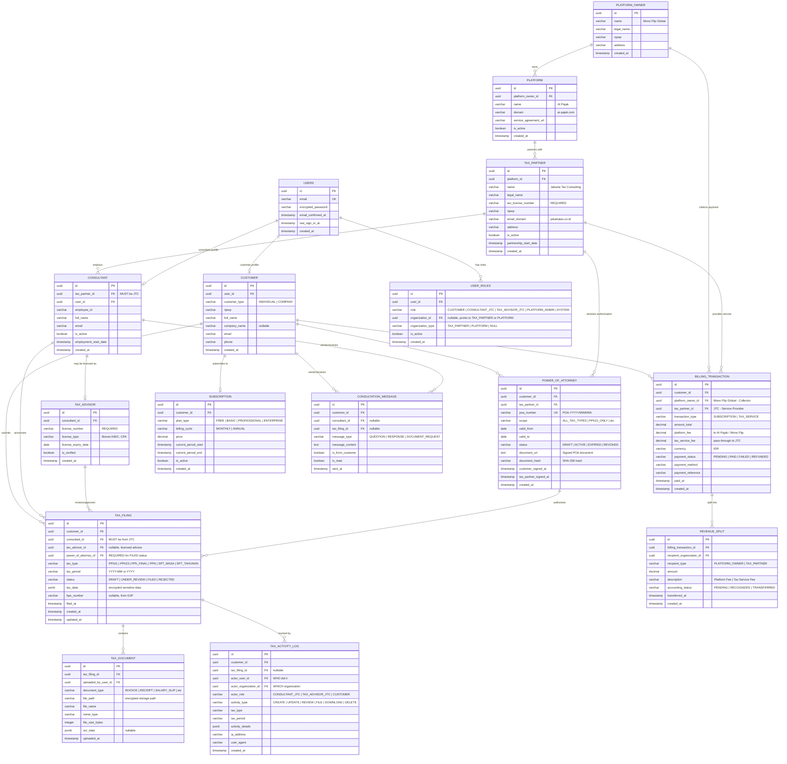

# AI Pajak Database Design
**Version**: 1.0
**Date**: 2025-12-23
**Status**: Initial Design

## Overview

This database design enforces the legal and operational structure defined in [LEGAL_STRUCTURE.md](LEGAL_STRUCTURE.md), ensuring strict separation between:
- **Platform Operator** (Mono Flip Global) - billing collection only
- **Platform** (AI Pajak) - software platform, no tax data access for admins
- **Tax Service Provider** (Jakarta Tax Consulting) - sole authority for tax filing
- **Customers** - end users

## Entity Relationship Diagram (ERD)



## Key Design Principles

### 1. **Hard Rule Enforcement**

#### Rule 1: PLATFORM_ADMIN Cannot Access Tax Data
- Enforced via RLS policies on `TAX_FILING`, `TAX_DOCUMENT`, `TAX_ACTIVITY_LOG`
- `USER_ROLES` with role `PLATFORM_ADMIN` are blocked from SELECT/INSERT/UPDATE/DELETE on tax tables

#### Rule 2: Consultant MUST Belong to Jakarta Tax Consulting
- Foreign key constraint: `consultant.tax_partner_id` → `tax_partner.id`
- Check constraint: Only consultants from JTC can be assigned to tax filings
- Application-level validation in consultation assignment logic

#### Rule 3: Tax Filing Actor ≠ Platform
- `TAX_FILING.consultant_id` → `CONSULTANT` → `TAX_PARTNER` (must be JTC)
- `TAX_ACTIVITY_LOG.actor_organization_id` cannot reference Platform entity
- RLS policies prevent any user with `PLATFORM_ADMIN` role from modifying tax data

#### Rule 4: Billing Collector ≠ Service Provider
- `BILLING_TRANSACTION.platform_owner_id` → Mono Flip Global (collector)
- `BILLING_TRANSACTION.tax_partner_id` → Jakarta Tax Consulting (provider)
- `REVENUE_SPLIT` table clearly separates platform fees from tax service fees

#### Rule 5: Audit Trail Required
- `TAX_ACTIVITY_LOG` table captures all actions on tax data
- Database triggers on `TAX_FILING`, `TAX_DOCUMENT`, and `POWER_OF_ATTORNEY` auto-create audit entries
- Cannot delete audit logs (RLS policy: no DELETE permission)

#### Rule 6: Legal Authorization via Power of Attorney (NEW)
- `POWER_OF_ATTORNEY` table establishes legal relationship between customer and tax partner
- Tax filings with status `FILED` or `UNDER_REVIEW` **REQUIRE** an active POA
- Database trigger validates POA before allowing tax filing submission
- POA status automatically updated based on validity dates
- Customers can revoke POA at any time (creates audit trail)
- Digital signatures captured with IP address for legal compliance

### 2. **Power of Attorney (POA) Workflow**

```
Customer Journey:
1. Customer creates POA (status: DRAFT)
2. Customer uploads/signs POA document (status: PENDING_SIGNATURE)
3. Tax Partner reviews and signs POA
4. POA becomes ACTIVE (both parties signed, within valid dates)
5. Tax Filing can now proceed (references POA)
6. POA automatically expires when valid_to date passes
7. Customer can manually revoke POA at any time

Database Enforcement:
- tax_filing.power_of_attorney_id FK → power_of_attorney.id
- Trigger: validate_tax_filing_poa() checks active POA before FILED status
- Function: has_active_poa() validates POA scope matches tax type
- Auto-expiration: update_poa_status() runs daily (via cron or application)
```

### 3. **Data Access Matrix**

| Role | Tax Filing | Tax Documents | POA | Customer Data | Billing | Audit Logs |
|------|-----------|---------------|-----|---------------|---------|------------|
| CUSTOMER | Own only | Own only | Own (manage) | Own only | Own only | Own only (read) |
| CONSULTANT_JTC | Assigned cases | Assigned cases | Partner POAs | Assigned cases | No | Write |
| TAX_ADVISOR_JTC | All JTC cases | All JTC cases | Partner POAs | All JTC cases | No | Write |
| PLATFORM_ADMIN | **NO ACCESS** | **NO ACCESS** | View only | Anonymized only | All | Read only |
| SYSTEM | No | No | No | No | All | Write |

### 4. **Entity Constraints**

- **PLATFORM_OWNER**: Single row (Mono Flip Global)
- **PLATFORM**: Single row (AI Pajak)
- **TAX_PARTNER**: Single row (Jakarta Tax Consulting) - extensible for future partners
- **CONSULTANT**: Must have `tax_partner_id` = JTC
- **TAX_ADVISOR**: Must reference valid `consultant_id` with verified license
- **POWER_OF_ATTORNEY**: Must have both customer and tax partner signatures to be ACTIVE
- **TAX_FILING**: Must have `consultant_id` from JTC consultants AND active `power_of_attorney_id` for FILED status

## Implementation Files

### Migration Files

All migration files are located in [../supabase/migrations/](../supabase/migrations/)

1. **[20251223000001_initial_schema.sql](../supabase/migrations/20251223000001_initial_schema.sql)**
   - Core table definitions
   - Enums and type safety
   - Foreign key constraints
   - Indexes for performance
   - Triggers for audit trail
   - **Lines of Code**: ~650
   - **Estimated Run Time**: ~500ms

2. **[20251223000002_rls_policies.sql](../supabase/migrations/20251223000002_rls_policies.sql)**
   - Row Level Security policies
   - Helper functions for role checking
   - Enforcement of all 5 hard rules
   - **Lines of Code**: ~550
   - **Estimated Run Time**: ~300ms

3. **[20251223000003_seed_data.sql](../supabase/migrations/20251223000003_seed_data.sql)**
   - Initial platform entities
   - Mono Flip Global, AI Pajak, Jakarta Tax Consulting
   - Data verification queries
   - **Lines of Code**: ~100
   - **Estimated Run Time**: ~100ms

4. **[20251223000004_power_of_attorney.sql](../supabase/migrations/20251223000004_power_of_attorney.sql)** ⭐ NEW
   - Power of Attorney table and workflows
   - POA status management (DRAFT → ACTIVE → EXPIRED/REVOKED)
   - Validation trigger: requires active POA before tax filing
   - Digital signature tracking with IP address
   - RLS policies for POA management
   - Audit trail integration for POA activities
   - **Lines of Code**: ~450
   - **Estimated Run Time**: ~200ms

### Documentation

- **[../supabase/README.md](../supabase/README.md)** - Complete guide for:
  - Database architecture
  - Migration usage
  - RLS policy testing
  - Common queries
  - Security considerations
  - Performance optimization
  - Troubleshooting

## Hard Rule Implementation Details

### Rule 1: PLATFORM_ADMIN Cannot Access Tax Data
**SQL Implementation**:
```sql
-- Block all PLATFORM_ADMIN access
CREATE POLICY "Block platform admins from tax filing"
ON tax_filing FOR ALL
TO authenticated
USING (NOT is_platform_admin())
WITH CHECK (NOT is_platform_admin());
```
**File**: [20251223000002_rls_policies.sql:181-185](../supabase/migrations/20251223000002_rls_policies.sql#L181-L185)

### Rule 2: Consultant MUST Belong to Jakarta Tax Consulting
**SQL Implementation**:
```sql
-- FK constraint ensures consultant belongs to tax_partner
CREATE TABLE consultant (
    tax_partner_id UUID NOT NULL REFERENCES tax_partner(id),
    -- ... other fields
);

-- Policy ensures only JTC consultants assigned
CREATE POLICY "Only JTC consultants can be assigned"
ON tax_filing FOR INSERT
WITH CHECK (
    consultant_id IN (
        SELECT c.id FROM consultant c
        JOIN tax_partner tp ON c.tax_partner_id = tp.id
        WHERE tp.name = 'Jakarta Tax Consulting'
    )
);
```
**Files**:
- [20251223000001_initial_schema.sql:157](../supabase/migrations/20251223000001_initial_schema.sql#L157)
- [20251223000002_rls_policies.sql:270-280](../supabase/migrations/20251223000002_rls_policies.sql#L270-L280)

### Rule 3: Tax Filing Actor ≠ Platform
**SQL Implementation**:
```sql
-- Audit log policy prevents platform organization as actor
CREATE POLICY "Prevent platform as tax actor"
ON tax_activity_log FOR INSERT
WITH CHECK (
    actor_organization_id IS NULL OR
    actor_organization_id NOT IN (SELECT id FROM platform)
);
```
**File**: [20251223000002_rls_policies.sql:347-355](../supabase/migrations/20251223000002_rls_policies.sql#L347-L355)

### Rule 4: Billing Collector ≠ Service Provider
**SQL Implementation**:
```sql
-- Separate columns for collector and provider
CREATE TABLE billing_transaction (
    platform_owner_id UUID NOT NULL REFERENCES platform_owner(id),
    tax_partner_id UUID REFERENCES tax_partner(id),
    -- ... other fields
);

-- Policy prevents same entity as both
CREATE POLICY "Enforce collector not provider"
ON billing_transaction FOR INSERT
WITH CHECK (platform_owner_id != tax_partner_id OR tax_partner_id IS NULL);
```
**Files**:
- [20251223000001_initial_schema.sql:292-310](../supabase/migrations/20251223000001_initial_schema.sql#L292-L310)
- [20251223000002_rls_policies.sql:385-392](../supabase/migrations/20251223000002_rls_policies.sql#L385-L392)

### Rule 5: Audit Trail Required
**SQL Implementation**:
```sql
-- Trigger auto-creates audit entries
CREATE TRIGGER tax_filing_audit_trigger
AFTER INSERT OR UPDATE OR DELETE ON tax_filing
FOR EACH ROW EXECUTE FUNCTION log_tax_filing_activity();

-- No DELETE policy = permanent audit trail
-- (Only SELECT policies exist for tax_activity_log)
```
**File**: [20251223000001_initial_schema.sql:519-571](../supabase/migrations/20251223000001_initial_schema.sql#L519-L571)

## Testing & Verification

### Automated Tests

```bash
# Run all migrations
cd /Users/tommy/git/ai-pajak
supabase db reset

# Verify tables created
psql $DATABASE_URL -c "\dt"

# Verify RLS enabled
psql $DATABASE_URL -c "
SELECT tablename, rowsecurity
FROM pg_tables
WHERE schemaname = 'public'
AND rowsecurity = true;
"

# Verify seed data
psql $DATABASE_URL -c "
SELECT 'platform_owner' as entity, COUNT(*) FROM platform_owner
UNION ALL
SELECT 'platform', COUNT(*) FROM platform
UNION ALL
SELECT 'tax_partner', COUNT(*) FROM tax_partner;
"
```

### Manual Testing Checklist

- [ ] PLATFORM_ADMIN cannot SELECT from `tax_filing`
- [ ] PLATFORM_ADMIN cannot SELECT from `tax_document`
- [ ] CUSTOMER can only see own tax filings
- [ ] CONSULTANT_JTC can only see assigned cases
- [ ] Audit log entries auto-created on tax_filing changes
- [ ] Audit logs cannot be deleted
- [ ] Billing transaction requires platform_owner_id ≠ tax_partner_id
- [ ] Revenue split correctly separates fees

## Next Steps

1. ✅ **ERD Design** - Completed
2. ✅ **Migration SQL** - Completed (3 files)
3. ✅ **RLS Policies** - Completed
4. ✅ **Seed Data** - Completed
5. ⏭️ **API Middleware** - Implement Next.js middleware for role enforcement
6. ⏭️ **Supabase Client Setup** - Configure client-side auth integration
7. ⏭️ **Testing Suite** - Create automated tests for RLS policies
8. ⏭️ **Documentation Review** - Review with Legal, Product, Engineering teams

## References

- [PRD.md](PRD.md) - Product Requirements Document v3.2
- [LEGAL_STRUCTURE.md](LEGAL_STRUCTURE.md) - Legal & Operational Framework
- [UPDATE_SUMMARY_2025-12-23.md](UPDATE_SUMMARY_2025-12-23.md) - Recent updates
- [../supabase/README.md](../supabase/README.md) - Database Usage Guide
