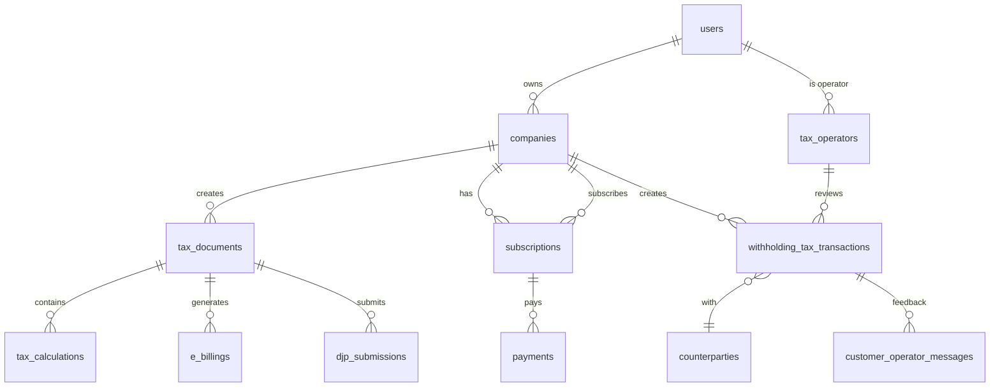

# Database Design (ERD)

**AI PAJAK** - Entity Relationship Diagram

**Last Updated**: 2025-12-24
**Database**: PostgreSQL 16+ (Supabase)

---

## 📖 Overview

AI PAJAK의 데이터베이스는 **67개 테이블**로 구성되어 있으며, 다음 5가지 주요 도메인으로 분류됩니다:

1. **Core Entities** (핵심 엔티티) - 사용자, 회사, 권한
2. **Tax Filing** (세금 신고) - 세금 문서, 계산, 제출
3. **Billing & Payments** (청구 및 결제) - 구독, 결제, e-Billing
4. **Communication** (커뮤니케이션) - 알림, 메시지, 활동 로그
5. **Withholding Tax** (원천세) - 거래, 상대방, 검토 워크플로우

---

## 🗺️ Complete ERD Diagram



👉 **상세 다이어그램**: [erd-overview.md](erd-overview.md)

---

## 📂 문서 구조

### 📊 ERD Diagrams
전체 및 도메인별 ERD 다이어그램

| 문서 | 내용 | 테이블 수 |
|------|------|----------|
| [erd-overview.md](erd-overview.md) | 전체 ERD (67개 테이블) | 67 |
| [erd-core-entities.md](erd-core-entities.md) | 핵심 엔티티 (사용자, 회사, 권한) | 12 |
| [erd-tax-filing.md](erd-tax-filing.md) | 세금 신고 관련 | 18 |
| [erd-billing.md](erd-billing.md) | 청구 및 결제 | 8 |
| [erd-communication.md](erd-communication.md) | 알림 및 메시지 | 6 |

### 📋 Schema Details
테이블 스키마 상세 명세

| 문서 | 내용 |
|------|------|
| [schemas/data-dictionary.md](schemas/data-dictionary.md) | 전체 테이블 데이터 사전 |
| [schemas/hard-rules-enforcement.md](schemas/hard-rules-enforcement.md) | DB 레벨 규제 준수 강제 |

### 🔄 Migrations
데이터베이스 마이그레이션 스크립트

| 문서 | 내용 |
|------|------|
| [migrations/schema-migrations.md](migrations/schema-migrations.md) | Supabase 마이그레이션 스크립트 |

---

## 🗂️ 5 Major Domains

### 1. Core Entities (핵심 엔티티)

**12 tables** - 사용자 인증, 회사 관리, 권한

```sql
-- 주요 테이블
users                    -- Supabase Auth 사용자
companies                -- 법인 정보
tax_operators            -- 세무 상담원 (Phase 1)
operator_client_assignments  -- 상담원-고객 배정
rbac_roles               -- 역할 기반 접근 제어
rbac_permissions         -- 권한 정의
```

**핵심 특징**:
- ✅ Supabase Auth 통합
- ✅ 멀티테넌시 (회사별 데이터 격리)
- ✅ RBAC (역할 기반 접근 제어)
- ✅ Tax Operator 워크플로우 (Phase 1)

👉 **상세**: [erd-core-entities.md](erd-core-entities.md)

---

### 2. Tax Filing (세금 신고)

**18 tables** - 세금 문서, 계산, DJP 제출

```sql
-- 주요 테이블
tax_documents            -- 모든 세금 문서 (JSONB data)
tax_calculations         -- 세금 계산 결과
djp_submissions          -- DJP 제출 기록
uploaded_files           -- OCR 파일
ocr_results              -- OCR 인식 결과
tax_deadlines            -- 세금 마감일
ter_rates                -- TER 테이블 (PPh 21)
kbli_pph23_rates         -- KBLI-PPh23 매핑 (1,560개)
tax_treaties             -- Tax Treaty (71개국)
```

**핵심 특징**:
- ✅ JSONB 활용 (유연한 세금 데이터 구조)
- ✅ OCR 파이프라인 (OpenAI + Google Vision)
- ✅ TER 자동 계산 (128개 세율)
- ✅ KBLI 기반 원천세 자동 판단

👉 **상세**: [erd-tax-filing.md](erd-tax-filing.md)

---

### 3. Billing & Payments (청구 및 결제)

**8 tables** - 구독, 결제, e-Billing

```sql
-- 주요 테이블
subscriptions            -- 구독 관리 (Free/Basic/Pro/Enterprise)
payments                 -- 결제 내역 (Midtrans 연동)
e_billings               -- DJP e-Billing 코드
payment_plans            -- 구독 플랜 정의
```

**핵심 특징**:
- ✅ 4가지 플랜 (Free, Basic, Professional, Enterprise)
- ✅ Midtrans 결제 연동
- ✅ e-Billing 자동 생성 (7일 유효기간)
- ✅ 구독 제한 자동 적용 (trigger)

👉 **상세**: [erd-billing.md](erd-billing.md)

---

### 4. Communication (커뮤니케이션)

**6 tables** - 알림, 메시지, 활동 로그

```sql
-- 주요 테이블
notifications            -- 멀티채널 알림 (in-app, email, SMS)
customer_operator_messages  -- AI 챗봇 메시지
activity_logs            -- 감사 로그
deadline_reminders       -- 마감일 리마인더
```

**핵심 특징**:
- ✅ 멀티채널 알림 (In-App, Email, SMS, WhatsApp)
- ✅ AI 챗봇 메시지 (고객은 AI로 인식)
- ✅ 완전한 감사 로그 (누가, 언제, 무엇을)

👉 **상세**: [erd-communication.md](erd-communication.md)

---

### 5. Withholding Tax (원천세) ⭐ 신규

**8 tables** - 원천세 거래, 상대방, 검토 워크플로우

```sql
-- 주요 테이블
withholding_tax_transactions  -- 원천세 거래 (PPh 22/23/15/4(2)/26)
counterparties           -- 거래 상대방 마스터
customer_operator_messages  -- AI 챗봇 고객 소통
submission_tasks         -- 상담원 제출 작업 추적
```

**핵심 특징**:
- ✅ AI 자동 판단 (신뢰도 점수 포함)
- ✅ 3단계 검증 (AI → 상담원 → 슈퍼바이저)
- ✅ AI 챗봇 고객 피드백
- ✅ 상대방 정보 마스터 데이터 (중복 방지)

**상태 흐름**:
```
pending_operator_review
    ↓
operator_reviewing
    ↓
    ├── needs_customer_feedback (AI 챗봇)
    ├── operator_approved
    └── pending_supervisor_approval
        ↓
      approved
```

---

## 🔑 Key Design Decisions

### 1. JSONB for Tax Data
**이유**: 세금 유형별로 필드가 다름 (PPh 21 vs PPN vs PPh 23)

```sql
CREATE TABLE tax_documents (
  id UUID PRIMARY KEY,
  tax_type VARCHAR(20), -- 'PPH21', 'PPH23', 'PPN'
  data JSONB NOT NULL,  -- ⭐ 유연한 구조
  -- PPh 21: { employees: [...], grossIncome: 500000000 }
  -- PPN: { invoices: [...], totalSales: 1000000000 }
);
```

**장점**:
- ✅ 스키마 변경 없이 새 세금 유형 추가 가능
- ✅ 복잡한 중첩 데이터 저장 (직원 목록, 송장 등)
- ✅ PostgreSQL JSONB 쿼리 성능 우수

### 2. Row Level Security (RLS)
**이유**: 멀티테넌시 데이터 격리

```sql
-- 사용자는 자신의 회사 데이터만 조회
CREATE POLICY companies_select ON companies
  FOR SELECT USING (
    auth.uid() IN (
      SELECT user_id FROM company_users
      WHERE company_id = companies.id
    )
  );
```

### 3. Soft Delete
**이유**: 법적 보관 요구사항 (인도네시아 세법 10년)

```sql
CREATE TABLE tax_documents (
  deleted_at TIMESTAMP WITH TIME ZONE,
  deleted_by UUID REFERENCES users(id)
);
```

### 4. Audit Trail
**이유**: 세금 신고는 법적 증거 자료

```sql
CREATE TABLE activity_logs (
  actor_id UUID,
  action VARCHAR(50), -- 'create', 'update', 'submit_to_djp'
  entity_type VARCHAR(50),
  entity_id UUID,
  changes JSONB, -- 변경 전후 비교
  ip_address INET,
  user_agent TEXT,
  created_at TIMESTAMP WITH TIME ZONE
);
```

---

## 📊 Table Statistics

### By Domain
| 도메인 | 테이블 수 | 예상 Row 수 (1년) |
|--------|----------|------------------|
| Core Entities | 12 | 10,000 |
| Tax Filing | 18 | 500,000 |
| Billing | 8 | 50,000 |
| Communication | 6 | 1,000,000 |
| Withholding Tax | 8 | 300,000 |
| **Total** | **52** | **1,860,000** |

### Largest Tables (by row count)
1. `activity_logs` - 1M+ rows/year
2. `notifications` - 500K+ rows/year
3. `tax_documents` - 500K+ rows/year
4. `withholding_tax_transactions` - 300K+ rows/year

---

## 🔐 Security & Compliance

### Row Level Security (RLS)
모든 테이블에 RLS 정책 적용:
- ✅ 사용자는 자신의 회사 데이터만 접근
- ✅ 세무사는 권한 부여된 고객사만 조회
- ✅ Tax Operator는 배정된 35개 고객만 조회

### Hard Rules Enforcement
DB Trigger로 규제 강제:
- ✅ Tax Consultant는 5개 이하 회사만 소유 (법적 제한)
- ✅ 구독 제한 자동 체크 (문서 수, OCR 수)
- ✅ NPWP 형식 검증 (XX.XXX.XXX.X-XXX.XXX)

👉 **상세**: [schemas/hard-rules-enforcement.md](schemas/hard-rules-enforcement.md)

### Data Retention
- **세금 문서**: 10년 보관 (인도네시아 세법)
- **활동 로그**: 5년 보관
- **알림**: 1년 후 자동 삭제

---

## 🚀 Performance Optimization

### Indexes
주요 쿼리 패턴에 대한 인덱스:

```sql
-- 회사별 세금 문서 조회 (가장 빈번)
CREATE INDEX idx_tax_documents_company_period
  ON tax_documents(company_id, period_year, period_month);

-- 마감일 조회
CREATE INDEX idx_tax_deadlines_date
  ON tax_deadlines(deadline_date)
  WHERE status = 'upcoming';

-- 원천세 검토 대기열
CREATE INDEX idx_wht_status
  ON withholding_tax_transactions(review_status, ai_confidence);
```

### Partitioning (Future)
대용량 테이블 파티셔닝:

```sql
-- activity_logs를 월별 파티션
CREATE TABLE activity_logs_2025_01 PARTITION OF activity_logs
  FOR VALUES FROM ('2025-01-01') TO ('2025-02-01');
```

---

## 📚 Related Documents

### Product Requirements
→ [PRD/README.md](../PRD/README.md)

### API Design
→ [API/README.md](../API/README.md)

### Implementation Guide
→ [IMPLEMENTATION/README.md](../IMPLEMENTATION/README.md)

---

## 🔄 Migration Status

| Migration | Status | Date |
|-----------|--------|------|
| Initial Schema (67 tables) | ✅ Complete | 2025-12-23 |
| RLS Policies | ✅ Complete | 2025-12-23 |
| Indexes | ✅ Complete | 2025-12-23 |
| Withholding Tax Tables | 🟡 In Progress | 2025-12-24 |

---

**Need Help?** 각 ERD 문서의 Mermaid 다이어그램을 참고하세요!
