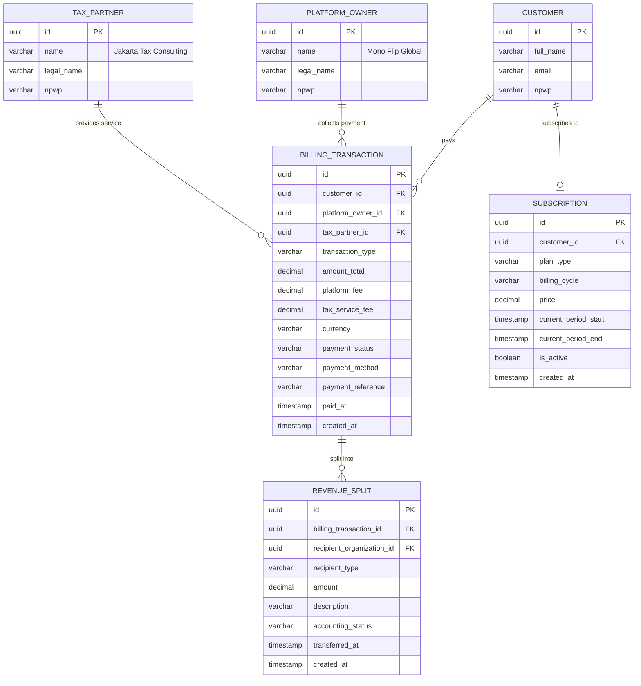

# Billing & Payment Entities

**Version**: 1.0
**Date**: 2025-12-23

This document describes the billing and payment entities that implement the collection agency model, where Mono Flip Global collects payments and distributes them to service providers.

## Entity Relationship Diagram (Billing)



## Billing Transaction

### Purpose
Records all financial transactions between customers, platform owner (collector), and tax partner (service provider).

### Business Rules
- **Collection Agency Model**: Platform Owner collects all payments
- **Service Provider Separation**: Tax Partner provides service, doesn't collect
- **Dual Fee Structure**: Platform fee + Tax service fee
- **Payment Gateway**: Integration with Indonesian payment gateways (Midtrans, Xendit)
- **Revenue Recognition**: Automatic revenue split creation

### Schema

| Column | Type | Constraints | Description |
|--------|------|-------------|-------------|
| `id` | UUID | PRIMARY KEY | Unique identifier |
| `customer_id` | UUID | NOT NULL, FK → customer(id) | Customer making payment |
| `platform_owner_id` | UUID | NOT NULL, FK → platform_owner(id) | Mono Flip Global (collector) |
| `tax_partner_id` | UUID | NULL, FK → tax_partner(id) | JTC (service provider, if applicable) |
| `transaction_type` | VARCHAR | NOT NULL | Transaction type (enum) |
| `amount_total` | DECIMAL(12,2) | NOT NULL | Total amount in IDR |
| `platform_fee` | DECIMAL(12,2) | NOT NULL | Fee to platform owner |
| `tax_service_fee` | DECIMAL(12,2) | NULL | Fee to tax partner |
| `currency` | VARCHAR(3) | NOT NULL, DEFAULT 'IDR' | Currency code |
| `payment_status` | VARCHAR | NOT NULL | Payment status (enum) |
| `payment_method` | VARCHAR | NULL | Payment method used |
| `payment_reference` | VARCHAR | NULL, UNIQUE | Payment gateway reference |
| `paid_at` | TIMESTAMP | NULL | Payment completion timestamp |
| `created_at` | TIMESTAMP | NOT NULL, DEFAULT NOW() | Transaction creation timestamp |

### Transaction Types

| Type | Description | Fee Structure |
|------|-------------|---------------|
| `SUBSCRIPTION` | Monthly/annual subscription | platform_fee only, tax_service_fee = NULL |
| `TAX_SERVICE` | Tax filing service | platform_fee + tax_service_fee |

### Payment Status

| Status | Description | Actions Available |
|--------|-------------|-------------------|
| `PENDING` | Payment initiated, awaiting completion | Cancel |
| `PAID` | Payment successful | Refund |
| `FAILED` | Payment failed | Retry |
| `REFUNDED` | Payment refunded | None |

### Payment Methods

- `BANK_TRANSFER` - Bank transfer (virtual account)
- `CREDIT_CARD` - Credit/debit card
- `E_WALLET` - Digital wallet (GoPay, OVO, DANA)
- `QRIS` - QR Indonesian Standard

### Indexes
- PRIMARY KEY on `id`
- INDEX on `customer_id` (customer transactions)
- INDEX on `platform_owner_id` (collector transactions)
- INDEX on `tax_partner_id` (service provider transactions)
- UNIQUE INDEX on `payment_reference` (payment gateway reference)
- COMPOSITE INDEX on `(payment_status, created_at DESC)` (status filtering)
- INDEX on `paid_at` (revenue recognition)

### Constraints
- CHECK: `transaction_type IN ('SUBSCRIPTION', 'TAX_SERVICE')`
- CHECK: `payment_status IN ('PENDING', 'PAID', 'FAILED', 'REFUNDED')`
- CHECK: `currency = 'IDR'`
- CHECK: `amount_total > 0`
- CHECK: `platform_fee >= 0`
- CHECK: `tax_service_fee >= 0 OR tax_service_fee IS NULL`
- CHECK: `amount_total = platform_fee + COALESCE(tax_service_fee, 0)`
- CHECK: If `transaction_type = 'SUBSCRIPTION'`, then `tax_partner_id IS NULL` AND `tax_service_fee IS NULL`
- CHECK: If `transaction_type = 'TAX_SERVICE'`, then `tax_partner_id IS NOT NULL` AND `tax_service_fee IS NOT NULL`
- CHECK: `platform_owner_id != tax_partner_id OR tax_partner_id IS NULL` (Hard Rule 4)

### Triggers
- `create_revenue_splits()` - Auto-creates revenue split records on PAID status
- `update_subscription_status()` - Updates subscription status on payment
- `audit_transaction_changes()` - Creates audit log entries

### RLS Policies
- **SELECT**: Customer (own transactions), Platform Admin (all), Tax Partner (service transactions), SYSTEM
- **INSERT**: SYSTEM only (via payment gateway webhook)
- **UPDATE**: SYSTEM only (payment status updates)
- **DELETE**: Not allowed

### Cross-References
- References: [CUSTOMER](erd-core-entities.md#customer)
- References: [PLATFORM_OWNER](erd-core-entities.md#platform-owner)
- References: [TAX_PARTNER](erd-core-entities.md#tax-partner)
- Referenced by: [REVENUE_SPLIT](erd-billing.md#revenue-split)
- Enforces: [Hard Rule 4 - Billing Collector ≠ Service Provider](hard-rules-enforcement.md#rule-4-billing-collector--service-provider)

---

## Revenue Split

### Purpose
Tracks revenue distribution from billing transactions to recipient organizations (Platform Owner and Tax Partner).

### Business Rules
- **Automatic Creation**: Created automatically when transaction status = PAID
- **Dual Recipients**: Platform fee to Platform Owner, Tax service fee to Tax Partner
- **Accounting Status**: Tracks transfer status for financial reporting
- **Immutable**: Cannot be modified after creation
- **Reconciliation**: Used for financial reconciliation and reporting

### Schema

| Column | Type | Constraints | Description |
|--------|------|-------------|-------------|
| `id` | UUID | PRIMARY KEY | Unique identifier |
| `billing_transaction_id` | UUID | NOT NULL, FK → billing_transaction(id) | Source transaction |
| `recipient_organization_id` | UUID | NOT NULL | Recipient ID (polymorphic) |
| `recipient_type` | VARCHAR | NOT NULL | Recipient type (enum) |
| `amount` | DECIMAL(12,2) | NOT NULL | Amount to recipient |
| `description` | VARCHAR | NOT NULL | Description of split |
| `accounting_status` | VARCHAR | NOT NULL | Accounting status (enum) |
| `transferred_at` | TIMESTAMP | NULL | Transfer completion timestamp |
| `created_at` | TIMESTAMP | NOT NULL, DEFAULT NOW() | Split creation timestamp |

### Recipient Types

| Type | Description | Organization Table |
|------|-------------|--------------------|
| `PLATFORM_OWNER` | Platform fee to Mono Flip Global | platform_owner |
| `TAX_PARTNER` | Tax service fee to Jakarta Tax Consulting | tax_partner |

### Accounting Status

| Status | Description | Accounting Action |
|--------|-------------|-------------------|
| `PENDING` | Split created, awaiting recognition | None |
| `RECOGNIZED` | Revenue recognized in accounting system | Journal entry created |
| `TRANSFERRED` | Amount transferred to recipient | Bank transfer completed |

### Indexes
- PRIMARY KEY on `id`
- INDEX on `billing_transaction_id` (transaction splits)
- INDEX on `recipient_organization_id` (recipient revenue)
- COMPOSITE INDEX on `(recipient_type, accounting_status, created_at DESC)` (accounting queries)
- INDEX on `transferred_at` (transfer tracking)

### Constraints
- CHECK: `recipient_type IN ('PLATFORM_OWNER', 'TAX_PARTNER')`
- CHECK: `accounting_status IN ('PENDING', 'RECOGNIZED', 'TRANSFERRED')`
- CHECK: `amount > 0`
- CHECK: If `accounting_status = 'TRANSFERRED'`, then `transferred_at IS NOT NULL`

### Triggers
- `validate_revenue_split_sum()` - Ensures splits sum to transaction amount
- `prevent_revenue_split_modification()` - Blocks updates and deletes

### RLS Policies
- **SELECT**: Platform Admin (all), Recipient organization (own splits), SYSTEM
- **INSERT**: SYSTEM only (automatic creation)
- **UPDATE**: SYSTEM only (accounting status updates)
- **DELETE**: Not allowed

### Cross-References
- References: [BILLING_TRANSACTION](erd-billing.md#billing-transaction)
- References: [PLATFORM_OWNER](erd-core-entities.md#platform-owner) (via recipient_organization_id)
- References: [TAX_PARTNER](erd-core-entities.md#tax-partner) (via recipient_organization_id)
- Enforces: [Hard Rule 4 - Billing Collector ≠ Service Provider](hard-rules-enforcement.md#rule-4-billing-collector--service-provider)

---

## Subscription

### Purpose
Manages customer subscription plans for platform access and features.

### Business Rules
- **One Active Subscription**: Customer can have only one active subscription
- **Auto-Renewal**: Subscriptions auto-renew unless cancelled
- **Billing Cycles**: Monthly or annual billing
- **Plan Tiers**: FREE, BASIC, PROFESSIONAL, ENTERPRISE
- **Free Plan**: Always active, no payment required

### Schema

| Column | Type | Constraints | Description |
|--------|------|-------------|-------------|
| `id` | UUID | PRIMARY KEY | Unique identifier |
| `customer_id` | UUID | NOT NULL, FK → customer(id) | Customer reference |
| `plan_type` | VARCHAR | NOT NULL | Subscription plan (enum) |
| `billing_cycle` | VARCHAR | NOT NULL | Billing frequency (enum) |
| `price` | DECIMAL(12,2) | NOT NULL | Plan price per cycle |
| `current_period_start` | TIMESTAMP | NOT NULL | Current billing period start |
| `current_period_end` | TIMESTAMP | NOT NULL | Current billing period end |
| `is_active` | BOOLEAN | NOT NULL, DEFAULT TRUE | Subscription active status |
| `created_at` | TIMESTAMP | NOT NULL, DEFAULT NOW() | Subscription creation timestamp |

### Plan Types

| Plan | Description | Price (Monthly) | Price (Annual) | Features |
|------|-------------|----------------|----------------|----------|
| `FREE` | Basic access | 0 | 0 | Limited tax filings, basic support |
| `BASIC` | Individual users | 99,000 | 990,000 | Unlimited PPh21, email support |
| `PROFESSIONAL` | Small businesses | 299,000 | 2,990,000 | All tax types, priority support |
| `ENTERPRISE` | Large companies | Custom | Custom | Dedicated consultant, API access |

### Billing Cycles

| Cycle | Description | Renewal Frequency |
|-------|-------------|-------------------|
| `MONTHLY` | Monthly billing | Every 30 days |
| `ANNUAL` | Annual billing | Every 365 days |

### Indexes
- PRIMARY KEY on `id`
- COMPOSITE INDEX on `(customer_id, is_active)` (active subscription lookup)
- INDEX on `plan_type` (plan analytics)
- INDEX on `current_period_end` (renewal processing)
- UNIQUE INDEX on `customer_id WHERE is_active = TRUE` (one active subscription)

### Constraints
- CHECK: `plan_type IN ('FREE', 'BASIC', 'PROFESSIONAL', 'ENTERPRISE')`
- CHECK: `billing_cycle IN ('MONTHLY', 'ANNUAL')`
- CHECK: `price >= 0`
- CHECK: `current_period_end > current_period_start`
- CHECK: If `plan_type = 'FREE'`, then `price = 0`
- UNIQUE: Only one active subscription per customer

### Triggers
- `auto_create_free_subscription()` - Creates FREE subscription on customer registration
- `renew_subscription()` - Auto-renews subscription on period end
- `create_subscription_transaction()` - Creates billing transaction on renewal

### RLS Policies
- **SELECT**: Customer (own subscription), Platform Admin (all), SYSTEM
- **INSERT**: SYSTEM only (automatic creation)
- **UPDATE**: SYSTEM only (plan changes, renewals)
- **DELETE**: Not allowed (use is_active = FALSE)

### Cross-References
- References: [CUSTOMER](erd-core-entities.md#customer)
- Creates: [BILLING_TRANSACTION](erd-billing.md#billing-transaction) (on renewal)

---

## Payment Flow

### Subscription Payment Flow

```
1. Customer upgrades plan
   → Subscription record created/updated
   ↓
2. Billing transaction created
   → transaction_type = 'SUBSCRIPTION'
   → platform_fee = subscription price
   → tax_service_fee = NULL
   → payment_status = 'PENDING'
   ↓
3. Customer completes payment (payment gateway)
   → Webhook received
   → payment_status = 'PAID'
   → paid_at = NOW()
   ↓
4. Revenue split created (automatic trigger)
   → recipient_type = 'PLATFORM_OWNER'
   → amount = platform_fee
   → accounting_status = 'PENDING'
   ↓
5. Accounting system processes
   → accounting_status = 'RECOGNIZED'
   → transferred_at = transfer date
   → accounting_status = 'TRANSFERRED'
```

### Tax Service Payment Flow

```
1. Tax filing completed
   → Service fee calculated
   ↓
2. Billing transaction created
   → transaction_type = 'TAX_SERVICE'
   → platform_fee = AI Pajak commission (20%)
   → tax_service_fee = JTC service fee (80%)
   → payment_status = 'PENDING'
   ↓
3. Customer completes payment
   → payment_status = 'PAID'
   ↓
4. Revenue splits created (automatic trigger)
   a. Platform Owner split
      → recipient_type = 'PLATFORM_OWNER'
      → amount = platform_fee
   b. Tax Partner split
      → recipient_type = 'TAX_PARTNER'
      → amount = tax_service_fee
   ↓
5. Accounting processing
   → Both splits: PENDING → RECOGNIZED → TRANSFERRED
```

---

## Revenue Reconciliation

### Daily Reconciliation Query

```sql
-- Daily revenue summary by recipient
SELECT
    recipient_type,
    accounting_status,
    COUNT(*) as split_count,
    SUM(amount) as total_amount,
    DATE(created_at) as date
FROM revenue_split
WHERE created_at >= CURRENT_DATE - INTERVAL '30 days'
GROUP BY recipient_type, accounting_status, DATE(created_at)
ORDER BY date DESC, recipient_type;
```

### Monthly Revenue Report

```sql
-- Monthly revenue by transaction type
SELECT
    DATE_TRUNC('month', bt.created_at) as month,
    bt.transaction_type,
    COUNT(*) as transaction_count,
    SUM(bt.amount_total) as gross_revenue,
    SUM(bt.platform_fee) as platform_revenue,
    SUM(bt.tax_service_fee) as tax_partner_revenue
FROM billing_transaction bt
WHERE bt.payment_status = 'PAID'
    AND bt.created_at >= DATE_TRUNC('month', CURRENT_DATE - INTERVAL '12 months')
GROUP BY DATE_TRUNC('month', bt.created_at), bt.transaction_type
ORDER BY month DESC, transaction_type;
```

---

## Summary

### Billing Architecture

**Collection Agency Model:**
- Mono Flip Global collects all payments
- Revenue automatically split to recipients
- Platform Owner receives platform fees
- Tax Partner receives tax service fees

### Key Constraints

1. **Billing Transaction** - Platform Owner ≠ Tax Partner
2. **Revenue Split** - Automatic creation on PAID status
3. **Subscription** - One active subscription per customer
4. **Immutability** - Revenue splits cannot be modified
5. **Reconciliation** - Complete audit trail for accounting

### Security Features

- **RLS Policies**: Database-level access control
- **SYSTEM Role**: Only SYSTEM can create transactions
- **Immutable Records**: Prevents financial tampering
- **Audit Trail**: All changes logged

### Integration Points

**Payment Gateways:**
- Midtrans
- Xendit
- Doku

**Accounting Systems:**
- Revenue recognition automation
- Transfer tracking
- Reconciliation reporting

### Next Steps

- Review [erd-communication.md](erd-communication.md) for communication entities
- Review [hard-rules-enforcement.md](hard-rules-enforcement.md) for compliance enforcement
- Review [data-dictionary.md](data-dictionary.md) for complete schema details
