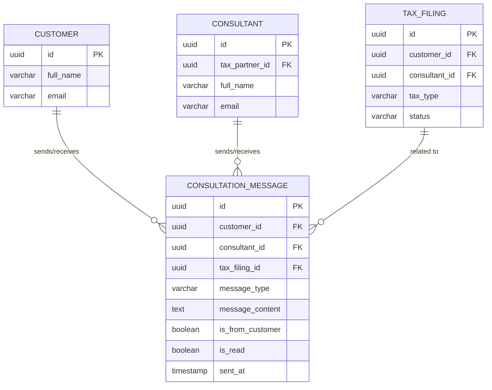

# Communication Entities

**Version**: 1.0
**Date**: 2025-12-23

This document describes the communication entities used for customer-consultant messaging and support.

## Entity Relationship Diagram (Communication)



## Consultation Message

### Purpose
Enables communication between customers and JTC consultants for tax-related questions and support.

### Business Rules
- **Customer-Consultant Only**: Communication limited to customer and assigned/available consultants
- **Optional Tax Filing Link**: Messages can be linked to specific tax filings
- **Message Types**: Questions, responses, document requests
- **Read Receipts**: Track message read status
- **Privacy**: Messages cannot be accessed by Platform Admins
- **Consultant Assignment**: Messages auto-assigned to consultants or routed to available consultants

### Schema

| Column | Type | Constraints | Description |
|--------|------|-------------|-------------|
| `id` | UUID | PRIMARY KEY | Unique identifier |
| `customer_id` | UUID | NOT NULL, FK → customer(id) | Customer in conversation |
| `consultant_id` | UUID | NULL, FK → consultant(id) | JTC consultant (NULL if unassigned) |
| `tax_filing_id` | UUID | NULL, FK → tax_filing(id) | Related tax filing (optional) |
| `message_type` | VARCHAR | NOT NULL | Message type (enum) |
| `message_content` | TEXT | NOT NULL | Message body |
| `is_from_customer` | BOOLEAN | NOT NULL | Direction: customer → consultant or consultant → customer |
| `is_read` | BOOLEAN | NOT NULL, DEFAULT FALSE | Read status |
| `sent_at` | TIMESTAMP | NOT NULL, DEFAULT NOW() | Message send timestamp |

### Message Types

| Type | Description | Typical Sender | Actions |
|------|-------------|----------------|---------|
| `QUESTION` | General tax question | Customer | Consultant responds |
| `RESPONSE` | Response to question | Consultant | Customer reads |
| `DOCUMENT_REQUEST` | Request for additional documents | Consultant | Customer uploads |
| `STATUS_UPDATE` | Tax filing status update | Consultant | Customer notified |
| `CLARIFICATION` | Request for clarification | Consultant | Customer responds |

### Indexes
- PRIMARY KEY on `id`
- COMPOSITE INDEX on `(customer_id, sent_at DESC)` (customer message history)
- INDEX on `consultant_id` (consultant messages)
- INDEX on `tax_filing_id` (filing-related messages)
- COMPOSITE INDEX on `(is_from_customer, is_read, sent_at DESC)` (unread messages)
- INDEX on `message_type` (filtering by type)

### Constraints
- CHECK: `message_type IN ('QUESTION', 'RESPONSE', 'DOCUMENT_REQUEST', 'STATUS_UPDATE', 'CLARIFICATION')`
- CHECK: `message_content` length between 1 and 5000 characters
- CHECK: If `is_from_customer = TRUE`, then sender is customer
- CHECK: If `is_from_customer = FALSE`, then sender is consultant AND `consultant_id IS NOT NULL`

### Triggers
- `auto_assign_consultant()` - Auto-assigns available consultant if NULL
- `notify_recipient()` - Sends notification to recipient (email/push)
- `audit_message_access()` - Logs message access (read events)

### RLS Policies
- **SELECT**: Customer (own messages), JTC consultant (assigned messages or all if unassigned), JTC advisor (all messages)
- **INSERT**: Customer (questions), JTC consultant (responses)
- **UPDATE**: Recipient only (mark as read)
- **DELETE**: Not allowed
- **BLOCK**: PLATFORM_ADMIN completely blocked from accessing messages

### Cross-References
- References: [CUSTOMER](erd-core-entities.md#customer)
- References: [CONSULTANT](erd-core-entities.md#consultant)
- References: [TAX_FILING](erd-tax-filing.md#tax-filing)
- Enforces: [Hard Rule 1 - PLATFORM_ADMIN Cannot Access Tax Data](hard-rules-enforcement.md#rule-1-platform_admin-cannot-access-tax-data)

---

## Message Flow

### Customer Initiates Conversation

```
1. Customer sends question
   → message_type = 'QUESTION'
   → is_from_customer = TRUE
   → consultant_id = NULL (if no assignment)
   ↓
2. Trigger: auto_assign_consultant()
   → Finds available JTC consultant
   → Sets consultant_id
   → Sends notification to consultant
   ↓
3. Consultant receives notification
   → Opens message
   → is_read = TRUE (updated)
   ↓
4. Consultant responds
   → message_type = 'RESPONSE'
   → is_from_customer = FALSE
   → Notification sent to customer
   ↓
5. Customer reads response
   → is_read = TRUE
```

### Consultant Initiates (Tax Filing Context)

```
1. Consultant reviewing tax filing
   → Needs clarification from customer
   ↓
2. Consultant sends message
   → message_type = 'CLARIFICATION'
   → tax_filing_id = [filing ID]
   → is_from_customer = FALSE
   ↓
3. Customer receives notification
   → Customer opens message
   → is_read = TRUE
   ↓
4. Customer responds
   → message_type = 'RESPONSE'
   → is_from_customer = TRUE
   ↓
5. Consultant reads response
   → is_read = TRUE
   → Continues tax filing processing
```

---

## Message Queries

### Unread Messages for Customer

```sql
-- Get all unread messages for a customer
SELECT
    cm.id,
    cm.message_type,
    cm.message_content,
    cm.sent_at,
    c.full_name as consultant_name,
    tf.tax_type,
    tf.tax_period
FROM consultation_message cm
LEFT JOIN consultant c ON cm.consultant_id = c.id
LEFT JOIN tax_filing tf ON cm.tax_filing_id = tf.id
WHERE cm.customer_id = :customer_id
    AND cm.is_from_customer = FALSE
    AND cm.is_read = FALSE
ORDER BY cm.sent_at DESC;
```

### Unread Messages for Consultant

```sql
-- Get all unread messages for a consultant
SELECT
    cm.id,
    cm.message_type,
    cm.message_content,
    cm.sent_at,
    cust.full_name as customer_name,
    cust.email as customer_email,
    tf.tax_type,
    tf.tax_period
FROM consultation_message cm
JOIN customer cust ON cm.customer_id = cust.id
LEFT JOIN tax_filing tf ON cm.tax_filing_id = tf.id
WHERE cm.consultant_id = :consultant_id
    AND cm.is_from_customer = TRUE
    AND cm.is_read = FALSE
ORDER BY cm.sent_at DESC;
```

### Conversation Thread

```sql
-- Get all messages in a conversation (customer + consultant)
SELECT
    cm.id,
    cm.message_type,
    cm.message_content,
    cm.is_from_customer,
    cm.is_read,
    cm.sent_at,
    CASE
        WHEN cm.is_from_customer THEN cust.full_name
        ELSE cons.full_name
    END as sender_name
FROM consultation_message cm
JOIN customer cust ON cm.customer_id = cust.id
LEFT JOIN consultant cons ON cm.consultant_id = cons.id
WHERE cm.customer_id = :customer_id
    AND (cm.consultant_id = :consultant_id OR cm.consultant_id IS NULL)
ORDER BY cm.sent_at ASC;
```

### Tax Filing Messages

```sql
-- Get all messages related to a specific tax filing
SELECT
    cm.id,
    cm.message_type,
    cm.message_content,
    cm.is_from_customer,
    cm.sent_at,
    CASE
        WHEN cm.is_from_customer THEN 'Customer'
        ELSE cons.full_name
    END as sender
FROM consultation_message cm
LEFT JOIN consultant cons ON cm.consultant_id = cons.id
WHERE cm.tax_filing_id = :tax_filing_id
ORDER BY cm.sent_at ASC;
```

---

## Consultant Assignment Logic

### Auto-Assignment Strategy

```sql
-- Function: Auto-assign available consultant
CREATE FUNCTION auto_assign_consultant(p_customer_id UUID)
RETURNS UUID AS $$
DECLARE
    v_consultant_id UUID;
BEGIN
    -- Priority 1: Consultant who previously helped this customer
    SELECT c.id INTO v_consultant_id
    FROM consultant c
    JOIN consultation_message cm ON cm.consultant_id = c.id
    WHERE cm.customer_id = p_customer_id
        AND c.is_active = TRUE
    GROUP BY c.id
    ORDER BY COUNT(*) DESC, MAX(cm.sent_at) DESC
    LIMIT 1;

    -- Priority 2: Consultant with lowest workload
    IF v_consultant_id IS NULL THEN
        SELECT c.id INTO v_consultant_id
        FROM consultant c
        LEFT JOIN consultation_message cm ON cm.consultant_id = c.id
            AND cm.sent_at > NOW() - INTERVAL '7 days'
        WHERE c.is_active = TRUE
        GROUP BY c.id
        ORDER BY COUNT(cm.id) ASC
        LIMIT 1;
    END IF;

    RETURN v_consultant_id;
END;
$$ LANGUAGE plpgsql;
```

---

## Notification System

### Notification Triggers

**Email Notifications:**
- New message received (customer or consultant)
- Document request from consultant
- Tax filing status update

**Push Notifications:**
- New message (real-time)
- Unread message reminder (daily digest)

**In-App Notifications:**
- Unread message count
- Real-time message arrival

### Notification Preferences

Customers and consultants can configure:
- Email notification frequency (real-time, daily digest, off)
- Push notification enable/disable
- In-app notification enable/disable

---

## Privacy & Security

### Access Control

**Customer Access:**
- Own messages only
- Cannot see other customers' messages
- Cannot see internal consultant notes

**Consultant Access (JTC):**
- Assigned customer messages
- Can view unassigned messages (for assignment)
- Can view all messages if TAX_ADVISOR_JTC role

**Platform Admin:**
- **NO ACCESS** to message content
- Can view anonymized metrics only (message counts, response times)

### Data Retention

**Active Conversations:**
- Retained indefinitely while customer account is active

**Closed Conversations:**
- Retained for 7 years (Indonesian tax record retention requirement)
- Archived after 2 years of inactivity

**Deleted Accounts:**
- Messages anonymized (customer_id retained for audit)
- Message content encrypted and archived

### Encryption

- **At Rest**: Database-level encryption (RDS PostgreSQL)
- **In Transit**: TLS 1.3
- **Application Level**: Optional end-to-end encryption for sensitive messages

---

## Analytics & Reporting

### Consultant Performance Metrics

```sql
-- Average response time by consultant
SELECT
    c.full_name as consultant_name,
    COUNT(*) as total_messages,
    AVG(
        EXTRACT(EPOCH FROM (response.sent_at - question.sent_at)) / 3600
    ) as avg_response_time_hours
FROM consultant c
JOIN consultation_message response ON response.consultant_id = c.id
    AND response.is_from_customer = FALSE
JOIN consultation_message question ON question.customer_id = response.customer_id
    AND question.is_from_customer = TRUE
    AND question.sent_at < response.sent_at
    AND NOT EXISTS (
        -- No earlier response
        SELECT 1 FROM consultation_message earlier
        WHERE earlier.customer_id = question.customer_id
            AND earlier.is_from_customer = FALSE
            AND earlier.sent_at > question.sent_at
            AND earlier.sent_at < response.sent_at
    )
WHERE response.sent_at >= NOW() - INTERVAL '30 days'
GROUP BY c.id, c.full_name
ORDER BY avg_response_time_hours ASC;
```

### Message Volume Trends

```sql
-- Daily message volume by type
SELECT
    DATE(sent_at) as date,
    message_type,
    is_from_customer,
    COUNT(*) as message_count
FROM consultation_message
WHERE sent_at >= CURRENT_DATE - INTERVAL '30 days'
GROUP BY DATE(sent_at), message_type, is_from_customer
ORDER BY date DESC, message_type;
```

---

## Summary

### Communication Architecture

**Core Features:**
- Customer-consultant messaging
- Tax filing context linking
- Auto-assignment of consultants
- Read receipt tracking
- Notification system

### Key Constraints

1. **Privacy** - Platform Admins cannot access messages
2. **Assignment** - Auto-assignment to available consultants
3. **Context** - Optional tax filing linkage
4. **Audit** - Message access logged
5. **Retention** - 7-year retention for compliance

### Security Features

- **RLS Policies**: Database-level access control
- **Encryption**: At rest and in transit
- **Audit Trail**: Message access logging
- **Privacy**: No platform admin access

### Integration Points

**Notification Services:**
- Email (SendGrid, AWS SES)
- Push notifications (Firebase Cloud Messaging)
- SMS (Twilio) - optional for urgent messages

**Real-time Messaging:**
- WebSocket for real-time updates
- Firebase Realtime / Cloud Pub/Sub for live message delivery

### Next Steps

- Review [hard-rules-enforcement.md](hard-rules-enforcement.md) for compliance enforcement
- Review [data-dictionary.md](data-dictionary.md) for complete schema details
- Review [schema-migrations.md](schema-migrations.md) for implementation
