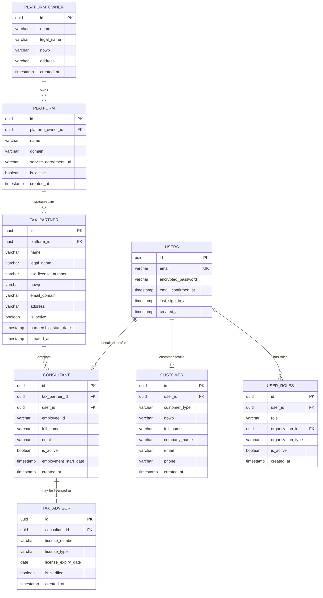

# Core Entities

**Version**: 1.0
**Date**: 2025-12-23

This document describes the core platform entities that form the foundation of the AI Pajak system.

## Entity Relationship Diagram (Core Entities)



## Platform Owner

### Purpose
Represents the legal entity that owns the platform and collects payments on behalf of service providers.

### Business Rules
- **Single Instance**: Only one platform owner (Mono Flip Global)
- **Billing Authority**: Collects all payments from customers
- **No Tax Access**: Cannot access customer tax data

### Schema

| Column | Type | Constraints | Description |
|--------|------|-------------|-------------|
| `id` | UUID | PRIMARY KEY | Unique identifier |
| `name` | VARCHAR | NOT NULL | Display name: "Mono Flip Global" |
| `legal_name` | VARCHAR | NOT NULL | Full legal entity name |
| `npwp` | VARCHAR | NOT NULL, UNIQUE | Indonesian tax ID |
| `address` | VARCHAR | NOT NULL | Legal business address |
| `created_at` | TIMESTAMP | NOT NULL, DEFAULT NOW() | Creation timestamp |

### Indexes
- PRIMARY KEY on `id`
- UNIQUE INDEX on `npwp`

### RLS Policies
- **SELECT**: Public (minimal info), Authenticated (full details)
- **INSERT/UPDATE/DELETE**: SYSTEM role only

### Cross-References
- Referenced by: [PLATFORM](erd-core-entities.md#platform)
- Referenced by: [BILLING_TRANSACTION](erd-billing.md#billing-transaction)
- Enforces: [Hard Rule 4 - Billing Collector](hard-rules-enforcement.md#rule-4-billing-collector--service-provider)

---

## Platform

### Purpose
Represents the software platform (AI Pajak) operated by the platform owner.

### Business Rules
- **Single Instance**: Only one platform (AI Pajak)
- **No Tax Data Access**: Platform admins cannot access tax data
- **Software Provider**: Provides technology infrastructure only

### Schema

| Column | Type | Constraints | Description |
|--------|------|-------------|-------------|
| `id` | UUID | PRIMARY KEY | Unique identifier |
| `platform_owner_id` | UUID | NOT NULL, FK → platform_owner(id) | Owner reference |
| `name` | VARCHAR | NOT NULL | Display name: "AI Pajak" |
| `domain` | VARCHAR | NOT NULL, UNIQUE | Platform domain: "ai-pajak.com" |
| `service_agreement_url` | VARCHAR | NULL | Terms of service URL |
| `is_active` | BOOLEAN | NOT NULL, DEFAULT TRUE | Active status |
| `created_at` | TIMESTAMP | NOT NULL, DEFAULT NOW() | Creation timestamp |

### Indexes
- PRIMARY KEY on `id`
- UNIQUE INDEX on `domain`
- FOREIGN KEY INDEX on `platform_owner_id`

### RLS Policies
- **SELECT**: Public (minimal info), Authenticated (full details)
- **INSERT/UPDATE**: PLATFORM_ADMIN or SYSTEM role
- **DELETE**: SYSTEM role only

### Cross-References
- References: [PLATFORM_OWNER](erd-core-entities.md#platform-owner)
- Referenced by: [TAX_PARTNER](erd-core-entities.md#tax-partner)
- Enforces: [Hard Rule 3 - Tax Filing Actor ≠ Platform](hard-rules-enforcement.md#rule-3-tax-filing-actor--platform)

---

## Tax Partner

### Purpose
Represents the tax service provider (Jakarta Tax Consulting) authorized to file taxes on behalf of customers.

### Business Rules
- **Licensed Entity**: Must have valid tax filing license
- **Exclusive Tax Authority**: Only JTC can file taxes
- **Legal Authorization**: Must have active POA from customers
- **Email Domain**: Official communications from verified domain

### Schema

| Column | Type | Constraints | Description |
|--------|------|-------------|-------------|
| `id` | UUID | PRIMARY KEY | Unique identifier |
| `platform_id` | UUID | NOT NULL, FK → platform(id) | Platform reference |
| `name` | VARCHAR | NOT NULL | Display name: "Jakarta Tax Consulting" |
| `legal_name` | VARCHAR | NOT NULL | Full legal entity name |
| `tax_license_number` | VARCHAR | NOT NULL, UNIQUE | Tax filing license |
| `npwp` | VARCHAR | NOT NULL, UNIQUE | Indonesian tax ID |
| `email_domain` | VARCHAR | NOT NULL, UNIQUE | Official email domain: "jakartatax.co.id" |
| `address` | VARCHAR | NOT NULL | Legal business address |
| `is_active` | BOOLEAN | NOT NULL, DEFAULT TRUE | Active status |
| `partnership_start_date` | TIMESTAMP | NOT NULL | Partnership start date |
| `created_at` | TIMESTAMP | NOT NULL, DEFAULT NOW() | Creation timestamp |

### Indexes
- PRIMARY KEY on `id`
- UNIQUE INDEX on `tax_license_number`
- UNIQUE INDEX on `npwp`
- UNIQUE INDEX on `email_domain`
- FOREIGN KEY INDEX on `platform_id`

### RLS Policies
- **SELECT**: Public (minimal info), Authenticated (full details)
- **INSERT/UPDATE**: SYSTEM role only (critical entity)
- **DELETE**: Not allowed (use is_active = FALSE)

### Cross-References
- References: [PLATFORM](erd-core-entities.md#platform)
- Referenced by: [CONSULTANT](erd-core-entities.md#consultant)
- Referenced by: [POWER_OF_ATTORNEY](erd-tax-filing.md#power-of-attorney)
- Referenced by: [BILLING_TRANSACTION](erd-billing.md#billing-transaction)
- Enforces: [Hard Rule 2 - Consultant MUST Belong to JTC](hard-rules-enforcement.md#rule-2-consultant-must-belong-to-jakarta-tax-consulting)

---

## Users

### Purpose
Authentication and identity management for all platform users.

### Business Rules
- **Email Unique**: One account per email address
- **Email Verification**: Must confirm email before full access
- **Multi-Role Support**: One user can have multiple roles
- **Authentication**: Managed by Supabase Auth

### Schema

| Column | Type | Constraints | Description |
|--------|------|-------------|-------------|
| `id` | UUID | PRIMARY KEY | Unique identifier |
| `email` | VARCHAR | NOT NULL, UNIQUE | User email address |
| `encrypted_password` | VARCHAR | NOT NULL | Hashed password (bcrypt) |
| `email_confirmed_at` | TIMESTAMP | NULL | Email verification timestamp |
| `last_sign_in_at` | TIMESTAMP | NULL | Last login timestamp |
| `created_at` | TIMESTAMP | NOT NULL, DEFAULT NOW() | Account creation timestamp |

### Indexes
- PRIMARY KEY on `id`
- UNIQUE INDEX on `email`
- INDEX on `email_confirmed_at` (filtering verified users)
- INDEX on `last_sign_in_at` (activity tracking)

### RLS Policies
- **SELECT**: Own record only
- **INSERT**: Public (registration)
- **UPDATE**: Own record only (profile updates)
- **DELETE**: Own record only (account deletion)

### Cross-References
- Referenced by: [USER_ROLES](erd-core-entities.md#user-roles)
- Referenced by: [CUSTOMER](erd-core-entities.md#customer)
- Referenced by: [CONSULTANT](erd-core-entities.md#consultant)
- Referenced by: [TAX_DOCUMENT](erd-tax-filing.md#tax-document) (uploaded_by)
- Referenced by: [TAX_ACTIVITY_LOG](erd-tax-filing.md#tax-activity-log) (actor)

---

## User Roles

### Purpose
Multi-role authorization system linking users to organizations and permissions.

### Business Rules
- **Multi-Role Support**: One user can have multiple active roles
- **Organization Context**: Roles tied to specific organizations (Tax Partner, Platform)
- **Role Types**: CUSTOMER, CONSULTANT, TAX_ADVISOR, PLATFORM_ADMIN, SYSTEM
- **Active Management**: Roles can be activated/deactivated without deletion

### Schema

| Column | Type | Constraints | Description |
|--------|------|-------------|-------------|
| `id` | UUID | PRIMARY KEY | Unique identifier |
| `user_id` | UUID | NOT NULL, FK → users(id) | User reference |
| `role` | VARCHAR | NOT NULL | Role type (enum) |
| `organization_id` | UUID | NULL | Organization reference (polymorphic) |
| `organization_type` | VARCHAR | NULL | TAX_PARTNER or PLATFORM |
| `is_active` | BOOLEAN | NOT NULL, DEFAULT TRUE | Role active status |
| `created_at` | TIMESTAMP | NOT NULL, DEFAULT NOW() | Role assignment timestamp |

### Role Types

| Role | Description | Organization Required | Access Level |
|------|-------------|----------------------|--------------|
| `CUSTOMER` | End user customer | No | Own data only |
| `CONSULTANT` | JTC consultant | Yes (TAX_PARTNER) | Assigned cases |
| `TAX_ADVISOR` | Licensed tax advisor | Yes (TAX_PARTNER) | All JTC cases |
| `PLATFORM_ADMIN` | Platform administrator | Yes (PLATFORM) | No tax data access |
| `SYSTEM` | System/automation | No | Full access (limited use) |

### Indexes
- PRIMARY KEY on `id`
- COMPOSITE INDEX on `(user_id, role, is_active)` (role lookup)
- INDEX on `organization_id` (organization-based filtering)
- FOREIGN KEY INDEX on `user_id`

### Constraints
- CHECK: `role IN ('CUSTOMER', 'CONSULTANT', 'TAX_ADVISOR', 'PLATFORM_ADMIN', 'SYSTEM')`
- CHECK: `organization_type IN ('TAX_PARTNER', 'PLATFORM', NULL)`
- CHECK: If `organization_id IS NOT NULL`, then `organization_type IS NOT NULL`

### RLS Policies
- **SELECT**: Own roles or organization members (if admin)
- **INSERT**: SYSTEM or organization admin only
- **UPDATE**: SYSTEM or organization admin (activate/deactivate)
- **DELETE**: SYSTEM only (prefer is_active = FALSE)

### Cross-References
- References: [USERS](erd-core-entities.md#users)
- References: [TAX_PARTNER](erd-core-entities.md#tax-partner) (via organization_id)
- References: [PLATFORM](erd-core-entities.md#platform) (via organization_id)
- Enforces: [Hard Rule 1 - PLATFORM_ADMIN Cannot Access Tax Data](hard-rules-enforcement.md#rule-1-platform_admin-cannot-access-tax-data)

---

## Customer

### Purpose
Customer profile information for individuals and companies using the platform.

### Business Rules
- **One Profile Per User**: Each user can have one customer profile
- **NPWP Required**: Indonesian tax ID required for tax filing
- **Customer Types**: INDIVIDUAL or COMPANY
- **Company Name**: Required only for COMPANY type

### Schema

| Column | Type | Constraints | Description |
|--------|------|-------------|-------------|
| `id` | UUID | PRIMARY KEY | Unique identifier |
| `user_id` | UUID | NOT NULL, UNIQUE, FK → users(id) | User reference |
| `customer_type` | VARCHAR | NOT NULL | INDIVIDUAL or COMPANY |
| `npwp` | VARCHAR | NOT NULL, UNIQUE | Indonesian tax ID (15 digits) |
| `full_name` | VARCHAR | NOT NULL | Full legal name |
| `company_name` | VARCHAR | NULL | Company name (if COMPANY type) |
| `email` | VARCHAR | NOT NULL | Contact email |
| `phone` | VARCHAR | NULL | Contact phone number |
| `created_at` | TIMESTAMP | NOT NULL, DEFAULT NOW() | Profile creation timestamp |

### Indexes
- PRIMARY KEY on `id`
- UNIQUE INDEX on `user_id`
- UNIQUE INDEX on `npwp`
- INDEX on `customer_type` (filtering by type)
- INDEX on `email` (contact lookup)

### Constraints
- CHECK: `customer_type IN ('INDIVIDUAL', 'COMPANY')`
- CHECK: If `customer_type = 'COMPANY'`, then `company_name IS NOT NULL`
- CHECK: `npwp` matches format (regex validation at application level)

### RLS Policies
- **SELECT**: Own profile or assigned JTC consultant/advisor
- **INSERT**: Authenticated user (registration)
- **UPDATE**: Own profile only
- **DELETE**: Own profile only (cascade to related data)

### Cross-References
- References: [USERS](erd-core-entities.md#users)
- Referenced by: [POWER_OF_ATTORNEY](erd-tax-filing.md#power-of-attorney)
- Referenced by: [TAX_FILING](erd-tax-filing.md#tax-filing)
- Referenced by: [BILLING_TRANSACTION](erd-billing.md#billing-transaction)
- Referenced by: [SUBSCRIPTION](erd-billing.md#subscription)
- Referenced by: [CONSULTATION_MESSAGE](erd-communication.md#consultation-message)
- Referenced by: [TAX_ACTIVITY_LOG](erd-tax-filing.md#tax-activity-log)

---

## Consultant

### Purpose
Tax consultants employed by Jakarta Tax Consulting to process customer tax filings.

### Business Rules
- **JTC Employees Only**: Must be employed by Jakarta Tax Consulting
- **One Profile Per User**: Each user can have one consultant profile
- **Email Domain**: Must use official JTC email domain
- **Active Management**: Can be activated/deactivated without deletion

### Schema

| Column | Type | Constraints | Description |
|--------|------|-------------|-------------|
| `id` | UUID | PRIMARY KEY | Unique identifier |
| `tax_partner_id` | UUID | NOT NULL, FK → tax_partner(id) | Must be JTC |
| `user_id` | UUID | NOT NULL, UNIQUE, FK → users(id) | User reference |
| `employee_id` | VARCHAR | NOT NULL, UNIQUE | JTC employee ID |
| `full_name` | VARCHAR | NOT NULL | Full legal name |
| `email` | VARCHAR | NOT NULL, UNIQUE | Official JTC email |
| `is_active` | BOOLEAN | NOT NULL, DEFAULT TRUE | Employment status |
| `employment_start_date` | TIMESTAMP | NOT NULL | Employment start date |
| `created_at` | TIMESTAMP | NOT NULL, DEFAULT NOW() | Profile creation timestamp |

### Indexes
- PRIMARY KEY on `id`
- UNIQUE INDEX on `user_id`
- UNIQUE INDEX on `employee_id`
- UNIQUE INDEX on `email`
- FOREIGN KEY INDEX on `tax_partner_id`
- INDEX on `is_active` (filtering active consultants)

### Constraints
- CHECK: Email domain matches `tax_partner.email_domain`
- Application-level validation: `tax_partner_id` must reference Jakarta Tax Consulting

### RLS Policies
- **SELECT**: Own profile or JTC organization members
- **INSERT**: SYSTEM or TAX_ADVISOR role
- **UPDATE**: Own profile or TAX_ADVISOR (employment status)
- **DELETE**: SYSTEM only (prefer is_active = FALSE)

### Cross-References
- References: [TAX_PARTNER](erd-core-entities.md#tax-partner)
- References: [USERS](erd-core-entities.md#users)
- Referenced by: [TAX_ADVISOR](erd-core-entities.md#tax-advisor)
- Referenced by: [TAX_FILING](erd-tax-filing.md#tax-filing)
- Referenced by: [CONSULTATION_MESSAGE](erd-communication.md#consultation-message)
- Enforces: [Hard Rule 2 - Consultant MUST Belong to JTC](hard-rules-enforcement.md#rule-2-consultant-must-belong-to-jakarta-tax-consulting)

---

## Tax Advisor

### Purpose
Licensed tax advisors who can review and approve tax filings.

### Business Rules
- **Must Be Consultant**: Tax advisors are consultants with additional licenses
- **License Required**: Must have valid Brevet A/B/C or CPA license
- **License Verification**: is_verified flag for manual license validation
- **Expiry Tracking**: License expiry date monitored for compliance

### Schema

| Column | Type | Constraints | Description |
|--------|------|-------------|-------------|
| `id` | UUID | PRIMARY KEY | Unique identifier |
| `consultant_id` | UUID | NOT NULL, UNIQUE, FK → consultant(id) | Consultant reference |
| `license_number` | VARCHAR | NOT NULL, UNIQUE | Tax advisor license number |
| `license_type` | VARCHAR | NOT NULL | Brevet A/B/C, CPA, etc. |
| `license_expiry_date` | DATE | NOT NULL | License expiration date |
| `is_verified` | BOOLEAN | NOT NULL, DEFAULT FALSE | Manual verification status |
| `created_at` | TIMESTAMP | NOT NULL, DEFAULT NOW() | License registration timestamp |

### License Types

| Type | Description | Authority |
|------|-------------|-----------|
| Brevet A | Basic tax consultant | IKPI |
| Brevet B | Intermediate tax consultant | IKPI |
| Brevet C | Advanced tax consultant | IKPI |
| CPA | Certified Public Accountant | IAI |

### Indexes
- PRIMARY KEY on `id`
- UNIQUE INDEX on `consultant_id`
- UNIQUE INDEX on `license_number`
- INDEX on `license_expiry_date` (expiry monitoring)
- INDEX on `is_verified` (filtering verified advisors)

### Constraints
- CHECK: `license_type IN ('Brevet A', 'Brevet B', 'Brevet C', 'CPA')`
- Application-level validation: `license_expiry_date` must be in the future

### RLS Policies
- **SELECT**: JTC organization members, customers (limited fields)
- **INSERT**: SYSTEM or TAX_ADVISOR (senior advisors)
- **UPDATE**: SYSTEM (license verification)
- **DELETE**: SYSTEM only

### Cross-References
- References: [CONSULTANT](erd-core-entities.md#consultant)
- Referenced by: [TAX_FILING](erd-tax-filing.md#tax-filing)
- Enforces: [Hard Rule 2 - Consultant MUST Belong to JTC](hard-rules-enforcement.md#rule-2-consultant-must-belong-to-jakarta-tax-consulting)

---

## Summary

### Entity Hierarchy

```
PLATFORM_OWNER (Mono Flip Global)
  └── PLATFORM (AI Pajak)
        └── TAX_PARTNER (Jakarta Tax Consulting)
              └── CONSULTANT
                    └── TAX_ADVISOR (optional)

USERS
  ├── USER_ROLES (multi-role support)
  ├── CUSTOMER (customer profile)
  └── CONSULTANT (consultant profile)
```

### Key Constraints

1. **Platform Owner** - Single instance entity
2. **Platform** - Single instance entity
3. **Tax Partner** - Single active instance (extensible)
4. **Consultant** - Must belong to Jakarta Tax Consulting
5. **Tax Advisor** - Must have valid license
6. **User Roles** - Multi-role support with organization context

### Next Steps

- Review [erd-tax-filing.md](erd-tax-filing.md) for tax filing workflow entities
- Review [erd-billing.md](erd-billing.md) for billing and payment entities
- Review [hard-rules-enforcement.md](hard-rules-enforcement.md) for compliance enforcement
- Review [data-dictionary.md](data-dictionary.md) for complete schema details
