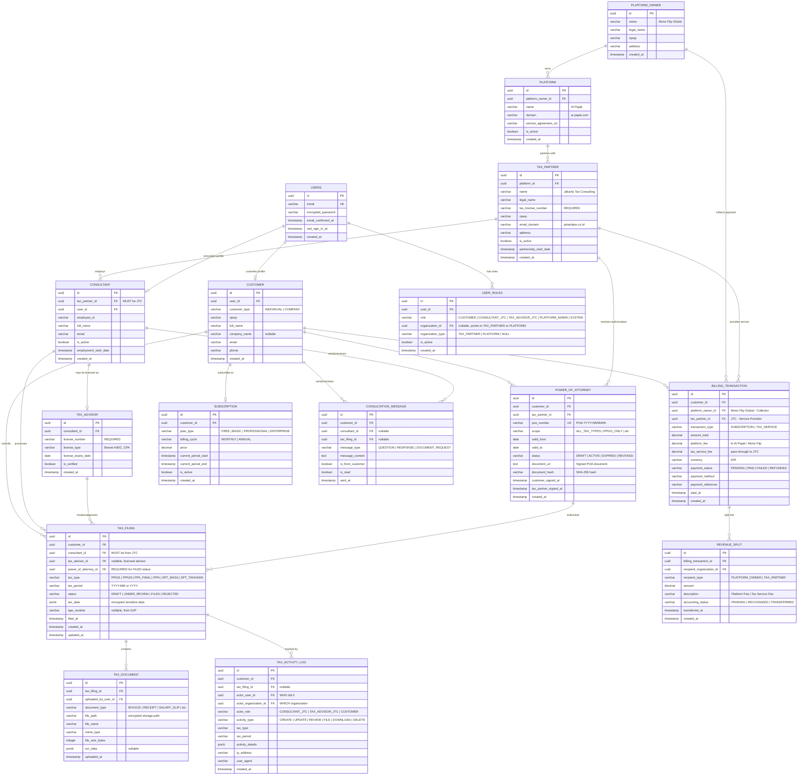

# ERD Overview

**Version**: 1.0
**Date**: 2025-12-23
**Status**: Initial Design

## Complete Entity Relationship Diagram



## Key Design Principles

### 1. Legal Separation of Duties

The ERD enforces strict separation between three legal entities:

- **Mono Flip Global (Platform Owner)** - Billing collection only
- **AI Pajak (Platform)** - Software platform operations
- **Jakarta Tax Consulting (Tax Partner)** - Tax filing services

### 2. Data Access Matrix

| Role | Tax Filing | Tax Documents | POA | Customer Data | Billing | Audit Logs |
|------|-----------|---------------|-----|---------------|---------|------------|
| CUSTOMER | Own only | Own only | Own (manage) | Own only | Own only | Own only (read) |
| CONSULTANT_JTC | Assigned cases | Assigned cases | Partner POAs | Assigned cases | No | Write |
| TAX_ADVISOR_JTC | All JTC cases | All JTC cases | Partner POAs | All JTC cases | No | Write |
| PLATFORM_ADMIN | **NO ACCESS** | **NO ACCESS** | View only | Anonymized only | All | Read only |
| SYSTEM | No | No | No | No | All | Write |

### 3. Entity Constraints

#### Single-Instance Entities (Enforced at Application Level)
- **PLATFORM_OWNER**: Single row (Mono Flip Global)
- **PLATFORM**: Single row (AI Pajak)
- **TAX_PARTNER**: Single active row (Jakarta Tax Consulting) - extensible for future

#### Multi-Instance Entities with Constraints
- **CONSULTANT**: Must have `tax_partner_id` = Jakarta Tax Consulting
- **TAX_ADVISOR**: Must reference valid `consultant_id` with verified license
- **POWER_OF_ATTORNEY**: Must have both customer and tax partner signatures to be ACTIVE
- **TAX_FILING**: Must have `consultant_id` from JTC AND active `power_of_attorney_id` for FILED status

### 4. Power of Attorney (POA) Workflow

The POA system ensures legal authorization before tax filing:

```
Customer Journey:
1. Customer creates POA (status: DRAFT)
2. Customer uploads/signs POA document → customer_signed_at recorded
3. Tax Partner reviews and signs POA → tax_partner_signed_at recorded
4. POA becomes ACTIVE (both parties signed, within valid dates)
5. Tax Filing can now proceed (references active POA)
6. POA automatically expires when valid_to date passes
7. Customer can manually revoke POA at any time

Database Enforcement:
- tax_filing.power_of_attorney_id FK → power_of_attorney.id
- Trigger: validate_tax_filing_poa() checks active POA before FILED status
- Function: has_active_poa() validates POA scope matches tax type
- Auto-expiration: update_poa_status() runs daily
```

### 5. Audit Trail Architecture

All tax-related operations are logged in `TAX_ACTIVITY_LOG`:

**Captured Information:**
- WHO: `actor_user_id`, `actor_role`
- WHICH ORGANIZATION: `actor_organization_id`
- WHAT: `activity_type`, `activity_details` (JSONB)
- WHEN: `created_at`
- WHERE: `ip_address`, `user_agent`

**Enforcement:**
- Database triggers auto-create audit entries
- No DELETE permission on audit logs (permanent record)
- RLS policies prevent tampering

### 6. Billing Architecture

**Collection Agency Model:**

```
Customer Payment Flow:
1. Customer pays → BILLING_TRANSACTION created
2. platform_owner_id = Mono Flip Global (collector)
3. tax_partner_id = Jakarta Tax Consulting (service provider)
4. REVENUE_SPLIT records created:
   - Platform Fee → Mono Flip Global
   - Tax Service Fee → Jakarta Tax Consulting
```

**Key Constraints:**
- `platform_owner_id` ≠ `tax_partner_id` (enforced by RLS policy)
- Revenue splits must sum to `amount_total`
- Accounting status tracked separately for each recipient

## Entity Groupings

### Core Platform Entities
- [Platform Owner](erd-core-entities.md#platform-owner)
- [Platform](erd-core-entities.md#platform)
- [Tax Partner](erd-core-entities.md#tax-partner)

### User Management
- [Users](erd-core-entities.md#users)
- [User Roles](erd-core-entities.md#user-roles)
- [Customer](erd-core-entities.md#customer)
- [Consultant](erd-core-entities.md#consultant)
- [Tax Advisor](erd-core-entities.md#tax-advisor)

### Tax Operations (PROTECTED)
- [Power of Attorney](erd-tax-filing.md#power-of-attorney)
- [Tax Filing](erd-tax-filing.md#tax-filing)
- [Tax Document](erd-tax-filing.md#tax-document)
- [Tax Activity Log](erd-tax-filing.md#tax-activity-log)

### Financial Operations
- [Billing Transaction](erd-billing.md#billing-transaction)
- [Revenue Split](erd-billing.md#revenue-split)
- [Subscription](erd-billing.md#subscription)

### Communication
- [Consultation Message](erd-communication.md#consultation-message)

## Security Features

### Row-Level Security (RLS)
All tables have RLS enabled with policies enforcing:
- Role-based access control
- Organization-level data isolation
- Audit trail immutability

See [hard-rules-enforcement.md](hard-rules-enforcement.md) for detailed RLS policies.

### Data Encryption
- `tax_filing.tax_data`: JSONB encrypted at application level
- `tax_document.file_path`: Encrypted storage path
- `power_of_attorney.document_hash`: SHA-256 verification

### Constraints & Validation
- Foreign key constraints ensure referential integrity
- Check constraints enforce business rules
- Unique constraints prevent duplicates
- NOT NULL constraints enforce required fields

## Performance Optimization

### Strategic Indexes
- Primary keys (UUID) - clustered indexes
- Foreign keys - non-clustered indexes
- Unique constraints - unique indexes
- Common query patterns - composite indexes

### Query Optimization
- JSONB GIN indexes for tax_data and activity_details
- Date range indexes for tax_period and filing dates
- Status indexes for filtering active records

See [data-dictionary.md](data-dictionary.md) for complete index definitions.

## Related Documentation

- [data-dictionary.md](data-dictionary.md) - Complete table and column definitions
- [erd-core-entities.md](erd-core-entities.md) - Core platform entities
- [erd-tax-filing.md](erd-tax-filing.md) - Tax filing workflow entities
- [erd-billing.md](erd-billing.md) - Billing and payment entities
- [erd-communication.md](erd-communication.md) - Communication entities
- [hard-rules-enforcement.md](hard-rules-enforcement.md) - Compliance enforcement
- [schema-migrations.md](schema-migrations.md) - Migration guide
