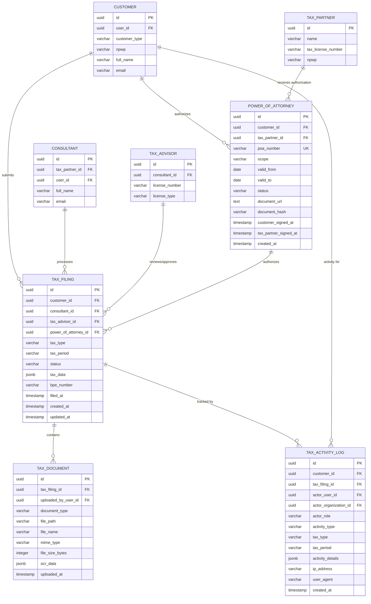

# Tax Filing Entities

**Version**: 1.0
**Date**: 2025-12-23

This document describes the tax filing workflow entities, including Power of Attorney, Tax Filing, Tax Documents, and Audit Trail.

## Entity Relationship Diagram (Tax Filing)



## Power of Attorney

### Purpose
Legal authorization document allowing Jakarta Tax Consulting to file taxes on behalf of customers.

### Business Rules
- **Legal Requirement**: Required before tax filing can be submitted (status: FILED)
- **Dual Signature**: Both customer and tax partner must sign
- **Validity Period**: Active only within valid_from to valid_to dates
- **Scope Control**: Can limit authorization to specific tax types
- **Revocable**: Customer can revoke at any time
- **Document Verification**: SHA-256 hash ensures document integrity

### Schema

| Column | Type | Constraints | Description |
|--------|------|-------------|-------------|
| `id` | UUID | PRIMARY KEY | Unique identifier |
| `customer_id` | UUID | NOT NULL, FK → customer(id) | Customer granting authorization |
| `tax_partner_id` | UUID | NOT NULL, FK → tax_partner(id) | Tax partner receiving authorization |
| `poa_number` | VARCHAR | NOT NULL, UNIQUE | POA-YYYY-NNNNNN format |
| `scope` | VARCHAR | NOT NULL | Authorization scope (enum) |
| `valid_from` | DATE | NOT NULL | Authorization start date |
| `valid_to` | DATE | NOT NULL | Authorization end date |
| `status` | VARCHAR | NOT NULL | POA status (enum) |
| `document_url` | TEXT | NULL | Signed POA document URL |
| `document_hash` | VARCHAR(64) | NULL | SHA-256 hash of document |
| `customer_signed_at` | TIMESTAMP | NULL | Customer signature timestamp |
| `tax_partner_signed_at` | TIMESTAMP | NULL | Tax partner signature timestamp |
| `created_at` | TIMESTAMP | NOT NULL, DEFAULT NOW() | Creation timestamp |

### Status Types

| Status | Description | Conditions |
|--------|-------------|------------|
| `DRAFT` | Initial creation | No signatures |
| `PENDING_CUSTOMER_SIGNATURE` | Waiting for customer to sign | Tax partner signed, customer not yet |
| `PENDING_TAX_PARTNER_SIGNATURE` | Waiting for tax partner to sign | Customer signed, tax partner not yet |
| `ACTIVE` | Fully authorized and valid | Both signed, within valid dates |
| `EXPIRED` | Validity period ended | Current date > valid_to |
| `REVOKED` | Manually revoked by customer | Customer action |

### Scope Types

| Scope | Description |
|-------|-------------|
| `ALL_TAX_TYPES` | All tax filing types |
| `PPh21_ONLY` | Income tax article 21 only |
| `PPh23_ONLY` | Income tax article 23 only |
| `PPN_ONLY` | Value-added tax only |
| `SPT_TAHUNAN_ONLY` | Annual tax return only |
| `CUSTOM` | Custom scope (details in JSONB) |

### Indexes
- PRIMARY KEY on `id`
- UNIQUE INDEX on `poa_number`
- COMPOSITE INDEX on `(customer_id, status, valid_to)` (filtering active POAs)
- INDEX on `tax_partner_id` (tax partner POAs)
- INDEX on `valid_from, valid_to` (date range queries)

### Constraints
- CHECK: `status IN ('DRAFT', 'PENDING_CUSTOMER_SIGNATURE', 'PENDING_TAX_PARTNER_SIGNATURE', 'ACTIVE', 'EXPIRED', 'REVOKED')`
- CHECK: `scope IN ('ALL_TAX_TYPES', 'PPh21_ONLY', 'PPh23_ONLY', 'PPN_ONLY', 'SPT_TAHUNAN_ONLY', 'CUSTOM')`
- CHECK: `valid_to > valid_from`
- CHECK: If status = 'ACTIVE', both customer_signed_at and tax_partner_signed_at NOT NULL

### Triggers
- `validate_poa_status()` - Validates status transitions
- `auto_expire_poa()` - Auto-expires POA when current date > valid_to
- `audit_poa_changes()` - Creates audit log entries for POA changes

### RLS Policies
- **SELECT**: Customer (own POAs), JTC consultants (partner POAs), Platform Admin (view only)
- **INSERT**: Customer only (creates DRAFT)
- **UPDATE**: Customer (manage own), Tax Partner (sign)
- **DELETE**: Not allowed (use status = REVOKED)

### Cross-References
- References: [CUSTOMER](erd-core-entities.md#customer)
- References: [TAX_PARTNER](erd-core-entities.md#tax-partner)
- Referenced by: [TAX_FILING](erd-tax-filing.md#tax-filing)
- Enforces: [Hard Rule 6 - Legal Authorization](hard-rules-enforcement.md#rule-6-legal-authorization-via-power-of-attorney)

---

## Power of Attorney Workflow

### Customer Journey

```
1. DRAFT
   Customer creates POA with scope and validity period
   ↓
2. Customer reviews and signs POA
   → customer_signed_at recorded
   → status = PENDING_TAX_PARTNER_SIGNATURE
   ↓
3. Tax Partner reviews and signs POA
   → tax_partner_signed_at recorded
   → status = ACTIVE
   ↓
4. ACTIVE
   Tax filing can proceed (references active POA)
   ↓
5a. EXPIRED (automatic)
    Current date > valid_to
    → Trigger updates status to EXPIRED

5b. REVOKED (manual)
    Customer revokes POA
    → Customer action sets status to REVOKED
    → Audit log created
```

### Database Enforcement

```sql
-- Function: Check if customer has active POA for tax type
CREATE FUNCTION has_active_poa(
    p_customer_id UUID,
    p_tax_type VARCHAR,
    p_tax_partner_id UUID
) RETURNS BOOLEAN AS $$
BEGIN
    RETURN EXISTS (
        SELECT 1 FROM power_of_attorney
        WHERE customer_id = p_customer_id
        AND tax_partner_id = p_tax_partner_id
        AND status = 'ACTIVE'
        AND CURRENT_DATE BETWEEN valid_from AND valid_to
        AND (scope = 'ALL_TAX_TYPES' OR scope = p_tax_type || '_ONLY')
    );
END;
$$ LANGUAGE plpgsql;

-- Trigger: Validate POA before filing
CREATE TRIGGER validate_tax_filing_poa
BEFORE INSERT OR UPDATE ON tax_filing
FOR EACH ROW
WHEN (NEW.status IN ('FILED', 'UNDER_REVIEW'))
EXECUTE FUNCTION check_active_poa();
```

**File**: `/Users/tommy/git/ai-pajak/supabase/migrations/20251223000004_power_of_attorney.sql`

---

## Tax Filing

### Purpose
Represents a customer's tax filing submission, processed by JTC consultants.

### Business Rules
- **POA Required**: Must have active POA for FILED status
- **JTC Only**: Consultant must be from Jakarta Tax Consulting
- **Tax Advisor Optional**: Licensed advisor for complex filings
- **Status Workflow**: DRAFT → UNDER_REVIEW → FILED or REJECTED
- **Encrypted Data**: tax_data JSONB contains encrypted sensitive information

### Schema

| Column | Type | Constraints | Description |
|--------|------|-------------|-------------|
| `id` | UUID | PRIMARY KEY | Unique identifier |
| `customer_id` | UUID | NOT NULL, FK → customer(id) | Customer submitting filing |
| `consultant_id` | UUID | NOT NULL, FK → consultant(id) | JTC consultant processing |
| `tax_advisor_id` | UUID | NULL, FK → tax_advisor(id) | Licensed advisor (optional) |
| `power_of_attorney_id` | UUID | NOT NULL, FK → power_of_attorney(id) | Required for FILED status |
| `tax_type` | VARCHAR | NOT NULL | Type of tax filing (enum) |
| `tax_period` | VARCHAR | NOT NULL | YYYY-MM or YYYY format |
| `status` | VARCHAR | NOT NULL | Filing status (enum) |
| `tax_data` | JSONB | NOT NULL | Encrypted sensitive tax data |
| `bpe_number` | VARCHAR | NULL, UNIQUE | BPE number from DJP (after filing) |
| `filed_at` | TIMESTAMP | NULL | Submission timestamp to DJP |
| `created_at` | TIMESTAMP | NOT NULL, DEFAULT NOW() | Creation timestamp |
| `updated_at` | TIMESTAMP | NOT NULL, DEFAULT NOW() | Last update timestamp |

### Tax Types

| Type | Description | Period Format |
|------|-------------|---------------|
| `PPh21` | Income tax article 21 (employee) | YYYY-MM |
| `PPh23` | Income tax article 23 (services) | YYYY-MM |
| `PPh_FINAL` | Final income tax | YYYY-MM |
| `PPN` | Value-added tax | YYYY-MM |
| `SPT_MASA` | Monthly tax return | YYYY-MM |
| `SPT_TAHUNAN` | Annual tax return | YYYY |

### Status Types

| Status | Description | Allowed Transitions |
|--------|-------------|---------------------|
| `DRAFT` | Initial creation, incomplete | → UNDER_REVIEW |
| `UNDER_REVIEW` | Being reviewed by consultant | → FILED, REJECTED, DRAFT |
| `FILED` | Submitted to DJP | None (final) |
| `REJECTED` | Rejected by consultant or DJP | → DRAFT |

### Indexes
- PRIMARY KEY on `id`
- COMPOSITE INDEX on `(customer_id, tax_period, tax_type)` (customer filings)
- INDEX on `consultant_id` (consultant workload)
- INDEX on `tax_advisor_id` (advisor cases)
- INDEX on `power_of_attorney_id` (POA linkage)
- INDEX on `status` (filtering by status)
- UNIQUE INDEX on `bpe_number` (DJP reference)
- GIN INDEX on `tax_data` (JSONB queries)

### Constraints
- CHECK: `tax_type IN ('PPh21', 'PPh23', 'PPh_FINAL', 'PPN', 'SPT_MASA', 'SPT_TAHUNAN')`
- CHECK: `status IN ('DRAFT', 'UNDER_REVIEW', 'FILED', 'REJECTED')`
- CHECK: If `status = 'FILED'`, then `power_of_attorney_id IS NOT NULL` AND `filed_at IS NOT NULL`
- CHECK: If `status = 'FILED'`, then `bpe_number IS NOT NULL`
- UNIQUE: `(customer_id, tax_period, tax_type)` (one filing per period per type)

### Triggers
- `validate_consultant_jtc()` - Ensures consultant belongs to JTC
- `validate_tax_filing_poa()` - Validates active POA before FILED status
- `audit_tax_filing_changes()` - Creates audit log entries
- `update_updated_at()` - Updates timestamp on changes

### RLS Policies
- **SELECT**: Customer (own filings), JTC consultant (assigned cases), JTC advisor (all cases)
- **INSERT**: Customer only
- **UPDATE**: Customer (DRAFT status), JTC consultant (assigned cases)
- **DELETE**: Not allowed
- **BLOCK**: PLATFORM_ADMIN completely blocked

### Cross-References
- References: [CUSTOMER](erd-core-entities.md#customer)
- References: [CONSULTANT](erd-core-entities.md#consultant)
- References: [TAX_ADVISOR](erd-core-entities.md#tax-advisor)
- References: [POWER_OF_ATTORNEY](erd-tax-filing.md#power-of-attorney)
- Referenced by: [TAX_DOCUMENT](erd-tax-filing.md#tax-document)
- Referenced by: [TAX_ACTIVITY_LOG](erd-tax-filing.md#tax-activity-log)
- Enforces: [Hard Rule 1 - PLATFORM_ADMIN Cannot Access](hard-rules-enforcement.md#rule-1-platform_admin-cannot-access-tax-data)
- Enforces: [Hard Rule 2 - Consultant MUST Belong to JTC](hard-rules-enforcement.md#rule-2-consultant-must-belong-to-jakarta-tax-consulting)
- Enforces: [Hard Rule 6 - Legal Authorization via POA](hard-rules-enforcement.md#rule-6-legal-authorization-via-power-of-attorney)

---

## Tax Document

### Purpose
Supporting documents uploaded for tax filing (invoices, receipts, salary slips, etc.).

### Business Rules
- **Encrypted Storage**: file_path points to encrypted storage
- **OCR Support**: Optional OCR data extraction for automation
- **File Type Validation**: MIME type validation for security
- **Uploader Tracking**: Tracks who uploaded the document
- **Size Limits**: Application-level file size validation

### Schema

| Column | Type | Constraints | Description |
|--------|------|-------------|-------------|
| `id` | UUID | PRIMARY KEY | Unique identifier |
| `tax_filing_id` | UUID | NOT NULL, FK → tax_filing(id) | Tax filing reference |
| `uploaded_by_user_id` | UUID | NOT NULL, FK → users(id) | User who uploaded |
| `document_type` | VARCHAR | NOT NULL | Document type (enum) |
| `file_path` | VARCHAR | NOT NULL | Encrypted storage path |
| `file_name` | VARCHAR | NOT NULL | Original filename |
| `mime_type` | VARCHAR | NOT NULL | File MIME type |
| `file_size_bytes` | INTEGER | NOT NULL | File size in bytes |
| `ocr_data` | JSONB | NULL | Extracted OCR data |
| `uploaded_at` | TIMESTAMP | NOT NULL, DEFAULT NOW() | Upload timestamp |

### Document Types

| Type | Description | Supported Formats |
|------|-------------|-------------------|
| `INVOICE` | Sales/purchase invoice | PDF, JPEG, PNG |
| `RECEIPT` | Payment receipt | PDF, JPEG, PNG |
| `SALARY_SLIP` | Employee salary slip | PDF |
| `BANK_STATEMENT` | Bank account statement | PDF |
| `CONTRACT` | Service/employment contract | PDF |
| `IDENTITY_CARD` | KTP, passport | JPEG, PNG |
| `NPWP_CARD` | Tax ID card | JPEG, PNG, PDF |
| `OTHER` | Other supporting documents | PDF, JPEG, PNG |

### Indexes
- PRIMARY KEY on `id`
- INDEX on `tax_filing_id` (filing documents)
- INDEX on `uploaded_by_user_id` (user uploads)
- INDEX on `document_type` (filtering by type)
- INDEX on `uploaded_at` (chronological ordering)
- GIN INDEX on `ocr_data` (OCR data queries)

### Constraints
- CHECK: `document_type IN ('INVOICE', 'RECEIPT', 'SALARY_SLIP', 'BANK_STATEMENT', 'CONTRACT', 'IDENTITY_CARD', 'NPWP_CARD', 'OTHER')`
- CHECK: `file_size_bytes > 0`
- CHECK: `mime_type IN ('application/pdf', 'image/jpeg', 'image/png')`

### Triggers
- `audit_document_upload()` - Creates audit log entry on upload
- `cascade_delete_document()` - Deletes file from storage on record deletion

### RLS Policies
- **SELECT**: Customer (own filings), JTC consultant (assigned cases), JTC advisor (all cases)
- **INSERT**: Customer, JTC consultant (assigned cases)
- **UPDATE**: Not allowed (immutable after upload)
- **DELETE**: Customer (own docs in DRAFT), JTC consultant (assigned cases)
- **BLOCK**: PLATFORM_ADMIN completely blocked

### Cross-References
- References: [TAX_FILING](erd-tax-filing.md#tax-filing)
- References: [USERS](erd-core-entities.md#users) (uploader)
- Enforces: [Hard Rule 1 - PLATFORM_ADMIN Cannot Access](hard-rules-enforcement.md#rule-1-platform_admin-cannot-access-tax-data)

---

## Tax Activity Log

### Purpose
Comprehensive audit trail for all tax-related activities, ensuring legal compliance and accountability.

### Business Rules
- **Immutable**: Cannot be modified or deleted
- **Automatic Creation**: Triggers auto-create entries
- **Complete Context**: WHO, WHAT, WHEN, WHERE captured
- **Organization Tracking**: Tracks actor's organization
- **IP Address Logging**: Captures IP for security
- **No Platform Actors**: Platform organization cannot be actor

### Schema

| Column | Type | Constraints | Description |
|--------|------|-------------|-------------|
| `id` | UUID | PRIMARY KEY | Unique identifier |
| `customer_id` | UUID | NOT NULL, FK → customer(id) | Customer whose data is accessed |
| `tax_filing_id` | UUID | NULL, FK → tax_filing(id) | Related tax filing (if applicable) |
| `actor_user_id` | UUID | NOT NULL, FK → users(id) | WHO did it |
| `actor_organization_id` | UUID | NULL | Organization ID (polymorphic) |
| `actor_role` | VARCHAR | NOT NULL | Actor's role at time of action |
| `activity_type` | VARCHAR | NOT NULL | Type of activity (enum) |
| `tax_type` | VARCHAR | NULL | Tax type (if applicable) |
| `tax_period` | VARCHAR | NULL | Tax period (if applicable) |
| `activity_details` | JSONB | NULL | Additional context |
| `ip_address` | VARCHAR | NULL | Actor's IP address |
| `user_agent` | VARCHAR | NULL | Actor's user agent |
| `created_at` | TIMESTAMP | NOT NULL, DEFAULT NOW() | Activity timestamp |

### Activity Types

| Type | Description | Triggered By |
|------|-------------|--------------|
| `CREATE` | Created tax filing or POA | INSERT on tax_filing, power_of_attorney |
| `UPDATE` | Updated tax filing or POA | UPDATE on tax_filing, power_of_attorney |
| `REVIEW` | Consultant reviewed filing | Status change to UNDER_REVIEW |
| `FILE` | Filed tax to DJP | Status change to FILED |
| `DOWNLOAD` | Downloaded tax document | Document download API call |
| `DELETE` | Deleted document or revoked POA | DELETE on tax_document, POA revocation |
| `VIEW` | Viewed tax data | SELECT queries (sampled) |

### Actor Roles

| Role | Description |
|------|-------------|
| `CUSTOMER` | Customer accessing own data |
| `CONSULTANT` | JTC consultant processing case |
| `TAX_ADVISOR` | JTC tax advisor reviewing case |

### Indexes
- PRIMARY KEY on `id`
- COMPOSITE INDEX on `(customer_id, created_at DESC)` (customer timeline)
- INDEX on `tax_filing_id` (filing history)
- INDEX on `actor_user_id` (user activity)
- INDEX on `activity_type` (filtering by type)
- INDEX on `created_at` (chronological queries)
- GIN INDEX on `activity_details` (JSONB queries)

### Constraints
- CHECK: `activity_type IN ('CREATE', 'UPDATE', 'REVIEW', 'FILE', 'DOWNLOAD', 'DELETE', 'VIEW')`
- CHECK: `actor_role IN ('CUSTOMER', 'CONSULTANT', 'TAX_ADVISOR')`
- CHECK: `actor_organization_id NOT IN (SELECT id FROM platform)` (Hard Rule 3)

### Triggers
- `prevent_audit_log_modification()` - Blocks UPDATE and DELETE operations

### RLS Policies
- **SELECT**: Customer (own logs), JTC consultant/advisor (assigned cases), Platform Admin (anonymized view)
- **INSERT**: Automatic via triggers, application layer for API calls
- **UPDATE**: Not allowed (immutable)
- **DELETE**: Not allowed (permanent record)

### Cross-References
- References: [CUSTOMER](erd-core-entities.md#customer)
- References: [TAX_FILING](erd-tax-filing.md#tax-filing)
- References: [USERS](erd-core-entities.md#users) (actor)
- Enforces: [Hard Rule 3 - Tax Filing Actor ≠ Platform](hard-rules-enforcement.md#rule-3-tax-filing-actor--platform)
- Enforces: [Hard Rule 5 - Audit Trail Required](hard-rules-enforcement.md#rule-5-audit-trail-required)

---

## Summary

### Tax Filing Workflow

```
1. Power of Attorney
   Customer → Create POA → Sign → Tax Partner Signs → ACTIVE

2. Tax Filing
   Customer → Create Filing (DRAFT) → Upload Documents
   ↓
   Consultant → Review → UNDER_REVIEW
   ↓
   Tax Advisor → Approve → FILED (requires active POA)

3. Audit Trail
   All actions logged → TAX_ACTIVITY_LOG (immutable)
```

### Key Constraints

1. **Power of Attorney** - Required for FILED status
2. **Consultant** - Must be from Jakarta Tax Consulting
3. **Tax Advisor** - Optional for complex filings
4. **Documents** - Encrypted storage, immutable after upload
5. **Audit Trail** - Automatic, immutable, comprehensive

### Security Features

- **Encrypted Data**: tax_data JSONB encrypted
- **Document Hashing**: SHA-256 for POA documents
- **IP Logging**: All activities tracked
- **RLS Policies**: Database-level access control
- **Immutable Audit**: Cannot modify or delete logs

### Next Steps

- Review [erd-billing.md](erd-billing.md) for billing entities
- Review [hard-rules-enforcement.md](hard-rules-enforcement.md) for compliance enforcement
- Review [data-dictionary.md](data-dictionary.md) for complete schema details
