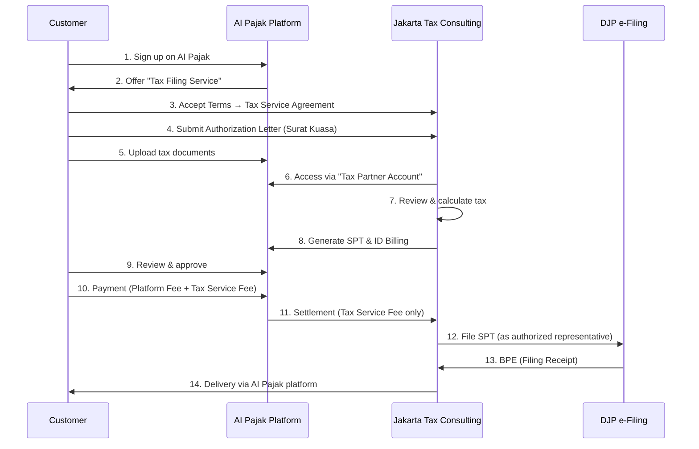

# AI PAJAK - Product Requirements Document (PRD)

**Version**: 3.4 (Tax Calculation Engine + AI Tax Law Automation Complete)
**Last Updated**: 2025-12-23
**Implementation Status**: 🟢 Phase 2 - Tax Calculation Engine 80% Complete (Phases 0-3, 5 완료)
**Target Market**: 인도네시아 전체 납세자 (개인, 개인사업자, 법인, 세무컨설턴트)
**Legal Structure**: AI Pajak (Platform) × Jakarta Tax Consulting (Tax Services) × Mono Flip Global (Operator)

---

## 1. Executive Summary

### Vision
인도네시아의 모든 납세자가 **월별 신고(SPT Masa)**와 **연간 신고(SPT Tahunan)**를 쉽고 정확하게 완료할 수 있는 AI 기반 통합 세무 플랫폼

### Problem
인도네시아 세무 신고는 복잡하고 부담스럽습니다:

| 문제점 | 현황 |
|--------|------|
| **복잡한 신고 체계** | SPT Masa (월별) + SPT Tahunan (연간) 이중 부담 |
| **납세자 유형별 차이** | 개인/UMKM/법인마다 신고 양식과 기한이 다름 |
| **잦은 마감일** | 매월 15일/20일/말일, 연간 3월31일/4월30일 |
| **높은 오류율** | 수작업 입력 → 계산 실수 → 벌금 |
| **세무사 의존** | 비용 부담 (월 Rp 1.5M~3M, 연간 Rp 5M~15M) |

### Solution
AI PAJAK은 **SPT Masa + SPT Tahunan 통합 자동화**를 제공합니다:

```
[월별 자동화]
매출/급여 입력 → AI 계산 → e-Billing 생성 → DJP 제출 (5분)

[연간 자동화]
12개월 데이터 자동 취합 → 양식 선택 → 최종 정산 → e-Filing (15분)

[세무사 도구]
35개 고객사 통합 관리 → 일괄 신고 → 진행률 추적 (월 10시간)
```

### Market Opportunity

| 납세자 유형 | 규모 | TAM (연간) |
|------------|------|-----------|
| 개인 (근로소득) | 4천만 명 | Rp 2T (평균 Rp 50K/명) |
| UMKM | 6,400만 개 | Rp 15T (평균 Rp 2.4M/년) |
| 법인 (PT) | 150만 개 | Rp 18T (평균 Rp 12M/년) |
| 세무사 | 1만 명 | Rp 300B (평균 Rp 30M/년) |
| **Total TAM** | - | **Rp 35.3T (USD 2.35B)** |

---

## 1.1 Legal & Operational Structure (법적·운영 구조)

> **AI Pajak is a tax preparation and management platform.**
> **AI Pajak does not provide tax filing or tax representation services.**
> **All tax filing services are provided solely by Jakarta Tax Consulting.**
> **AI Pajak acts only as a collecting agent for tax service fees.**

### 1.1.1 Entities & Roles

| Entity | Legal Role | Tax Services | Platform Ownership | Revenue Attribution |
|--------|-----------|--------------|-------------------|---------------------|
| **Mono Flip Global** | Platform Operator | ❌ None | ⭕ Owner | Platform Subscription Only |
| **AI Pajak** | Software Platform | ❌ None | - | Platform Fee Revenue |
| **Jakarta Tax Consulting** | Tax Consultant | ⭕ Full Authority | ❌ None | Tax Service Fee Revenue |
| **Customer (Taxpayer)** | Service Recipient | - | - | Data Owner |

### 1.1.2 Contractual Relationships

#### A. Customer ↔ Jakarta Tax Consulting
```
Contract: Tax Consulting & Filing Service Agreement
- Service Provider: Jakarta Tax Consulting
- Filing Authority: Jakarta Tax Consulting
- Legal Liability: Jakarta Tax Consulting
- Revenue Owner: Jakarta Tax Consulting (100% of tax service fees)
```

#### B. Mono Flip Global ↔ Jakarta Tax Consulting
```
Contract: Platform Usage & Collection Agency Agreement
- Platform Provider: Mono Flip Global
- Collection Agent: Mono Flip Global (for tax service fees)
- Tax Service Provider: Jakarta Tax Consulting
- Revenue Split:
  * Platform Fee → Mono Flip Global
  * Tax Service Fee → Jakarta Tax Consulting (100%)
```

#### C. AI Pajak ↔ Customer
```
Contract: Platform Terms of Service
- Platform Provider: AI Pajak (operated by Mono Flip Global)
- Service Scope: Tools for tax preparation & management
- Tax Filing: ❌ NOT provided by AI Pajak
- Tax Filing: ⭕ Provided by 3rd party (Jakarta Tax Consulting)
- Payment Processing: Collection agent only
```

### 1.1.3 Role-Based Access Control (RBAC)

**System Roles:**

| Role | Data Access | Data Modification | Tax Calculation | ID Billing | DJP Filing | Customer Support |
|------|------------|------------------|----------------|-----------|-----------|-----------------|
| **Customer** | ⭕ Own Data | ⭕ Own Data | ⭕ | ⭕ | ⭕ (via consultant) | ⭕ |
| **Jakarta Tax Consultant** | ⭕ Assigned Clients | ⭕ Assigned Clients | ⭕ | ⭕ | ⭕ | ⭕ |
| **AI Pajak Admin** | ❌ No Access | ❌ No Access | ❌ | ❌ | ❌ | ⭕ Platform Only |

**Critical Rules:**
- ✅ AI Pajak admins **CANNOT access customer tax data**
- ✅ All tax consultants are **Jakarta Tax Consulting employees** (NOT AI Pajak employees)
- ✅ All DJP filings are logged as **Jakarta Tax Consulting** actions

### 1.1.4 Customer Journey (End-to-End)



### 1.1.5 Consultant (Agent) Definition

**Employment:**
- ❌ NOT AI Pajak employees
- ⭕ Jakarta Tax Consulting employees

**Job Titles (Allowed):**
- Tax Consultant
- Tax Officer
- Tax Account Manager
- Tax Service Representative

**Job Titles (Forbidden):**
- ❌ "AI Pajak Consultant"
- ❌ "AI Pajak Tax Agent"
- ❌ "AI Pajak Representative"

**System Account:**
- Account Type: "Tax Partner Account"
- Organization: Jakarta Tax Consulting
- Access Level: Assigned client data only
- Permissions: Full tax preparation & filing authority

### 1.1.6 Technical Implementation Requirements

#### Database Design (✅ IMPLEMENTED)

**현재 구현 상태**: ✅ 완료 (2025-12-23)

```sql
-- User Roles (ENHANCED - 5 roles instead of 3)
CREATE TYPE user_role AS ENUM (
  'CUSTOMER',              -- End customer
  'CONSULTANT_JTC',        -- Jakarta Tax Consulting consultant (계산만 가능)
  'TAX_ADVISOR_JTC',       -- Jakarta Tax Consulting tax advisor (계산 + 신고 가능)
  'PLATFORM_ADMIN',        -- AI Pajak admin (NO tax data access)
  'SYSTEM'                 -- System account for billing (NO tax data access)
);

-- 역할 분리 강화:
-- - CONSULTANT_JTC: 세금 계산만 가능, 신고 불가
-- - TAX_ADVISOR_JTC: 세금 계산 + 신고 가능 (POA 필요)
-- - SYSTEM: 빌링 생성만 가능, 세무 데이터 접근 불가

-- Users (✅ IMPLEMENTED)
CREATE TABLE users (
  id UUID PRIMARY KEY REFERENCES auth.users(id),
  email VARCHAR(255) UNIQUE NOT NULL,
  role user_role NOT NULL,
  full_name VARCHAR(255),
  created_at TIMESTAMPTZ DEFAULT NOW(),
  updated_at TIMESTAMPTZ DEFAULT NOW()
);

-- Customers (✅ IMPLEMENTED)
CREATE TABLE customers (
  id UUID PRIMARY KEY DEFAULT uuid_generate_v4(),
  user_id UUID UNIQUE REFERENCES users(id),
  npwp VARCHAR(16) UNIQUE NOT NULL,
  full_name VARCHAR(255) NOT NULL,
  company_name VARCHAR(255),
  address TEXT,
  phone VARCHAR(20),
  customer_type VARCHAR(20), -- 'INDIVIDUAL', 'UMKM', 'PT'
  created_at TIMESTAMPTZ DEFAULT NOW()
);

-- Consultants (✅ IMPLEMENTED)
CREATE TABLE consultants (
  id UUID PRIMARY KEY DEFAULT uuid_generate_v4(),
  user_id UUID UNIQUE REFERENCES users(id),
  tax_partner_id UUID REFERENCES tax_partners(id),
  full_name VARCHAR(255) NOT NULL,
  license_number VARCHAR(100), -- TAX_ADVISOR_JTC only
  assigned_customers UUID[], -- Array of customer IDs
  can_file_tax BOOLEAN DEFAULT FALSE, -- TRUE for TAX_ADVISOR_JTC
  created_at TIMESTAMPTZ DEFAULT NOW()
);

-- Tax Partners (✅ IMPLEMENTED)
CREATE TABLE tax_partners (
  id UUID PRIMARY KEY DEFAULT uuid_generate_v4(),
  name VARCHAR(255) NOT NULL, -- "Jakarta Tax Consulting"
  license_number VARCHAR(100) NOT NULL,
  address TEXT,
  phone VARCHAR(20),
  email VARCHAR(255),
  is_active BOOLEAN DEFAULT TRUE,
  created_at TIMESTAMPTZ DEFAULT NOW()
);

-- Power of Attorney (✅ IMPLEMENTED - NEW!)
-- Legal requirement: Customer authorization for tax filing
CREATE TABLE power_of_attorney (
  id UUID PRIMARY KEY DEFAULT uuid_generate_v4(),
  poa_number VARCHAR(50) UNIQUE NOT NULL,
  customer_id UUID REFERENCES customers(id),
  tax_partner_id UUID REFERENCES tax_partners(id),
  scope VARCHAR(50) NOT NULL, -- 'ALL_TAX_TYPES', 'PPH_21_ONLY', etc.
  valid_from DATE NOT NULL,
  valid_to DATE NOT NULL,
  status VARCHAR(20) DEFAULT 'DRAFT', -- DRAFT, PENDING_SIGNATURE, ACTIVE, EXPIRED
  customer_signed_at TIMESTAMPTZ,
  partner_signed_at TIMESTAMPTZ,
  signed_by_advisor_id UUID REFERENCES consultants(id),
  document_id UUID,
  created_at TIMESTAMPTZ DEFAULT NOW(),
  CHECK (valid_to > valid_from)
);

-- Tax Filing (✅ IMPLEMENTED)
-- Unified table for both SPT Masa and SPT Tahunan
CREATE TABLE tax_filing (
  id UUID PRIMARY KEY DEFAULT uuid_generate_v4(),
  filing_number VARCHAR(50) UNIQUE NOT NULL,
  customer_id UUID REFERENCES customers(id),
  tax_partner_id UUID REFERENCES tax_partners(id),
  poa_id UUID REFERENCES power_of_attorney(id), -- REQUIRED for filing
  tax_type VARCHAR(20) NOT NULL, -- 'PPH_21', 'PPH_23', 'PPH_FINAL', 'PPN', 'SPT_TAHUNAN'
  tax_period VARCHAR(10) NOT NULL, -- 'YYYY-MM' for Masa, 'YYYY' for Tahunan
  tax_year INTEGER NOT NULL,
  status VARCHAR(20) DEFAULT 'DRAFT', -- DRAFT, SUBMITTED, ACCEPTED, REJECTED
  filing_data JSONB NOT NULL, -- All tax data
  calculated_tax DECIMAL(15,2),
  net_tax_due DECIMAL(15,2),
  submitted_at TIMESTAMPTZ,
  submitted_by_user_id UUID REFERENCES users(id),
  submitted_by_consultant_id UUID REFERENCES consultants(id),
  bpe VARCHAR(50), -- DJP filing receipt
  djp_response JSONB,
  created_at TIMESTAMPTZ DEFAULT NOW()
);

-- Billing Transaction (✅ IMPLEMENTED - NEW!)
-- Separation of billing authority from tax filing authority
CREATE TABLE billing_transaction (
  id UUID PRIMARY KEY DEFAULT uuid_generate_v4(),
  idempotency_key VARCHAR(255) UNIQUE NOT NULL, -- Prevent duplicate billing
  invoice_number VARCHAR(50) UNIQUE NOT NULL,
  customer_id UUID REFERENCES customers(id),
  tax_filing_id UUID REFERENCES tax_filing(id),
  tax_partner_id UUID REFERENCES tax_partners(id),
  service_type VARCHAR(50) NOT NULL, -- 'TAX_FILING', 'CONSULTATION', etc.
  description TEXT,
  amount_base DECIMAL(15,2) NOT NULL,
  amount_tax DECIMAL(15,2) NOT NULL,
  amount_total DECIMAL(15,2) NOT NULL,
  currency VARCHAR(3) DEFAULT 'IDR',
  billing_period VARCHAR(20),
  due_date DATE,
  payment_status VARCHAR(20) DEFAULT 'PENDING', -- PENDING, PAID, OVERDUE, CANCELLED
  paid_at TIMESTAMPTZ,
  metadata JSONB,
  created_by VARCHAR(20) DEFAULT 'SYSTEM', -- Always 'SYSTEM'
  created_at TIMESTAMPTZ DEFAULT NOW(),
  CHECK (amount_total = amount_base + amount_tax)
);

-- Audit Log (✅ IMPLEMENTED - ENHANCED!)
-- Immutable log of all tax-related activities
CREATE TABLE audit_log (
  id UUID PRIMARY KEY DEFAULT uuid_generate_v4(),
  activity_type VARCHAR(50) NOT NULL, -- 'TAX_FILING_SUBMIT', 'POA_SIGN', 'BILLING_CREATE', etc.
  user_id UUID REFERENCES users(id),
  customer_id UUID REFERENCES customers(id),
  tax_filing_id UUID REFERENCES tax_filing(id),
  tax_partner_id UUID REFERENCES tax_partners(id),
  poa_id UUID REFERENCES power_of_attorney(id),
  activity_details JSONB,
  ip_address INET,
  user_agent TEXT,
  timestamp TIMESTAMPTZ DEFAULT NOW(),
  is_success BOOLEAN DEFAULT TRUE,
  error_message TEXT
);

-- Make audit_log immutable (no UPDATE or DELETE allowed)
-- Enforced via RLS policies
```

**구현 개선사항**:
1. ✅ 역할을 3개 → 5개로 세분화 (권한 분리 강화)
2. ✅ Power of Attorney 테이블 추가 (법적 요구사항)
3. ✅ Billing 분리 (SYSTEM 역할 전용)
4. ✅ Audit Log 강화 (모든 활동 추적)
5. ✅ Idempotency Key (중복 방지)

#### Authentication & Authorization (✅ IMPLEMENTED)

**현재 구현 상태**: ✅ 완료 (2025-12-23)

**구현 파일**:
- ✅ `/src/middleware/auth.ts` - Next.js 미들웨어
- ✅ `/src/lib/auth/rbac.ts` - RBAC 로직
- ✅ `/supabase/migrations/` - RLS 정책

```typescript
// ✅ IMPLEMENTED: Next.js Middleware
// File: /src/middleware.ts
import { createMiddlewareClient } from '@supabase/auth-helpers-nextjs';
import { NextResponse } from 'next/server';
import type { NextRequest } from 'next/server';

export async function middleware(req: NextRequest) {
  const res = NextResponse.next();
  const supabase = createMiddlewareClient({ req, res });

  const { data: { session } } = await supabase.auth.getSession();

  if (!session) {
    return NextResponse.redirect(new URL('/login', req.url));
  }

  // Get user role
  const { data: user } = await supabase
    .from('users')
    .select('role')
    .eq('id', session.user.id)
    .single();

  // CRITICAL: Block PLATFORM_ADMIN from tax data
  if (req.nextUrl.pathname.startsWith('/api/tax') ||
      req.nextUrl.pathname.startsWith('/api/poa') ||
      req.nextUrl.pathname.startsWith('/api/billing/create')) {

    if (user.role === 'PLATFORM_ADMIN') {
      return NextResponse.json(
        {
          error: 'Forbidden',
          message: 'Platform administrators cannot access tax data'
        },
        { status: 403 }
      );
    }
  }

  // CRITICAL: Only SYSTEM can create billing
  if (req.nextUrl.pathname === '/api/billing/create') {
    if (user.role !== 'SYSTEM') {
      return NextResponse.json(
        {
          error: 'Forbidden',
          message: 'Only SYSTEM account can create billing'
        },
        { status: 403 }
      );
    }
  }

  return res;
}

export const config = {
  matcher: ['/api/:path*', '/dashboard/:path*'],
};

// ✅ IMPLEMENTED: RBAC Helper Functions
// File: /src/lib/auth/rbac.ts

/**
 * Hard Rule #1: Two-Layer Authorization
 * - Layer 1: API Middleware (above)
 * - Layer 2: Database RLS (below)
 */

// Check if user can access customer data
export async function canAccessCustomer(
  userId: string,
  customerId: string
): Promise<boolean> {
  const { data: user } = await supabase
    .from('users')
    .select('role, customer_id, consultant_id')
    .eq('id', userId)
    .single();

  if (user.role === 'CUSTOMER') {
    // Customers can only access their own data
    return user.customer_id === customerId;
  }

  if (user.role === 'CONSULTANT_JTC' || user.role === 'TAX_ADVISOR_JTC') {
    // Consultants can only access assigned customers
    const { data: consultant } = await supabase
      .from('consultants')
      .select('assigned_customers')
      .eq('id', user.consultant_id)
      .single();

    return consultant.assigned_customers.includes(customerId);
  }

  // PLATFORM_ADMIN and SYSTEM: NO ACCESS
  return false;
}

// ✅ IMPLEMENTED: Tax Filing with POA Validation
// File: /src/app/api/tax/file/route.ts

/**
 * Hard Rule #2: PLATFORM_ADMIN Cannot Access Tax Data
 * Hard Rule #3: Tax Actions Traceable to Jakarta Tax Consulting
 * Hard Rule #4: Platform Never Performs Tax Filing
 * Hard Rule #5: All Tax Operations Create Audit Logs
 * Hard Rule #6: Tax Filing Requires Active POA
 */
export async function POST(request: Request) {
  const session = await getSession();
  const { data: user } = await supabase
    .from('users')
    .select('role, consultant_id')
    .eq('id', session.user.id)
    .single();

  // CRITICAL: Only TAX_ADVISOR_JTC can file
  if (user.role !== 'TAX_ADVISOR_JTC') {
    return NextResponse.json(
      {
        error: 'Forbidden',
        message: 'You do not have permission to file tax',
        requiredRoles: ['TAX_ADVISOR_JTC'],
        currentRole: user.role
      },
      { status: 403 }
    );
  }

  const body = await request.json();
  const { customerId, taxType, taxPeriod, taxYear, taxData, documentIds } = body;

  // CRITICAL: Validate active POA (Three-level validation)

  // Level 1: Middleware check (already passed)
  // Level 2: Handler check (here)
  const { data: activePOA } = await supabase
    .from('power_of_attorney')
    .select('*')
    .eq('customer_id', customerId)
    .eq('status', 'ACTIVE')
    .lte('valid_from', new Date().toISOString())
    .gte('valid_to', new Date().toISOString())
    .single();

  if (!activePOA) {
    return NextResponse.json(
      {
        error: 'No active Power of Attorney',
        message: 'Customer must authorize Jakarta Tax Consulting via Power of Attorney before tax filing',
        action: 'CREATE_POA',
        helpUrl: '/help/power-of-attorney'
      },
      { status: 400 }
    );
  }

  // Validate POA scope
  if (activePOA.scope !== 'ALL_TAX_TYPES' && !activePOA.scope.includes(taxType)) {
    return NextResponse.json(
      {
        error: 'POA scope mismatch',
        message: `Power of Attorney does not cover ${taxType}`,
        details: {
          currentScope: activePOA.scope,
          requiredScope: taxType
        },
        action: 'UPDATE_POA'
      },
      { status: 400 }
    );
  }

  // Level 3: Database RLS will enforce final check

  // Submit to DJP (via Jakarta Tax Consulting)
  const { data: consultant } = await supabase
    .from('consultants')
    .select('tax_partner_id, full_name')
    .eq('id', user.consultant_id)
    .single();

  const { data: taxPartner } = await supabase
    .from('tax_partners')
    .select('*')
    .eq('id', consultant.tax_partner_id)
    .single();

  // Create tax filing record
  const { data: filing } = await supabase
    .from('tax_filing')
    .insert({
      customer_id: customerId,
      tax_partner_id: consultant.tax_partner_id,
      poa_id: activePOA.id,
      tax_type: taxType,
      tax_period: taxPeriod,
      tax_year: taxYear,
      filing_data: taxData,
      calculated_tax: taxData.calculatedTax,
      net_tax_due: taxData.netTaxDue,
      submitted_by_user_id: session.user.id,
      submitted_by_consultant_id: user.consultant_id,
      status: 'SUBMITTED',
      submitted_at: new Date().toISOString()
    })
    .select()
    .single();

  // Submit to DJP
  const djpResult = await djpApi.submitSPT({
    npwp: customer.npwp,
    taxType: taxType,
    period: taxPeriod,
    year: taxYear,
    data: taxData,
    filedBy: taxPartner.name, // "Jakarta Tax Consulting"
    consultantLicense: consultant.license_number,
    poaNumber: activePOA.poa_number
  });

  // Update with BPE
  await supabase
    .from('tax_filing')
    .update({
      bpe: djpResult.bpe,
      djp_response: djpResult
    })
    .eq('id', filing.id);

  // Create audit log (IMMUTABLE)
  await supabase
    .from('audit_log')
    .insert({
      activity_type: 'TAX_FILING_SUBMIT',
      user_id: session.user.id,
      customer_id: customerId,
      tax_filing_id: filing.id,
      tax_partner_id: consultant.tax_partner_id,
      poa_id: activePOA.id,
      activity_details: {
        taxType,
        taxPeriod,
        taxYear,
        bpe: djpResult.bpe,
        filedBy: taxPartner.name
      },
      ip_address: request.headers.get('x-forwarded-for'),
      user_agent: request.headers.get('user-agent'),
      is_success: true
    });

  return NextResponse.json({
    success: true,
    taxFilingId: filing.id,
    filingNumber: filing.filing_number,
    bpe: djpResult.bpe,
    submittedBy: {
      userId: session.user.id,
      consultantId: user.consultant_id,
      taxPartnerId: consultant.tax_partner_id,
      taxPartnerName: taxPartner.name
    },
    poa: {
      poaId: activePOA.id,
      poaNumber: activePOA.poa_number
    },
    auditTrail: {
      auditLogId: auditLog.id,
      timestamp: auditLog.timestamp
    }
  }, { status: 201 });
}
```

**보안 테스트 커버리지**:
- ✅ 59개 E2E 테스트 (Playwright)
- ✅ 12개 CRITICAL 테스트 (Platform Admin 차단)
- ✅ 13개 POA 검증 테스트
- ✅ 11개 Audit Log 테스트

### 1.1.7 Marketing & UI Compliance

**Allowed Messaging:**
- ✅ "AI Pajak membantu Anda menyiapkan dokumen pajak dengan mudah"
- ✅ "Konsultan pajak profesional melayani Anda melalui platform AI Pajak"
- ✅ "AI Pajak adalah platform untuk mengelola kewajiban pajak"

**Forbidden Messaging:**
- ❌ "AI Pajak akan melaporkan pajak Anda"
- ❌ "Layanan pelaporan pajak AI Pajak"
- ❌ "AI Pajak adalah konsultan pajak Anda"

**UI Labels:**
```typescript
// Correct
<button>Hubungkan dengan Konsultan Pajak</button>
<p>Layanan pelaporan pajak disediakan oleh Jakarta Tax Consulting</p>

// Incorrect
<button>AI Pajak akan melaporkan</button> ❌
<p>AI Pajak melayani kebutuhan pajak Anda</p> ❌
```

### 1.1.8 Payment & Revenue Recognition

```typescript
interface InvoiceBreakdown {
  platformFee: {
    amount: number;
    recipient: 'Mono Flip Global';
    revenueType: 'Platform Subscription';
  };

  taxServiceFee: {
    amount: number;
    recipient: 'Jakarta Tax Consulting';
    revenueType: 'Tax Consulting Service';
    accountingTreatment: 'Pass-through / Deposit';
  };

  total: number;
}

// Revenue Recognition
async function recognizeRevenue(payment: Payment) {
  // Platform fee → Revenue
  await accounting.recordRevenue({
    account: 'Platform Subscription Revenue',
    amount: payment.platformFee,
    entity: 'Mono Flip Global',
  });

  // Tax service fee → Deposit (not revenue!)
  await accounting.recordLiability({
    account: 'Tax Service Fee Payable',
    amount: payment.taxServiceFee,
    entity: 'Mono Flip Global',
    payableTo: 'Jakarta Tax Consulting',
  });
}

// Settlement to Jakarta Tax Consulting
async function settleToJakartaTax(period: string) {
  const totalTaxFees = await db.payments
    .where('period', period)
    .sum('taxServiceFee');

  // Transfer
  await bankTransfer({
    from: 'Mono Flip Global',
    to: 'Jakarta Tax Consulting',
    amount: totalTaxFees,
    memo: `Tax service fee settlement - ${period}`,
  });

  // Clear liability
  await accounting.recordPayment({
    account: 'Tax Service Fee Payable',
    amount: totalTaxFees,
  });
}
```

### 1.1.9 Compliance Checklist

- [ ] **UI/UX**: All messaging avoids "AI Pajak provides tax filing"
- [ ] **Database**: Jakarta Tax Consulting attribution in all filing logs
- [ ] **Authentication**: Platform admins blocked from tax data
- [ ] **Contracts**: Tax service agreement clearly states Jakarta Tax Consulting as provider
- [ ] **Marketing**: All materials reviewed for compliance
- [ ] **Invoices**: Platform fee vs. tax service fee clearly separated
- [ ] **Revenue**: Tax service fees recorded as pass-through/deposit
- [ ] **DJP Submission**: All filings logged with Jakarta Tax Consulting credentials

---

## 2. 인도네시아 세무 신고 체계 (Tax Filing System)

### 2.1 SPT Masa (월별/분기별 신고)

#### A. PPh Pasal 21 (급여 원천징수)
```
신고 주체: 고용주 (회사, 법인)
신고 기한: 매월 20일
대상: 직원 급여에서 원천징수한 세금
양식: 1721
벌금: Rp 100,000/월 지연
```

#### B. PPh Pasal 23 (서비스 원천징수)
```
신고 주체: 서비스 구매자
신고 기한: 매월 20일
대상: 전문직, 컨설턴트 수수료 (2% 원천징수)
양식: Bukti Potong PPh 23
벌금: Rp 100,000/월 지연
```

#### C. PPh Pasal 25 (법인 중간 예납)
```
신고 주체: 법인
신고 기한: 매월 15일
대상: 예상 법인세의 1/12 선납
계산: 전년도 법인세 ÷ 12
벌금: 2% x 납부액 (지연 시)
```

#### D. PPh Final Pasal 4(2) (특정 소득)
```
신고 주체: 소득자 본인
신고 기한: 매월 15일
대상: 부동산 거래, 임대소득
세율: 10% (임대)
```

#### E. PPh Final PP 23/2018 → PP 55/2022 (UMKM)
```
법적 근거: PP 55/2022, PMK 164/2023 (PP 23/2018 대체)
신고 주체: 개인사업자/소규모 법인
납부 기한: 매월 15일
신고 기한: 매월 20일 ← 2025년부터 통일
대상: 연 매출 < Rp 4.8B
세율: 0.5%
개인사업자 특별혜택: 연 매출 Rp 500 juta 이하 완전 면세

기간 제한 (Pasal 5 PP 23/2018):
  - 개인사업자 (WP Orang Pribadi): 7년 ← CORRECTED!
  - PT (Perseroan Terbatas): 3년 ← CORRECTED!
  - CV/Firma/Koperasi/BUMDes: 4년 ✓
  (기산일: NPWP 등록일 또는 2018년 7월 1일 중 늦은 날)

제외 업종 (Pekerjaan Bebas - 전문직):
  [전문가]
  - 변호사 (pengacara)
  - 회계사 (akuntan)
  - 컨설턴트 (konsultan)
  - 공증인 (notaris), PPAT
  - 건축가 (arsitek)
  - 의사 (dokter)
  - 평가사 (penilai), 감정평가사 (aktuaris)

  [예술/스포츠]
  - 가수, 배우, 감독, 댄서, 모델
  - 운동선수, 코치

  [판매/중개]
  - MLM 대리인 (distributor MLM)
  - 보험 에이전트 (agen asuransi)
  - 광고 대행 (agen iklan)

  [기타]
  - 임대업 (sewa/persewaan)
  - 건설 (konstruksi)
  - 광업 (pertambangan)
  - 금융 (keuangan)

중요: 제외 업종에 해당하면 KLU 변경 필요
```

#### F. PPN (부가가치세)
```
법적 근거: UU No. 7/2021 (UU HPP), PMK 131/2024
신고 주체: PKP (과세사업자)
납부 기한: 매월 말일
신고 기한: 매월 말일
대상: 매출 PPN - 매입 PPN
세율:
  - 2025년 1월 1일부터: 12% (법정세율)
  - 실질 부담 (PMK 131/2024):
    * 비사치품: DPP 11/12 적용 → 실질 11% 유지
    * 사치품: 완전 12% 적용
양식: SPT Masa PPN 1111
e-Faktur 필수 (Coretax 시스템 - 2025)
벌금: Rp 500,000/월 지연
```

**SPT Masa 연간 총 신고 건수**:
- 법인 1개: PPh 21 (12) + PPh 25 (12) + PPN (12) = **36건/년**
- UMKM 1개: PPh Final (12) = **12건/년**

---

### 2.2 SPT Tahunan Pribadi (개인 연간 신고)

#### 신고 대상
- NPWP 보유자
- 연 소득 > PTKP (Rp 54,000,000)

#### 신고 기한
- **3월 31일** (매년)
- 지연 벌금: Rp 100,000

#### 양식 선택

| 양식 | 대상 | 복잡도 |
|------|------|--------|
| **1770 SS** | 근로소득만, 연 소득 < Rp 60M | ⭐ (간편) |
| **1770 S** | 근로소득 + 1-2개 추가 소득 | ⭐⭐ (보통) |
| **1770** | 사업자, 복잡한 소득 구조 | ⭐⭐⭐ (복잡) |

#### 포함 내용
```
1. 소득 총합산:
   - 근로소득 (PPh 21)
   - 전문직 소득 (PPh 23)
   - 사업소득 (PPh Final 또는 일반)
   - 임대소득 (PPh Final 10%)
   - 기타 소득

2. 비용 공제:
   - PTKP (개인 공제)
   - 사업 비용 (사업자만)

3. 크레딧 (이미 낸 세금):
   - PPh 21 원천징수액
   - PPh 23 원천징수액
   - PPh Final 납부액

4. 최종 정산:
   - 환급 OR 추가 납부
```

---

### 2.3 SPT Tahunan Badan (법인 연간 신고)

#### 신고 대상
- 모든 법인 (PT, CV, Firma, Koperasi 등)

#### 신고 기한
- **4월 30일** (매년)
- 지연 벌금: Rp 1,000,000

#### 필수 첨부 서류
```
1. 재무제표:
   - 대차대조표 (Neraca)
   - 손익계산서 (Laba Rugi)
   - 현금흐름표 (Arus Kas)
   - 주석 (Catatan)

2. 세무 계산:
   - 법인세 계산서
   - PPh 25 납부 내역 (12개월)
   - 최종 정산

3. 감사 보고서 (특정 규모 이상)
```

#### 법인세 계산
```
과세소득 = 매출 - 비용
법인세율 = 22%

단, 연 매출 < Rp 50B인 중소기업:
  - 처음 Rp 4.8B: 22% x 50% = 11% (할인)
  - 나머지: 22%
```

---

## 2.4 개인소득세(PPh 21) 전체 케이스 분석

### 개요
PPh 21은 **근로소득 및 유사 활동에 대한 원천징수세**로, 고용주가 급여 지급 시 원천징수하여 납부합니다. 2024년부터 **TER (Tarif Efektif Rata-rata)** 시스템이 도입되어 계산 방식이 간소화되었으나, 직업 유형별로 계산 로직이 다르므로 정확한 구현이 필요합니다.

**법적 근거**: UU No. 7/2021 (UU HPP), PMK 168/2023 (TER 시행), PMK 66/2023 (PTKP)

---

### 2.4.1 7가지 직업 유형 (Employment Types)

#### 1️⃣ 정규직 직원 (Pegawai Tetap)

**대상**:
- 정규 고용계약
- 매월 정기 급여
- BPJS 가입
- 예: 회사원, 공무원

**급여 구성**:
```
총 급여 (Penghasilan Bruto):
  - 기본급 (Gaji Pokok)
  + 고정수당 (Tunjangan Tetap: 교통비, 식대, 주택수당 등)
  + 변동수당 (Tunjangan Tidak Tetap: 성과급, 초과근무수당)
  + 보너스/THR (별도 계산)
  + 현물급여 (Natura) ← 2024년부터 과세 대상

공제 가능 항목:
  - BPJS Ketenagakerjaan 납부액 (본인 부담분)
  - 퇴직연금(DPLK) 납부액 (한도: 5% gross income, max Rp 2.4M/월)
```

**계산 방법 (PMK 168/2023 - TER 방식)**:

**Step 1**: 월 과세소득 계산
```
월 과세소득 = 총 급여 - BPJS - 연금 - 직업 공제(5%) - PTKP 월 환산
```

**Step 2**: TER 테이블 적용
```
PTKP 카테고리 선택:
  - Category A (TK/0, TK/1, TK/2, TK/3)
  - Category B (K/0, K/1, K/2, K/3)
  - Category C (K/I/0, K/I/1, K/I/2, K/I/3)

TER 테이블 (44개 레이어):
  레이어 1: 월소득 ≤ Rp 5.4M → 0%
  레이어 2: Rp 5.4M < x ≤ Rp 5.65M → 0.25%
  레이어 3: Rp 5.65M < x ≤ Rp 5.95M → 0.5%
  ...
  레이어 44: Rp 1.4B+ → 34%

월 PPh 21 = 월 과세소득 × TER 세율
```

**Step 3**: 보너스/THR 별도 계산
```
보너스/THR PPh 21 = (보너스 금액 ÷ 12) × TER 세율 × 12
(또는 누진세 직접 적용 가능)
```

**Step 4**: 연말 정산 (Desember)
```
연간 총소득 검증:
  - 1-12월 급여 합계
  - 보너스/THR 합계
  - 총 공제 합계 (BPJS, 연금)

연간 과세소득 = 연간 총소득 - 총 공제 - PTKP 연간
연간 세금 = 누진세 5단계 적용
차액 = 연간 세금 - 이미 낸 세금 (1-11월)
12월 PPh 21 = 차액 (환급 또는 추가 납부)
```

**예시**:
```
직원: Budi (미혼, TK/0)
월급: Rp 15,000,000
BPJS: Rp 300,000
연금: Rp 0

월 과세소득:
  = 15,000,000 - 300,000 - (15,000,000 × 5%) - (54,000,000 ÷ 12)
  = 15,000,000 - 300,000 - 750,000 - 4,500,000
  = Rp 9,450,000

TER (Category A, Layer ~15): 3.5%
월 PPh 21 = 9,450,000 × 3.5% = Rp 330,750
```

**현물급여(Natura) 과세 (PMK 66/2023)**:
- 2024년부터 전면 과세 대상
- 예외: 음식/음료(현장 제공), 유니폼, 안전장비, 종교시설
- 계산: 시가 평가 → 급여에 합산

---

#### 2️⃣ 비정규직/일용직 (Pegawai Tidak Tetap / Harian)

**대상**:
- 일일 계약
- 프로젝트 기반 계약
- 월 26일 미만 근무
- 예: 건설 일용직, 이벤트 스태프, 임시 행정보조

**계산 방법**:

**Case 1: 일 급여 ≤ Rp 450,000**
```
PPh 21 = 0% (과세 제외)
```

**Case 2: Rp 450,000 < 일 급여 < Rp 2,000,000**
```
일 과세소득 = 일 급여 - PTKP 일 환산 (Rp 450,000)
일 PPh 21 = 일 과세소득 × 5%
```

**Case 3: 일 급여 ≥ Rp 2,000,000 또는 월 누적 > Rp 10M**
```
TER 테이블 적용 (정규직과 동일)
```

**예시**:
```
일용 노동자: Pak Joko
일 급여: Rp 600,000
월 15일 근무

일 PPh 21:
  = (600,000 - 450,000) × 5%
  = 150,000 × 5%
  = Rp 7,500

월 총 PPh 21 = 7,500 × 15일 = Rp 112,500
```

**중요**: 월 누적 소득이 Rp 10,000,000 초과 시 TER 적용으로 전환

---

#### 3️⃣ 프리랜서/전문직 (Bukan Pegawai - Profesional)

**대상**:
- 독립 계약자 (Independent Contractor)
- 전문직: 변호사, 컨설턴트, 디자이너, 개발자, 강사
- NPWP 보유자
- 클라이언트가 PPh 21 원천징수

**계산 방법** (PMK 252/2008):

**Step 1**: 50% DPP (Deemed Profit Percentage)
```
DPP = 수수료 × 50%
(소득의 50%는 비용으로 간주)
```

**Step 2**: 누진세 적용
```
월 과세소득 = DPP - PTKP 월 환산
월 PPh 21 = 누진세 5단계 적용
```

**누진세 5단계** (UU HPP 7/2021):
| 과세소득(연간) | 세율 | 월 과세소득 | 월 세율 적용 |
|--------------|------|------------|-------------|
| ≤ Rp 60M | 5% | ≤ Rp 5M | 5% |
| Rp 60M - 250M | 15% | Rp 5M - 20.83M | 15% |
| Rp 250M - 500M | 25% | Rp 20.83M - 41.67M | 25% |
| Rp 500M - 5B | 30% | Rp 41.67M - 416.67M | 30% |
| > Rp 5B | 35% | > Rp 416.67M | 35% |

**예시**:
```
프리랜서: Ibu Rani (변호사, K/0)
건당 수수료: Rp 50,000,000
NPWP: 있음

DPP = 50,000,000 × 50% = Rp 25,000,000
PTKP 월 환산 (K/0) = 58,500,000 ÷ 12 = Rp 4,875,000
월 과세소득 = 25,000,000 - 4,875,000 = Rp 20,125,000

누진세 계산:
  - 처음 Rp 5M: 5M × 5% = Rp 250,000
  - 나머지 Rp 15.125M: 15.125M × 15% = Rp 2,268,750
  - 총 PPh 21 = 250,000 + 2,268,750 = Rp 2,518,750

클라이언트가 원천징수: Rp 2,518,750 (Rani는 수수료 Rp 47,481,250 수령)
```

**NPWP 없을 시**: 세율 2배 (120%)
```
PPh 21 = 2,518,750 × 120% = Rp 3,022,500
```

---

#### 4️⃣ 군인/경찰 (Prajurit TNI / Anggota Polri)

**특수성**:
- 급여가 APBN(국가예산)에서 직접 지급
- PPh 21은 **정부가 부담** (Ditanggung Pemerintah - DTP)
- 본인은 세금 납부 없음

**계산 방법**:
```
월 과세소득 계산: 정규직과 동일
월 PPh 21 계산: TER 적용

단, 납부 주체:
  - 본인: Rp 0 (급여 전액 수령)
  - 정부: PPh 21 전액 부담
```

**예시**:
```
중사 Budi:
월급: Rp 8,000,000
PPh 21: Rp 180,000 (TER 계산)

본인 수령: Rp 8,000,000 (전액)
정부 부담: Rp 180,000 (APBN에서 납부)
```

**중요**: SPT Tahunan 신고 시 Form 1721-A1에 표시되지만 추가 납부 없음

---

#### 5️⃣ 연금 수급자 (Pensiunan)

**대상**:
- 퇴직 연금 수령자
- 월 연금 > PTKP
- 예: 공무원 퇴직, 회사 퇴직연금

**계산 방법**:

**Step 1**: 연금 공제 적용
```
연금 공제 = 5% × 월 연금 (최대 Rp 200,000/월)
```

**Step 2**: TER 적용
```
월 과세소득 = 월 연금 - 연금 공제 - PTKP 월 환산
월 PPh 21 = TER 적용
```

**예시**:
```
Pensiunan Pak Hasan (K/1):
월 연금: Rp 10,000,000

연금 공제:
  = 10,000,000 × 5% = Rp 500,000 (한도 초과)
  = Rp 200,000 (최대 한도 적용)

월 과세소득:
  = 10,000,000 - 200,000 - (58,500,000 ÷ 12)
  = 10,000,000 - 200,000 - 4,875,000
  = Rp 4,925,000

TER (Category B, Layer ~8): 1.5%
월 PPh 21 = 4,925,000 × 1.5% = Rp 73,875
```

---

#### 6️⃣ 이사/임원 (Pejabat Negara / Komisaris / Direksi)

**대상**:
- 이사 (Direktur)
- 감사 (Komisaris)
- 국가 공직자 (Pejabat Negara)

**급여 구성**:
```
1. 정기 급여 (Gaji Tetap):
   - 기본급
   - 고정수당

2. Tantiem (이익 배당):
   - 연간 1회 또는 분기별
   - 회사 순이익의 일정 비율
```

**계산 방법**:

**정기 급여**: 정규직과 동일 (TER 적용)

**Tantiem**:
```
연간 Tantiem을 12로 나눠 월 급여에 합산
또는
Tantiem 단독으로 누진세 적용 가능
```

**예시**:
```
Direktur Pak Bambang (K/2):
월급: Rp 50,000,000
연간 Tantiem: Rp 200,000,000

Option 1: 월별 합산
  월 총소득 = 50,000,000 + (200,000,000 ÷ 12) = Rp 66,666,667
  TER 적용 (Category B, Layer ~35): 25%
  월 PPh 21 = 66,666,667 × 25% = Rp 16,666,667

Option 2: Tantiem 별도
  월급 PPh 21: TER 적용
  Tantiem PPh 21: 누진세 직접 적용
```

---

#### 7️⃣ 외국인 (Tenaga Kerja Asing - TKA)

**183일 규칙**:
- **183일 이하 체류**: PPh 26 (20% 원천징수) 적용
- **183일 초과 체류**: PPh 21 (거주자와 동일) 적용

**Tax Treaty 적용**:
- 71개국과 조세조약 체결
- SKD (Surat Keterangan Domisili) 제출 시 감면
- 예: 한국인 → 0-15% (조약에 따라)

**계산 방법**:

**Case 1: 183일 이하 (비거주자)**
```
PPh 26 = 총 급여 × 20%
공제 없음 (PTKP 적용 X)
Tax Treaty: SKD 제출 시 감면율 적용
```

**Case 2: 183일 초과 (거주자)**
```
정규직과 동일:
  - PTKP 적용 (TK/0 기본)
  - TER 테이블 적용
  - 연말 정산
```

**예시**:
```
한국인 개발자 Kim (250일 체류, KITAS 보유):
월급: Rp 30,000,000
Tax Treaty: 한국-인니 (근로소득 15%)

Case 1: 183일 초과 거주자로 간주
  PPh 21 = TER 적용 (정규직과 동일)
  예상 세율: ~8%
  월 PPh 21 = Rp 2,400,000

Case 2: Tax Treaty 선택 (유리한 쪽)
  비교: PPh 21 (8%) vs Tax Treaty (15%)
  → PPh 21이 유리 (8% 적용)
```

**중요**: Tax Treaty는 **선택 사항**이며, 일반 PPh 21보다 불리하면 적용 안 함

---

### 2.4.2 PTKP 2025 (Penghasilan Tidak Kena Pajak)

**법적 근거**: PMK 101/2016, PMK 66/2023 (변경 없음)

| 코드 | 설명 | 연간 PTKP | 월 환산 |
|------|------|----------|--------|
| **TK/0** | 미혼, 부양가족 없음 | Rp 54,000,000 | Rp 4,500,000 |
| **TK/1** | 미혼, 부양 1명 | Rp 58,500,000 | Rp 4,875,000 |
| **TK/2** | 미혼, 부양 2명 | Rp 63,000,000 | Rp 5,250,000 |
| **TK/3** | 미혼, 부양 3명 | Rp 67,500,000 | Rp 5,625,000 |
| **K/0** | 기혼, 부양가족 없음 | Rp 58,500,000 | Rp 4,875,000 |
| **K/1** | 기혼, 부양 1명 | Rp 63,000,000 | Rp 5,250,000 |
| **K/2** | 기혼, 부양 2명 | Rp 67,500,000 | Rp 5,625,000 |
| **K/3** | 기혼, 부양 3명 | Rp 72,000,000 | Rp 6,000,000 |
| **K/I/0** | 기혼(맞벌이), 부양 없음 | Rp 112,500,000 | Rp 9,375,000 |
| **K/I/1** | 기혼(맞벌이), 부양 1명 | Rp 117,000,000 | Rp 9,750,000 |
| **K/I/2** | 기혼(맞벌이), 부양 2명 | Rp 121,500,000 | Rp 10,125,000 |
| **K/I/3** | 기혼(맞벌이), 부양 3명 | Rp 126,000,000 | Rp 10,500,000 |

**부양가족 조건**:
- 최대 3명
- 혈족: 부모, 자녀, 형제자매
- 소득 없음
- 부양 증빙 필요

---

### 2.4.3 TER 테이블 구조 (PMK 168/2023)

**Category A** (TK/0, TK/1, TK/2, TK/3) - 44 Layers:

| Layer | 월 과세소득 범위 | TER 세율 |
|-------|----------------|---------|
| 1 | ≤ Rp 5,400,000 | 0% |
| 2 | Rp 5,400,001 - 5,650,000 | 0.25% |
| 3 | Rp 5,650,001 - 5,950,000 | 0.5% |
| 4 | Rp 5,950,001 - 6,300,000 | 0.75% |
| 5 | Rp 6,300,001 - 6,750,000 | 1% |
| ... | ... | ... |
| 15 | Rp 9,200,001 - 10,050,000 | 3.5% |
| 20 | Rp 12,200,001 - 13,750,000 | 6% |
| 25 | Rp 16,400,001 - 19,500,000 | 9% |
| 30 | Rp 24,150,001 - 31,000,000 | 13% |
| 35 | Rp 43,000,001 - 62,200,000 | 19% |
| 40 | Rp 94,200,001 - 161,500,000 | 28% |
| 44 | > Rp 1,405,600,000 | 34% |

**Category B** (K/0, K/1, K/2, K/3) - 44 Layers:
(TK 대비 약간 낮은 세율, 동일한 44 레이어 구조)

**Category C** (K/I/0, K/I/1, K/I/2, K/I/3) - 40 Layers:
(맞벌이 부부, PTKP 높아 세율 구간 다름)

**전체 TER 테이블**: 총 128개 세율 조합 (44+44+40)

**데이터베이스 구현 필요**:
```sql
CREATE TABLE ter_rates (
  id SERIAL PRIMARY KEY,
  category VARCHAR(1), -- 'A', 'B', 'C'
  layer INT,
  min_income BIGINT,
  max_income BIGINT,
  rate DECIMAL(4,2),
  created_at TIMESTAMP DEFAULT NOW()
);

-- 128 rows 삽입 필요
```

---

### 2.4.4 PMK 168/2023 주요 변경사항 (2024년 적용)

#### 1. TER 시스템 도입
- **이전**: 매월 누진세 직접 계산 (복잡)
- **현재**: TER 테이블 조회 (간소화)
- **장점**: 계산 시간 단축, 오류 감소

#### 2. 보너스/THR 통합 계산
- **이전**: 보너스만 별도 계산
- **현재**: 보너스 + THR 모두 월급에 합산 가능
- **선택**: 누진세 직접 적용도 가능

#### 3. 현물급여(Natura) 전면 과세
- **이전**: 대부분 비과세
- **현재**: 원칙적 과세 (일부 예외만)
- **예외**:
  - 현장 제공 음식/음료
  - 유니폼, 안전장비
  - 종교시설, 스포츠시설(현장 내)
  - 차량(영업용)

#### 4. 연말 정산 의무화
- 12월에 연간 총소득 검증
- TER로 계산한 1-11월 세금 합계 vs 누진세 직접 계산
- 차액 환급 또는 추가 징수

---

### 2.4.5 AI PAJAK 구현 요구사항

#### Database Schema
```sql
-- 직원 마스터
CREATE TABLE employees (
  id UUID PRIMARY KEY,
  company_id UUID REFERENCES companies(id),
  npwp VARCHAR(15),
  name VARCHAR(255),
  employment_type VARCHAR(50), -- 'permanent', 'daily', 'freelance', etc.
  ptkp_status VARCHAR(10), -- 'TK/0', 'K/1', etc.
  join_date DATE,
  salary_base BIGINT,
  created_at TIMESTAMP DEFAULT NOW()
);

-- 월별 급여
CREATE TABLE payrolls (
  id UUID PRIMARY KEY,
  employee_id UUID REFERENCES employees(id),
  period_month INT, -- 1-12
  period_year INT,

  -- 급여 구성
  salary_base BIGINT,
  allowances JSONB, -- {"transport": 1000000, "meal": 500000}
  bonus BIGINT DEFAULT 0,
  thr BIGINT DEFAULT 0,
  natura BIGINT DEFAULT 0,

  -- 공제
  bpjs_employee BIGINT DEFAULT 0,
  pension BIGINT DEFAULT 0,

  -- PPh 21 계산 결과
  gross_income BIGINT,
  deductions BIGINT,
  taxable_income BIGINT,
  ter_category VARCHAR(1),
  ter_layer INT,
  ter_rate DECIMAL(4,2),
  pph21_amount BIGINT,

  net_salary BIGINT,
  created_at TIMESTAMP DEFAULT NOW()
);

-- 프리랜서 수수료
CREATE TABLE freelance_invoices (
  id UUID PRIMARY KEY,
  freelancer_id UUID REFERENCES employees(id),
  client_company_id UUID REFERENCES companies(id),
  invoice_date DATE,
  fee_amount BIGINT,
  has_npwp BOOLEAN DEFAULT true,

  -- PPh 21 계산
  dpp_50_percent BIGINT, -- 수수료 × 50%
  ptkp_monthly BIGINT,
  taxable_income BIGINT,
  progressive_tax BIGINT,
  pph21_rate_multiplier DECIMAL(3,2), -- 1.0 (NPWP) or 1.2 (no NPWP)
  pph21_withheld BIGINT,

  net_fee BIGINT,
  bukti_potong_number VARCHAR(50),
  created_at TIMESTAMP DEFAULT NOW()
);

-- 연금 수급
CREATE TABLE pension_payments (
  id UUID PRIMARY KEY,
  pensioner_id UUID REFERENCES employees(id),
  period_month INT,
  period_year INT,

  pension_amount BIGINT,
  pension_deduction BIGINT, -- 5%, max Rp 200k
  ptkp_monthly BIGINT,
  taxable_income BIGINT,
  pph21_amount BIGINT,

  net_pension BIGINT,
  created_at TIMESTAMP DEFAULT NOW()
);
```

#### Calculation Functions
```typescript
// src/lib/tax/pph21/calculator.ts

import { TERRateService } from './ter-rates';
import { PTKPService } from './ptkp';

export class PPh21Calculator {

  /**
   * 정규직 PPh 21 계산 (TER 방식)
   */
  static calculatePermanentEmployee(params: {
    grossIncome: number;
    bpjsEmployee: number;
    pension: number;
    ptkpStatus: string; // 'TK/0', 'K/1', etc.
  }): PPh21Result {
    // 1. 직업 공제 (5%)
    const occupationalDeduction = params.grossIncome * 0.05;

    // 2. PTKP 월 환산
    const ptkpMonthly = PTKPService.getMonthlyPTKP(params.ptkpStatus);

    // 3. 월 과세소득
    const taxableIncome =
      params.grossIncome
      - params.bpjsEmployee
      - params.pension
      - occupationalDeduction
      - ptkpMonthly;

    if (taxableIncome <= 0) {
      return { pph21: 0, terCategory: null, terLayer: null };
    }

    // 4. TER 조회
    const terCategory = PTKPService.getTERCategory(params.ptkpStatus);
    const terData = TERRateService.getTERRate(terCategory, taxableIncome);

    // 5. PPh 21 계산
    const pph21 = Math.round(taxableIncome * terData.rate / 100);

    return {
      grossIncome: params.grossIncome,
      deductions: params.bpjsEmployee + params.pension + occupationalDeduction,
      ptkpMonthly,
      taxableIncome,
      terCategory,
      terLayer: terData.layer,
      terRate: terData.rate,
      pph21,
      netSalary: params.grossIncome - params.bpjsEmployee - params.pension - pph21
    };
  }

  /**
   * 일용직 PPh 21 계산
   */
  static calculateDailyWorker(params: {
    dailyWage: number;
    workDays: number;
  }): PPh21Result {
    if (params.dailyWage <= 450000) {
      return { pph21: 0, dailyPph21: 0 };
    }

    if (params.dailyWage < 2000000) {
      const dailyTaxableIncome = params.dailyWage - 450000;
      const dailyPph21 = Math.round(dailyTaxableIncome * 0.05);
      const totalPph21 = dailyPph21 * params.workDays;

      return {
        dailyWage: params.dailyWage,
        dailyTaxableIncome,
        dailyPph21,
        workDays: params.workDays,
        totalPph21,
        netDailyWage: params.dailyWage - dailyPph21
      };
    }

    // 월 누적 > Rp 2M: TER 적용
    const monthlyIncome = params.dailyWage * params.workDays;
    // ... TER 계산 로직
  }

  /**
   * 프리랜서 PPh 21 계산 (50% DPP + 누진세)
   */
  static calculateFreelancer(params: {
    feeAmount: number;
    hasNPWP: boolean;
    ptkpStatus: string;
  }): PPh21Result {
    // 1. 50% DPP
    const dpp = Math.round(params.feeAmount * 0.5);

    // 2. PTKP 월 환산
    const ptkpMonthly = PTKPService.getMonthlyPTKP(params.ptkpStatus);

    // 3. 월 과세소득
    const taxableIncome = dpp - ptkpMonthly;

    if (taxableIncome <= 0) {
      return { pph21: 0 };
    }

    // 4. 누진세 5단계
    const progressiveTax = this.calculateProgressiveTax(taxableIncome);

    // 5. NPWP 없을 시 120%
    const multiplier = params.hasNPWP ? 1.0 : 1.2;
    const pph21 = Math.round(progressiveTax * multiplier);

    return {
      feeAmount: params.feeAmount,
      dpp,
      ptkpMonthly,
      taxableIncome,
      progressiveTax,
      npwpMultiplier: multiplier,
      pph21,
      netFee: params.feeAmount - pph21
    };
  }

  /**
   * 누진세 5단계 계산
   */
  static calculateProgressiveTax(annualIncome: number): number {
    const brackets = [
      { limit: 60000000, rate: 0.05 },
      { limit: 250000000, rate: 0.15 },
      { limit: 500000000, rate: 0.25 },
      { limit: 5000000000, rate: 0.30 },
      { limit: Infinity, rate: 0.35 }
    ];

    let tax = 0;
    let remaining = annualIncome;
    let previousLimit = 0;

    for (const bracket of brackets) {
      const taxableInBracket = Math.min(
        remaining,
        bracket.limit - previousLimit
      );

      if (taxableInBracket <= 0) break;

      tax += taxableInBracket * bracket.rate;
      remaining -= taxableInBracket;
      previousLimit = bracket.limit;

      if (remaining <= 0) break;
    }

    return Math.round(tax);
  }

  /**
   * 연금 수급자 PPh 21 계산
   */
  static calculatePensioner(params: {
    pensionAmount: number;
    ptkpStatus: string;
  }): PPh21Result {
    // 1. 연금 공제 (5%, max Rp 200k)
    const pensionDeduction = Math.min(
      params.pensionAmount * 0.05,
      200000
    );

    // 2. PTKP 월 환산
    const ptkpMonthly = PTKPService.getMonthlyPTKP(params.ptkpStatus);

    // 3. 월 과세소득
    const taxableIncome = params.pensionAmount - pensionDeduction - ptkpMonthly;

    if (taxableIncome <= 0) {
      return { pph21: 0 };
    }

    // 4. TER 조회
    const terCategory = PTKPService.getTERCategory(params.ptkpStatus);
    const terData = TERRateService.getTERRate(terCategory, taxableIncome);

    // 5. PPh 21 계산
    const pph21 = Math.round(taxableIncome * terData.rate / 100);

    return {
      pensionAmount: params.pensionAmount,
      pensionDeduction,
      ptkpMonthly,
      taxableIncome,
      terCategory,
      terLayer: terData.layer,
      terRate: terData.rate,
      pph21,
      netPension: params.pensionAmount - pph21
    };
  }

  /**
   * 외국인 183일 규칙 판정
   */
  static isForeignerResident(params: {
    entryDate: Date;
    exitDate?: Date;
  }): { isResident: boolean; daysStayed: number } {
    const today = params.exitDate || new Date();
    const daysStayed = Math.floor(
      (today.getTime() - params.entryDate.getTime()) / (1000 * 60 * 60 * 24)
    );

    return {
      isResident: daysStayed > 183,
      daysStayed
    };
  }

  /**
   * 연말 정산 (Desember)
   */
  static yearEndReconciliation(params: {
    employeeId: string;
    year: number;
    monthlyPayrolls: Payroll[]; // 1-11월
  }): PPh21YearEndResult {
    // 1. 연간 총소득 합산
    const annualGrossIncome = monthlyPayrolls.reduce(
      (sum, p) => sum + p.grossIncome, 0
    );

    // 2. 연간 총 공제
    const annualDeductions = monthlyPayrolls.reduce(
      (sum, p) => sum + p.bpjsEmployee + p.pension, 0
    );

    // 3. 직업 공제 (5%)
    const occupationalDeduction = annualGrossIncome * 0.05;

    // 4. PTKP 연간
    const ptkpAnnual = PTKPService.getAnnualPTKP(params.ptkpStatus);

    // 5. 연간 과세소득
    const annualTaxableIncome =
      annualGrossIncome
      - annualDeductions
      - occupationalDeduction
      - ptkpAnnual;

    // 6. 누진세 계산
    const annualTaxDue = this.calculateProgressiveTax(annualTaxableIncome);

    // 7. 이미 낸 세금 (1-11월)
    const taxPaid = monthlyPayrolls.reduce((sum, p) => sum + p.pph21Amount, 0);

    // 8. 차액
    const difference = annualTaxDue - taxPaid;

    return {
      annualGrossIncome,
      annualDeductions,
      occupationalDeduction,
      ptkpAnnual,
      annualTaxableIncome,
      annualTaxDue,
      taxPaidJanNov: taxPaid,
      decemberAdjustment: difference,
      isRefund: difference < 0,
      refundAmount: difference < 0 ? Math.abs(difference) : 0,
      additionalPayment: difference > 0 ? difference : 0
    };
  }
}

interface PPh21Result {
  grossIncome?: number;
  deductions?: number;
  ptkpMonthly?: number;
  taxableIncome?: number;
  terCategory?: string;
  terLayer?: number;
  terRate?: number;
  pph21: number;
  netSalary?: number;
  // ... other fields
}
```

#### UI Components
```typescript
// src/components/forms/tax-forms/pph21-employee-form.tsx

'use client';

import { useState } from 'react';
import { PPh21Calculator } from '@/lib/tax/pph21/calculator';

export function PPh21EmployeeForm() {
  const [employmentType, setEmploymentType] = useState<string>('permanent');
  const [result, setResult] = useState<any>(null);

  const calculatePPh21 = () => {
    switch (employmentType) {
      case 'permanent':
        const permResult = PPh21Calculator.calculatePermanentEmployee({
          grossIncome: formData.grossIncome,
          bpjsEmployee: formData.bpjs,
          pension: formData.pension,
          ptkpStatus: formData.ptkpStatus
        });
        setResult(permResult);
        break;

      case 'daily':
        // ...
        break;

      case 'freelance':
        // ...
        break;

      // ... other types
    }
  };

  return (
    <div className="space-y-6">
      <h2>PPh 21 계산기</h2>

      {/* Employment Type Selector */}
      <div>
        <label>직업 유형</label>
        <select value={employmentType} onChange={(e) => setEmploymentType(e.target.value)}>
          <option value="permanent">정규직</option>
          <option value="daily">일용직</option>
          <option value="freelance">프리랜서</option>
          <option value="military">군인/경찰</option>
          <option value="pensioner">연금 수급자</option>
          <option value="director">이사/임원</option>
          <option value="foreigner">외국인</option>
        </select>
      </div>

      {/* Dynamic Form Fields based on employmentType */}
      {employmentType === 'permanent' && (
        <PermanentEmployeeFields />
      )}

      {employmentType === 'freelance' && (
        <FreelancerFields />
      )}

      {/* ... other conditional fields */}

      <button onClick={calculatePPh21}>
        계산하기
      </button>

      {/* Result Display */}
      {result && (
        <PPh21ResultCard result={result} />
      )}
    </div>
  );
}
```

---

### 2.4.6 요약: AI PAJAK 구현 체크리스트

- [ ] **TER 테이블 데이터베이스** (128 rows)
- [ ] **PTKP 마스터 데이터** (12 codes)
- [ ] **7가지 직업 유형 계산 로직**
  - [ ] 정규직 (TER)
  - [ ] 일용직 (daily rate)
  - [ ] 프리랜서 (50% DPP + 누진세)
  - [ ] 군인/경찰 (DTP)
  - [ ] 연금 (5% 공제)
  - [ ] 이사/임원 (Tantiem)
  - [ ] 외국인 (183일 규칙 + Tax Treaty)
- [ ] **연말 정산 로직** (12월 차액 계산)
- [ ] **현물급여(Natura) 과세** (2024 신규)
- [ ] **Form 1721-A1 OCR** (연말 정산 증빙)
- [ ] **Bukti Potong PPh 21 생성** (PDF)
- [ ] **SPT Masa PPh 21 XML** (e-Filing 제출)

---

## 2.5 원천징수세 업종별·라이선스별 매트릭스 (PPh 22/23/15/4(2)/26)

### 개요
인도네시아 원천징수세는 **KBLI (업종 코드)**와 **라이선스 보유 여부**에 따라 세율이 달라지므로, AI PAJAK은 이 복잡한 매트릭스를 정확히 구현해야 합니다. NPWP 미보유 시 모든 세율이 **2배(120%)**로 증가합니다.

**핵심 변수**:
1. **KBLI Code** (1,560개 코드 - KBLI 2025 기준)
2. **License Type** (API, SBU/SIUJK, etc.)
3. **NPWP Status** (보유 vs 미보유)

---

### 2.5.1 PPh 22 (Import & Procurement Tax)

#### 개요
PPh 22는 **수입** 및 **정부 조달**에 대한 원천징수세입니다.

**법적 근거**: PMK 34/2017

#### 세율 매트릭스

| 활동 | 조건 | NPWP 있음 | NPWP 없음 |
|------|------|----------|-----------|
| **수입 (Import)** | | | |
| - API 라이선스 보유 | Import license | 2.5% | 5% |
| - API 라이선스 없음 | No license | 7.5% | 15% |
| - 특정 품목 (철강, 시멘트) | Specific goods | 0.5-3% | 1-6% |
| **정부 조달** | | | |
| - 일반 상품 | Government procurement | 1.5% | 3% |
| - 연료 (BBM) | Fuel | 0.3% | 0.6% |
| - 시멘트, 철강 | Construction materials | 0.25-0.45% | 0.5-0.9% |
| **특수 거래** | | | |
| - 철강 유통 | Steel trading | 0.3% | 0.6% |
| - 자동차 판매 | Car sales | 0.45% | 0.9% |
| - 부동산 거래 (high-end) | Luxury property | 2% | 4% |

#### KBLI 기반 PPh 22 매핑

```typescript
// PPh 22 KBLI-based rates
const pph22Rates: Record<string, { rate: number; requiresLicense: boolean }> = {
  // 수입업 (Import)
  '46510': { rate: 0.025, requiresLicense: true }, // API 보유 시
  '46520': { rate: 0.075, requiresLicense: false }, // API 없음

  // 철강 (Steel)
  '24100': { rate: 0.003, requiresLicense: false }, // 철강 제조
  '46722': { rate: 0.003, requiresLicense: false }, // 철강 유통

  // 시멘트 (Cement)
  '23941': { rate: 0.0025, requiresLicense: false }, // 시멘트 제조
  '46732': { rate: 0.0025, requiresLicense: false }, // 시멘트 유통

  // 자동차 판매 (Automotive)
  '45101': { rate: 0.0045, requiresLicense: false }, // 자동차 판매
  '45102': { rate: 0.0045, requiresLicense: false }, // 자동차 임대

  // 정부 조달 (Government Procurement)
  '*': { rate: 0.015, requiresLicense: false }, // 기본값
};
```

#### License-Based Adjustment

```typescript
interface PPh22Params {
  kbliCode: string;
  hasAPI: boolean; // Import license
  hasNPWP: boolean;
  transactionType: 'import' | 'procurement' | 'trading';
}

function calculatePPh22Rate(params: PPh22Params): number {
  let baseRate = 0;

  // 1. KBLI 기반 기본 세율
  if (params.transactionType === 'import') {
    baseRate = params.hasAPI ? 0.025 : 0.075;
  } else if (params.transactionType === 'procurement') {
    baseRate = pph22Rates[params.kbliCode]?.rate || 0.015;
  } else {
    baseRate = pph22Rates[params.kbliCode]?.rate || 0;
  }

  // 2. NPWP 미보유 시 2배
  if (!params.hasNPWP) {
    baseRate *= 2;
  }

  return baseRate;
}
```

#### 구현 예시

```typescript
// 예시 1: 수입업체 (API 보유, NPWP 있음)
const case1 = calculatePPh22Rate({
  kbliCode: '46510',
  hasAPI: true,
  hasNPWP: true,
  transactionType: 'import'
});
// 결과: 2.5%

// 예시 2: 수입업체 (API 없음, NPWP 없음)
const case2 = calculatePPh22Rate({
  kbliCode: '46520',
  hasAPI: false,
  hasNPWP: false,
  transactionType: 'import'
});
// 결과: 15% (7.5% × 2)

// 예시 3: 철강 유통 (NPWP 있음)
const case3 = calculatePPh22Rate({
  kbliCode: '46722',
  hasAPI: false,
  hasNPWP: true,
  transactionType: 'trading'
});
// 결과: 0.3%
```

---

### 2.5.2 PPh 23 (Service Withholding Tax)

#### 개요
PPh 23은 **전문 서비스** 및 **배당금, 로열티, 이자**에 대한 원천징수세로, **KBLI 코드**에 따라 **2% vs 15%**로 구분됩니다.

**법적 근거**: PMK 141/2015, PMK 23/2020

#### 핵심 규칙
- **2% (Listed Services)**: KBLI가 PMK 141 Annex에 명시된 서비스
- **15% (Non-Listed Services)**: 명시되지 않은 서비스
- **NPWP 없을 시**: 각각 **4%**, **30%** (2배)

#### KBLI 기반 PPh 23 매트릭스 (주요 100+ 코드)

| KBLI | 업종 | 세율 (NPWP 있음) | 세율 (NPWP 없음) |
|------|------|----------------|----------------|
| **2% Services (Listed)** | | | |
| 62010 | Software Development | 2% | 4% |
| 62020 | IT Consulting | 2% | 4% |
| 62090 | IT Support Services | 2% | 4% |
| 69200 | Accounting, Auditing | 2% | 4% |
| 69100 | Legal Services | 2% | 4% |
| 70200 | Management Consulting | 2% | 4% |
| 71101 | Architectural Services | 2% | 4% |
| 71102 | Engineering Services | 2% | 4% |
| 73100 | Advertising | 2% | 4% |
| 74100 | Industrial Design | 2% | 4% |
| 74200 | Photography | 2% | 4% |
| 74300 | Translation Services | 2% | 4% |
| 78200 | Recruitment Services | 2% | 4% |
| 82300 | Event Organization | 2% | 4% |
| 85510 | Training Services | 2% | 4% |
| **15% Services (Non-Listed)** | | | |
| 56101 | Restaurant Services | 15% | 30% |
| 56210 | Catering Services | 15% | 30% |
| 77210 | Sports Equipment Rental | 15% | 30% |
| 81100 | Facility Management | 15% | 30% |
| 81210 | Cleaning Services | 15% | 30% |
| 81290 | Other Cleaning Services | 15% | 30% |
| 96020 | Salon, Beauty Services | 15% | 30% |

#### 전체 KBLI-PPh23 데이터베이스 스키마

```sql
CREATE TABLE kbli_pph23_rates (
  id SERIAL PRIMARY KEY,
  kbli_code VARCHAR(5) NOT NULL UNIQUE,
  kbli_description VARCHAR(500),
  category VARCHAR(100), -- 'software', 'consulting', 'professional', etc.
  is_listed BOOLEAN DEFAULT FALSE, -- PMK 141 Annex에 명시 여부
  rate_with_npwp DECIMAL(4,2), -- 0.02 or 0.15
  rate_without_npwp DECIMAL(4,2), -- 0.04 or 0.30
  legal_basis VARCHAR(100), -- 'PMK 141/2015', 'PMK 23/2020', etc.
  notes TEXT,
  created_at TIMESTAMP DEFAULT NOW()
);

-- 주요 2% 서비스 (100+ rows)
INSERT INTO kbli_pph23_rates (kbli_code, kbli_description, category, is_listed, rate_with_npwp, rate_without_npwp, legal_basis) VALUES
('62010', 'Jasa Pengembangan Perangkat Lunak (Software Development)', 'IT', TRUE, 0.02, 0.04, 'PMK 141/2015'),
('62020', 'Jasa Konsultasi TI (IT Consulting)', 'IT', TRUE, 0.02, 0.04, 'PMK 141/2015'),
('69200', 'Jasa Akuntansi & Audit (Accounting)', 'Professional', TRUE, 0.02, 0.04, 'PMK 141/2015'),
('69100', 'Jasa Hukum (Legal Services)', 'Professional', TRUE, 0.02, 0.04, 'PMK 141/2015'),
('70200', 'Jasa Konsultasi Manajemen (Management Consulting)', 'Consulting', TRUE, 0.02, 0.04, 'PMK 141/2015'),
('71101', 'Jasa Arsitek (Architectural)', 'Engineering', TRUE, 0.02, 0.04, 'PMK 141/2015'),
('73100', 'Jasa Periklanan (Advertising)', 'Marketing', TRUE, 0.02, 0.04, 'PMK 141/2015'),
('74100', 'Jasa Desain (Design)', 'Creative', TRUE, 0.02, 0.04, 'PMK 141/2015'),
('78200', 'Jasa Rekrutmen (Recruitment)', 'HR', TRUE, 0.02, 0.04, 'PMK 141/2015'),
('82300', 'Jasa Event Organizer', 'Event', TRUE, 0.02, 0.04, 'PMK 141/2015'),
('85510', 'Jasa Pelatihan (Training)', 'Education', TRUE, 0.02, 0.04, 'PMK 141/2015'),
-- ... (총 100+ rows)

-- 15% 서비스 (나머지)
('56101', 'Jasa Restoran (Restaurant)', 'F&B', FALSE, 0.15, 0.30, 'Default'),
('81210', 'Jasa Kebersihan (Cleaning)', 'Facility', FALSE, 0.15, 0.30, 'Default'),
('96020', 'Jasa Salon (Beauty)', 'Personal', FALSE, 0.15, 0.30, 'Default');
```

#### Calculation Logic

```typescript
interface PPh23Params {
  kbliCode: string;
  serviceAmount: number;
  hasNPWP: boolean;
  serviceType: 'service' | 'dividend' | 'royalty' | 'interest';
}

async function calculatePPh23(params: PPh23Params): Promise<number> {
  // 1. 배당금, 로열티, 이자는 항상 15%
  if (params.serviceType !== 'service') {
    const rate = params.hasNPWP ? 0.15 : 0.30;
    return params.serviceAmount * rate;
  }

  // 2. 서비스: KBLI 조회
  const kbliData = await db.kbliPph23Rates.findOne({
    kbli_code: params.kbliCode
  });

  if (!kbliData) {
    // KBLI 없으면 기본 15% 적용
    const rate = params.hasNPWP ? 0.15 : 0.30;
    return params.serviceAmount * rate;
  }

  // 3. NPWP 여부에 따라 세율 선택
  const rate = params.hasNPWP
    ? kbliData.rate_with_npwp
    : kbliData.rate_without_npwp;

  return Math.round(params.serviceAmount * rate);
}
```

#### 구현 예시

```typescript
// 예시 1: Software Development (NPWP 있음)
await calculatePPh23({
  kbliCode: '62010',
  serviceAmount: 50_000_000,
  hasNPWP: true,
  serviceType: 'service'
});
// 결과: Rp 1,000,000 (2%)

// 예시 2: Cleaning Services (NPWP 없음)
await calculatePPh23({
  kbliCode: '81210',
  serviceAmount: 10_000_000,
  hasNPWP: false,
  serviceType: 'service'
});
// 결과: Rp 3,000,000 (30%)

// 예시 3: 배당금 (항상 15%)
await calculatePPh23({
  kbliCode: '',
  serviceAmount: 100_000_000,
  hasNPWP: true,
  serviceType: 'dividend'
});
// 결과: Rp 15,000,000 (15%)
```

---

### 2.5.3 PPh 15 (Shipping & Transportation Tax)

#### 개요
PPh 15는 **운송업**에 대한 원천징수세입니다.

**법적 근거**: PP 40/2009

#### 세율 매트릭스

| 활동 | NPWP 있음 | NPWP 없음 |
|------|----------|-----------|
| **항공 운송 (Airline)** | | |
| - 국내선 | 1.8% | 3.6% |
| - 국제선 | 2.64% | 5.28% |
| **해상 운송 (Shipping)** | | |
| - 국내 화물 | 1.2% | 2.4% |
| - 국제 화물 | 2.64% | 5.28% |
| **육상 운송 (Land Transportation)** | | |
| - 화물 운송 (Trucking) | 1.2% | 2.4% |
| - 여객 운송 (Bus) | 1.2% | 2.4% |
| **특수 운송** | | |
| - 전세기 (Charter Flight) | 1.8% | 3.6% |
| - 컨테이너 (Container) | 1.2% | 2.4% |

```typescript
interface PPh15Params {
  transportType: 'air' | 'sea' | 'land';
  isDomestic: boolean;
  amount: number;
  hasNPWP: boolean;
}

function calculatePPh15(params: PPh15Params): number {
  let baseRate = 0;

  if (params.transportType === 'air') {
    baseRate = params.isDomestic ? 0.018 : 0.0264;
  } else if (params.transportType === 'sea') {
    baseRate = params.isDomestic ? 0.012 : 0.0264;
  } else { // land
    baseRate = 0.012;
  }

  // NPWP 없으면 2배
  if (!params.hasNPWP) {
    baseRate *= 2;
  }

  return Math.round(params.amount * baseRate);
}
```

---

### 2.5.4 PPh 4(2) (Final Tax on Specific Income)

#### 개요
PPh 4(2)는 **특정 소득**(부동산, 임대, 건설 등)에 대한 **최종 세금**입니다.

**법적 근거**: PP 34/2017, PP 29/2020

#### 세율 매트릭스

| 소득 유형 | 조건 | NPWP 있음 | NPWP 없음 |
|----------|------|----------|-----------|
| **부동산 거래** | | | |
| - 주택/토지 매각 | Real estate sale | 2.5% | 5% |
| - 부동산 임대 | Rental income | 10% | 20% |
| **건설 서비스 (Construction)** | | | |
| - SBU/SIUJK 라이선스 보유 | With license | | |
|   * 소규모 (Kecil) | Small contractor | 1.75% | 3.5% |
|   * 중규모 (Menengah) | Medium contractor | 2.65% | 5.3% |
|   * 대규모 (Besar) | Large contractor | 2.65% | 5.3% |
| - SBU/SIUJK 없음 | No license | 4% | 8% |
| **기타** | | | |
| - 이자 예금 (> Rp 7.5M) | Bank interest | 20% | 20% |
| - 복권 당첨금 | Lottery | 25% | 25% |

#### License-Based PPh 4(2) 계산 (건설업)

```typescript
interface PPh4_2ConstructionParams {
  contractAmount: number;
  hasSBU: boolean; // SBU/SIUJK license
  contractorSize: 'small' | 'medium' | 'large'; // 소/중/대 규모
  hasNPWP: boolean;
}

function calculatePPh4_2Construction(params: PPh4_2ConstructionParams): number {
  let baseRate = 0;

  if (params.hasSBU) {
    if (params.contractorSize === 'small') {
      baseRate = 0.0175; // 1.75%
    } else {
      baseRate = 0.0265; // 2.65% (medium & large)
    }
  } else {
    baseRate = 0.04; // 4% (no license)
  }

  // NPWP 없으면 2배
  if (!params.hasNPWP) {
    baseRate *= 2;
  }

  return Math.round(params.contractAmount * baseRate);
}
```

#### 구현 예시

```typescript
// 예시 1: 건설업체 (SBU 보유, 소규모, NPWP 있음)
calculatePPh4_2Construction({
  contractAmount: 500_000_000,
  hasSBU: true,
  contractorSize: 'small',
  hasNPWP: true
});
// 결과: Rp 8,750,000 (1.75%)

// 예시 2: 건설업체 (SBU 없음, NPWP 없음)
calculatePPh4_2Construction({
  contractAmount: 500_000_000,
  hasSBU: false,
  contractorSize: 'small',
  hasNPWP: false
});
// 결과: Rp 40,000,000 (8%)

// 예시 3: 부동산 임대 (NPWP 있음)
const rentalIncome = 20_000_000;
const pph4_2 = rentalIncome * 0.10;
// 결과: Rp 2,000,000 (10%)
```

---

### 2.5.5 PPh 26 (Non-Resident Tax & Tax Treaty)

#### 개요
PPh 26은 **외국인 또는 외국 법인**의 인도네시아 소득에 대한 원천징수세입니다. **Tax Treaty** 적용 시 감면 가능합니다.

**법적 근거**: UU PPh Pasal 26, 71개국 Tax Treaty

#### 기본 세율
- **20%** (Tax Treaty 없을 시)
- **0-15%** (Tax Treaty 적용 시)

#### Tax Treaty 주요 71개국 세율

| 국가 | 배당금 (Dividend) | 이자 (Interest) | 로열티 (Royalty) | 근로소득 (Salary) |
|------|-----------------|---------------|----------------|-----------------|
| **한국 (Korea)** | 10-15% | 10% | 15% | 0-15% |
| **싱가포르 (Singapore)** | 10-15% | 10% | 8-10% | 0-15% |
| **일본 (Japan)** | 10-15% | 10% | 10% | 0-15% |
| **미국 (USA)** | 10-15% | 10% | 10% | 0% |
| **중국 (China)** | 10% | 10% | 10% | 0-15% |
| **네덜란드 (Netherlands)** | 5-10% | 10% | 10% | 0% |
| **호주 (Australia)** | 15% | 10% | 10-15% | 0-15% |
| **영국 (UK)** | 10-15% | 10% | 10-15% | 0% |
| **독일 (Germany)** | 10-15% | 10% | 15% | 0-15% |

#### SKD (Surat Keterangan Domisili) 요구사항

Tax Treaty 감면을 받으려면:
1. **SKD (Certificate of Domicile)** 제출
   - 외국 정부의 거주자 증명서
   - 인니 영사관 인증 필요
2. **DGT Form** 작성
   - Directorate General of Taxation 양식
   - 소득 유형, 금액, Treaty 조항 명시
3. **제출 기한**: 원천징수 전 또는 신고 시

#### 계산 로직

```typescript
interface PPh26Params {
  recipientCountry: string; // 'KR', 'SG', 'JP', etc.
  incomeType: 'dividend' | 'interest' | 'royalty' | 'salary';
  amount: number;
  hasSKD: boolean; // Certificate of Domicile
  has183DaysRule?: boolean; // 근로소득만 해당
}

async function calculatePPh26(params: PPh26Params): Promise<{
  pph26: number;
  rate: number;
  treatyApplied: boolean;
}> {
  // 1. SKD 없으면 기본 20%
  if (!params.hasSKD) {
    const rate = 0.20;
    return {
      pph26: Math.round(params.amount * rate),
      rate,
      treatyApplied: false
    };
  }

  // 2. Tax Treaty 조회
  const treaty = await db.taxTreaties.findOne({
    country_code: params.recipientCountry,
    income_type: params.incomeType
  });

  if (!treaty) {
    // Treaty 없으면 20%
    const rate = 0.20;
    return {
      pph26: Math.round(params.amount * rate),
      rate,
      treatyApplied: false
    };
  }

  // 3. 근로소득 특수 처리 (183일 규칙)
  if (params.incomeType === 'salary') {
    if (params.has183DaysRule) {
      // 183일 초과 거주자: PPh 21 적용 (PPh 26 면제)
      return {
        pph26: 0,
        rate: 0,
        treatyApplied: true
      };
    } else {
      // 183일 이하: Treaty rate 또는 0%
      const rate = treaty.rate_min || 0;
      return {
        pph26: Math.round(params.amount * rate),
        rate,
        treatyApplied: true
      };
    }
  }

  // 4. 배당금, 이자, 로열티: Treaty rate 적용
  const rate = treaty.rate_min || treaty.rate_max || 0.20;
  return {
    pph26: Math.round(params.amount * rate),
    rate,
    treatyApplied: true
  };
}
```

#### Tax Treaty 데이터베이스 스키마

```sql
CREATE TABLE tax_treaties (
  id SERIAL PRIMARY KEY,
  country_code VARCHAR(2), -- 'KR', 'SG', 'JP', etc.
  country_name VARCHAR(100),
  income_type VARCHAR(20), -- 'dividend', 'interest', 'royalty', 'salary'
  rate_min DECIMAL(4,2), -- 최소 세율 (조건부)
  rate_max DECIMAL(4,2), -- 최대 세율
  condition TEXT, -- 적용 조건 (예: shareholding ≥ 25%)
  effective_date DATE,
  treaty_document_url VARCHAR(500),
  created_at TIMESTAMP DEFAULT NOW()
);

-- 예시: 한국-인니 Tax Treaty
INSERT INTO tax_treaties (country_code, country_name, income_type, rate_min, rate_max, condition) VALUES
('KR', 'South Korea', 'dividend', 0.10, 0.15, 'shareholding ≥ 25% → 10%, else 15%'),
('KR', 'South Korea', 'interest', 0.10, 0.10, NULL),
('KR', 'South Korea', 'royalty', 0.15, 0.15, NULL),
('KR', 'South Korea', 'salary', 0, 0.15, '183 days rule');

-- 싱가포르-인니 Tax Treaty
INSERT INTO tax_treaties (country_code, country_name, income_type, rate_min, rate_max, condition) VALUES
('SG', 'Singapore', 'dividend', 0.10, 0.15, 'shareholding ≥ 25% → 10%, else 15%'),
('SG', 'Singapore', 'interest', 0.10, 0.10, NULL),
('SG', 'Singapore', 'royalty', 0.08, 0.10, 'industrial/commercial → 8%, copyright → 10%'),
('SG', 'Singapore', 'salary', 0, 0.15, '183 days rule');

-- ... (71개국 × 4개 소득 유형 = 284 rows)
```

#### 구현 예시

```typescript
// 예시 1: 한국 법인 배당금 (SKD 있음, 지분 30%)
await calculatePPh26({
  recipientCountry: 'KR',
  incomeType: 'dividend',
  amount: 100_000_000,
  hasSKD: true
});
// 결과: Rp 10,000,000 (10%)

// 예시 2: 싱가포르 법인 로열티 (SKD 있음)
await calculatePPh26({
  recipientCountry: 'SG',
  incomeType: 'royalty',
  amount: 50_000_000,
  hasSKD: true
});
// 결과: Rp 4,000,000 (8% - industrial)

// 예시 3: 한국인 급여 (SKD 있음, 150일 체류)
await calculatePPh26({
  recipientCountry: 'KR',
  incomeType: 'salary',
  amount: 30_000_000,
  hasSKD: true,
  has183DaysRule: false // 183일 미만
});
// 결과: Rp 0 (Treaty에 따라 면제 또는 15%)

// 예시 4: SKD 없는 외국인
await calculatePPh26({
  recipientCountry: 'US',
  incomeType: 'interest',
  amount: 20_000_000,
  hasSKD: false
});
// 결과: Rp 4,000,000 (20% - 기본 세율)
```

---

### 2.5.6 AI PAJAK 구현 요구사항

#### Master Data Tables

```sql
-- KBLI Master (1,560 codes)
CREATE TABLE kbli_master (
  id SERIAL PRIMARY KEY,
  kbli_code VARCHAR(5) UNIQUE NOT NULL,
  kbli_2020_code VARCHAR(5), -- Migration reference
  category_letter VARCHAR(1), -- A-U (KBLI categories)
  category_name VARCHAR(100),
  description VARCHAR(500),
  description_en VARCHAR(500),

  -- Tax implications
  pph22_applicable BOOLEAN DEFAULT FALSE,
  pph23_applicable BOOLEAN DEFAULT FALSE,
  pph23_rate DECIMAL(4,2), -- 0.02 or 0.15

  notes TEXT,
  created_at TIMESTAMP DEFAULT NOW()
);

-- License Types
CREATE TABLE license_types (
  id SERIAL PRIMARY KEY,
  code VARCHAR(20) UNIQUE, -- 'API', 'SBU', 'SIUJK', etc.
  name VARCHAR(100),
  description TEXT,
  issuing_authority VARCHAR(100), -- 발급 기관
  validity_period INT, -- months
  required_for_kbli JSONB, -- ['46510', '46520'] (KBLI codes)
  created_at TIMESTAMP DEFAULT NOW()
);

-- Company Licenses
CREATE TABLE company_licenses (
  id UUID PRIMARY KEY,
  company_id UUID REFERENCES companies(id),
  license_type_id INT REFERENCES license_types(id),
  license_number VARCHAR(100),
  issued_date DATE,
  expiry_date DATE,
  status VARCHAR(20), -- 'active', 'expired', 'revoked'
  document_url VARCHAR(500),
  created_at TIMESTAMP DEFAULT NOW()
);

-- Tax Treaties (71 countries × 4 income types)
CREATE TABLE tax_treaties (
  id SERIAL PRIMARY KEY,
  country_code VARCHAR(2),
  country_name VARCHAR(100),
  income_type VARCHAR(20),
  rate_min DECIMAL(4,2),
  rate_max DECIMAL(4,2),
  condition TEXT,
  article_number VARCHAR(20), -- Treaty article reference
  effective_date DATE,
  treaty_document_url VARCHAR(500),
  created_at TIMESTAMP DEFAULT NOW(),
  UNIQUE(country_code, income_type)
);

-- Withholding Tax Calculations (Audit Trail)
CREATE TABLE withholding_tax_calculations (
  id UUID PRIMARY KEY,
  company_id UUID REFERENCES companies(id),
  tax_type VARCHAR(10), -- 'PPH22', 'PPH23', 'PPH15', 'PPH4_2', 'PPH26'
  transaction_date DATE,

  -- Input parameters
  kbli_code VARCHAR(5),
  transaction_amount BIGINT,
  has_npwp BOOLEAN,
  has_license BOOLEAN,
  license_type VARCHAR(20),
  country_code VARCHAR(2), -- PPh 26 only
  has_skd BOOLEAN, -- PPh 26 only

  -- Calculation result
  applicable_rate DECIMAL(5,4),
  withholding_amount BIGINT,

  -- Metadata
  calculation_method TEXT, -- 설명
  legal_basis VARCHAR(100),
  calculated_at TIMESTAMP DEFAULT NOW()
);
```

#### Unified Withholding Tax Calculator

```typescript
// src/lib/tax/withholding/calculator.ts

interface WithholdingTaxParams {
  taxType: 'PPH22' | 'PPH23' | 'PPH15' | 'PPH4_2' | 'PPH26';
  kbliCode?: string;
  transactionAmount: number;
  hasNPWP: boolean;

  // License info
  hasLicense?: boolean;
  licenseType?: 'API' | 'SBU' | 'SIUJK';
  contractorSize?: 'small' | 'medium' | 'large';

  // PPh 26 specific
  recipientCountry?: string;
  incomeType?: 'dividend' | 'interest' | 'royalty' | 'salary';
  hasSKD?: boolean;
  has183Days?: boolean;

  // PPh 15 specific
  transportType?: 'air' | 'sea' | 'land';
  isDomestic?: boolean;
}

export class WithholdingTaxCalculator {

  async calculate(params: WithholdingTaxParams): Promise<WithholdingTaxResult> {
    let baseRate = 0;
    let method = '';
    let legalBasis = '';

    switch (params.taxType) {
      case 'PPH22':
        ({ baseRate, method, legalBasis } = await this.calculatePPh22(params));
        break;
      case 'PPH23':
        ({ baseRate, method, legalBasis } = await this.calculatePPh23(params));
        break;
      case 'PPH15':
        ({ baseRate, method, legalBasis } = this.calculatePPh15(params));
        break;
      case 'PPH4_2':
        ({ baseRate, method, legalBasis } = this.calculatePPh4_2(params));
        break;
      case 'PPH26':
        ({ baseRate, method, legalBasis } = await this.calculatePPh26(params));
        break;
    }

    // NPWP adjustment (except PPh 26)
    if (params.taxType !== 'PPH26' && !params.hasNPWP) {
      baseRate *= 2;
      method += ' (NPWP 없음: 2배 적용)';
    }

    const withholdingAmount = Math.round(params.transactionAmount * baseRate);

    return {
      taxType: params.taxType,
      applicableRate: baseRate,
      withholdingAmount,
      calculationMethod: method,
      legalBasis
    };
  }

  private async calculatePPh22(params: WithholdingTaxParams): Promise<RateInfo> {
    // Implementation from Section 2.5.1
    // ...
  }

  private async calculatePPh23(params: WithholdingTaxParams): Promise<RateInfo> {
    // Implementation from Section 2.5.2
    // ...
  }

  // ... other methods
}

interface WithholdingTaxResult {
  taxType: string;
  applicableRate: number;
  withholdingAmount: number;
  calculationMethod: string;
  legalBasis: string;
}
```

#### UI Component Example

```typescript
// src/components/forms/tax-forms/withholding-tax-form.tsx

export function WithholdingTaxForm() {
  const [taxType, setTaxType] = useState<string>('PPH23');
  const [kbli, setKbli] = useState<string>('');
  const [result, setResult] = useState<any>(null);

  const calculate = async () => {
    const calculator = new WithholdingTaxCalculator();
    const result = await calculator.calculate({
      taxType: taxType as any,
      kbliCode: kbli,
      transactionAmount: formData.amount,
      hasNPWP: formData.hasNPWP,
      hasLicense: formData.hasLicense,
      licenseType: formData.licenseType
    });

    setResult(result);
  };

  return (
    <div>
      <select value={taxType} onChange={(e) => setTaxType(e.target.value)}>
        <option value="PPH22">PPh 22 (Import/Procurement)</option>
        <option value="PPH23">PPh 23 (Services)</option>
        <option value="PPH15">PPh 15 (Transportation)</option>
        <option value="PPH4_2">PPh 4(2) (Construction/Rental)</option>
        <option value="PPH26">PPh 26 (Non-Resident)</option>
      </select>

      <KBLISelector value={kbli} onChange={setKbli} />

      {/* Dynamic fields based on taxType */}

      <button onClick={calculate}>계산하기</button>

      {result && (
        <div>
          <h3>결과</h3>
          <p>세율: {(result.applicableRate * 100).toFixed(2)}%</p>
          <p>원천징수액: Rp {result.withholdingAmount.toLocaleString()}</p>
          <p>법적 근거: {result.legalBasis}</p>
          <p>계산 방법: {result.calculationMethod}</p>
        </div>
      )}
    </div>
  );
}
```

---

### 2.5.7 요약: 구현 체크리스트

- [ ] **KBLI Master 데이터** (1,560 codes)
- [ ] **KBLI-PPh23 매핑** (100+ listed services)
- [ ] **License Types 마스터** (API, SBU, SIUJK, etc.)
- [ ] **Tax Treaty 데이터** (71 countries × 4 income types = 284 rows)
- [ ] **PPh 22 계산 로직** (License-based)
- [ ] **PPh 23 계산 로직** (KBLI-based 2% vs 15%)
- [ ] **PPh 15 계산 로직** (Transportation types)
- [ ] **PPh 4(2) 계산 로직** (Construction license-based)
- [ ] **PPh 26 계산 로직** (Tax Treaty + SKD)
- [ ] **Unified Calculator Service**
- [ ] **NPWP 2배 로직** (모든 세금 유형)
- [ ] **Bukti Potong 생성** (PDF - PPh 23/26)
- [ ] **License 만료 알림** (SBU/SIUJK expiry tracking)

---

## 3. Target Users & Pain Points

### 3.1 개인 납세자 (Wajib Pajak Orang Pribadi)

**타겟 규모**: 4천만 명

---

#### Persona 1-1: 근로소득자 (Karyawan)

**페르소나: 부디 (Budi, 28세, IT 스타트업 직원)**

**배경**:
- 월급여: Rp 12,000,000
- 회사가 PPh 21 원천징수
- 미혼, NPWP 보유

**현재 상황 (AS-IS)**:
```
[월별]
❌ 신고 의무 없음 (회사가 PPh 21 처리)

[연간 - 3월]
1월: "SPT 신고해야 하는데..." (미루기)
3월 25일: "마감 6일 남았다!" (당황)
3월 28일: DJP e-Filing 접속
          → EFIN 뭐더라... (비밀번호 찾기)
          → 양식 1770 SS 선택
          → "Form 1721-A1이 뭐지?" (회사 경리에게 연락)
          → 경리: "이메일로 보냈는데요?" (받은편지함 뒤지기)
          → 찾았다! 하나씩 입력... (2시간 소요)
          → 제출 완료

결과: 환급 Rp 900,000 → 4월에 입금
      "내년엔 미리 해야지..." (매년 반복)
```

**Pain Points**:

1. **매년 3월에 똑같은 고생**
   - 💢 1년에 한 번이라 매번 잊어버림
   - 💢 작년에 어떻게 했는지 기억 안 남
   - 💢 EFIN 비밀번호 리셋 반복

2. **Form 1721-A1 찾기**
   - 💢 회사에서 1월에 보냈는데 어디 갔지?
   - 💢 이메일 뒤지기 (Ctrl+F "1721")
   - 💢 PDF 열어서 숫자 하나씩 입력

3. **PTKP 계산 헷갈림**
   - 💢 "TK/0이 뭐지? K/1은?"
   - 💢 "작년에 결혼했는데 바꿔야 하나?"

**이상적인 경험 (TO-BE with AI PAJAK)**:
```
[2월 - 준비]
알림: "SPT 시즌이 다가옵니다. 회사에 Form 1721-A1 요청하세요"

[3월 1일 - 시작]
이메일: "회사에서 Form 1721-A1 도착"
       → 첨부파일 자동 저장 (AI PAJAK 연동)

[3월 5일 - 신고]
앱 알림: "SPT 준비 완료! 5분이면 끝나요"
       → 클릭

화면:
  "안녕하세요 부디님! 자동으로 불러왔어요"

  ✅ 2024년 총 급여: Rp 144,000,000
  ✅ 원천징수 세금: Rp 5,400,000
  ✅ PTKP: TK/0 (미혼, 부양가족 없음)

  계산 결과:
  - 납부할 세금: Rp 4,500,000
  - 이미 낸 세금: Rp 5,400,000
  - 환급: Rp 900,000 🎉

  [DJP 제출하기] 버튼 클릭

  → "제출 완료! 4월에 Rp 900,000 환급됩니다"

소요 시간: 3분
```

**Goals**:
- ✅ Form 1721-A1 자동 인식 (PDF/사진 OCR)
- ✅ 작년 데이터 자동 불러오기
- ✅ PTKP 자동 계산 (결혼, 자녀 변동 반영)
- ✅ 환급액 미리 계산
- ✅ 원클릭 e-Filing 제출

**Must-Have Features**:
- 🔴 P0: Form 1721-A1 OCR 자동 인식
- 🔴 P0: SPT 1770 SS 자동 작성
- 🔴 P0: e-Filing 자동 제출
- 🔴 P0: 3월 리마인더 (D-30, D-14, D-7)
- 🟡 P1: 환급금 추적 (입금 확인 알림)

---

#### Persona 1-2: 독립 전문직 (Profesional Independen)

**페르소나: 이부 라니 (Ibu Rani, 42세, 독립 변호사)**

**배경**:
- 개인 법률사무소 운영
- 연 수임료: Rp 500,000,000
- 직원 2명, 사무실 임대
- 장부 작성 중 (회계사 도움)

**현재 상황 (AS-IS)**:
```
[월별]
클라이언트들이 PPh 23 (2%) 원천징수
  → 매월 Bukti Potong 받음 (PDF 이메일)
  → 폴더에 저장만 함 (정리 X)

[연간 - 3월]
3월 1일: 회계사에게 연락
         "SPT 도와주세요"
         → 수수료: Rp 5,000,000

         "자료 보내주세요":
         1. 모든 Bukti Potong PPh 23 (12개월치)
         2. 비용 영수증 전부
         3. 은행 거래내역

3월 5-10일: 자료 수집 지옥
         → 이메일 뒤지기 (클라이언트별 검색)
         → "7월 Bukti Potong 못 찾겠어..." (재요청)
         → 영수증 박스 뒤지기
         → 10% 정도 분실 추정

3월 15일: 회계사에게 자료 전달
         → "일부 Bukti Potong 누락됐네요" (다시 찾기)

3월 25일: 회계사가 SPT 완성
         → 검토 (이해 못 하지만 서명)
         → e-Filing 제출

결과: 추가 납부 Rp 20,900,000
      (이미 낸 세금 Rp 10M, 총 세금 Rp 30.9M)
```

**Pain Points**:

1. **Bukti Potong 관리 안 됨**
   - 💢 12개월 x 10개 클라이언트 = 120장
   - 💢 이메일에 흩어져 있음
   - 💢 일부 분실 → 원천징수 크레딧 못 받음 (손해)

2. **비용 영수증 분실**
   - 💢 사무실 임대, 도서 구입, 직원 급여 증빙
   - 💢 종이 영수증 → 분실률 30%
   - 💢 비용 공제 못 받음 → 세금 더 냄

3. **회계사 비용**
   - 💢 SPT 작성 수수료: Rp 5,000,000
   - 💢 매년 지출, 부담스러움
   - 💢 "내가 직접 하면 안 되나?"

4. **장부 작성 어려움**
   - 💢 복식부기 필수
   - 💢 회계 프로그램 사용법 모름
   - 💢 매달 밀림 → 연말에 몰아서 (힘듦)

**이상적인 경험 (TO-BE with AI PAJAK)**:
```
[연중 - 매월]
클라이언트에게 Bukti Potong 받으면:
  → AI PAJAK 앱에서 "사진 촬영" 또는 "PDF 업로드"
  → OCR 자동 인식:
    - 금액: Rp 50,000,000
    - 원천징수: Rp 1,000,000
    - 클라이언트: PT ABC
  → "저장" 클릭 (3초 완료)

비용 발생 시:
  → 영수증 사진 촬영
  → OCR 인식: "사무실 임대 Rp 5,000,000"
  → 카테고리 자동 분류: "임차료"
  → 저장

[3월 - SPT 신고]
3월 1일: 앱 알림 "SPT 준비 완료!"
         → 클릭

화면:
  "2024년 요약"

  수입:
  - 클라이언트 A: Rp 100M (원천징수 Rp 2M)
  - 클라이언트 B: Rp 80M (원천징수 Rp 1.6M)
  - ...
  - 총 수임료: Rp 500M
  - 총 원천징수: Rp 10M ✅

  비용:
  - 임차료: Rp 60M
  - 급여: Rp 100M
  - 도서/구독: Rp 20M
  - 기타: Rp 20M
  - 총 비용: Rp 200M ✅

  세금 계산:
  - 과세소득: Rp 500M - Rp 200M - Rp 54M (PTKP) = Rp 246M
  - 누진세: Rp 30,900,000
  - 크레딧 (이미 낸 세금): Rp 10,000,000
  - 추가 납부: Rp 20,900,000

  [e-Filing 제출] 클릭

  → "완료! e-Billing 생성됨. 납부 후 완료됩니다"

소요 시간:
  - 연중 관리: 월 30분 (영수증 스캔)
  - SPT 신고: 10분
  - 회계사 비용 절감: Rp 5,000,000 🎉
```

**Goals**:
- ✅ Bukti Potong 자동 수집 및 관리
- ✅ 비용 영수증 OCR → 자동 장부
- ✅ 크레딧 자동 합산 (세금 절감)
- ✅ SPT 1770 자동 작성
- ✅ 회계사 없이 직접 신고 가능

**Must-Have Features**:
- 🔴 P0: Bukti Potong OCR (PPh 23)
- 🔴 P0: 영수증 OCR + 자동 분류
- 🔴 P0: 간편 장부 (수입/지출)
- 🔴 P0: 누진세 자동 계산
- 🔴 P0: SPT 1770 자동 생성
- 🟡 P1: 복식부기 옵션 (고급 사용자)

---

### 3.2 개인사업자 (UMKM - Usaha Mikro Kecil Menengah)

**타겟 규모**: 6,400만 개

---

#### Persona 2: 온라인 쇼핑몰 운영자

**페르소나: 이부 시티 (Ibu Siti, 35세, 온라인 의류 판매)**

**배경**:
- TikTok Shop, Shopee, Instagram 판매
- 월 매출: Rp 40,000,000~60,000,000 (연 Rp 600M)
- 사업 시작: 2023년 (현재 3년차, PPh Final 0.5% 마지막 해)
- 직원 없음, 혼자 운영

**현재 상황 (AS-IS)**:
```
[월별 - SPT Masa PPh Final]
매월 15일까지 신고해야 함 (모름, 계속 놓침)

1월: (신고 안 함, 마감일 몰랐음)
2월: 친구: "PPh Final 신고 안 해?"
     나: "그게 뭔데?" (검색)
     → DJP 웹사이트... 복잡함 (포기)
3월: (또 안 함)
...
12월: 세무서에서 편지 도착
      "벌금 Rp 1,200,000 (12개월 x Rp 100K)"

결국: 세무사 찾아감
      "이제라도 신고해주세요" → 수수료 Rp 3,000,000
      세무사: "내년부터 매월 제가 해드릴까요?"
            → 월 Rp 500,000 (연 Rp 6,000,000)

      "너무 비싼데..." (고민)

[연간 - SPT Tahunan]
세무사가 대행 (Rp 2,000,000 추가)

총 비용: Rp 8,000,000/년
```

**Pain Points**:

1. **매월 신고를 깜빡함**
   - 💢 주문 처리하기 바쁨
   - 💢 15일 마감일 자꾸 놓침
   - 💢 벌금 누적

2. **신고 방법을 모름**
   - 💢 "PPh Final이 뭐야?"
   - 💢 "매출을 어떻게 계산하지?" (은행 입금 = 매출?)
   - 💢 "환불, 배송비는 빼나?"

3. **세무사 비용 부담**
   - 💢 연 Rp 8,000,000 → 매출의 1.3%
   - 💢 "내가 직접 하면 안 되나?"
   - 💢 하지만 방법을 모름

4. **2026년 전환 모름**
   - 💢 3년차 마지막 해인 줄 모름
   - 💢 내년부터 일반 과세 (세금 폭증)
   - 💢 장부 준비 안 됨 → 큰 문제 예상

**이상적인 경험 (TO-BE with AI PAJAK)**:
```
[연중 - 매월]
판매 발생 시:
  → 은행 계좌 연동 (Tokopedia, Shopee 정산금 자동 입력)
  → 또는 수동 입력: "이번 달 매출 Rp 50,000,000"

매월 10일: 알림 "이번 달 PPh Final 납부하세요 (D-5)"

매월 14일: 알림 "내일 마감입니다!"
           → 클릭

화면:
  "1월 PPh Final 계산"

  매출: Rp 50,000,000
  세금 (0.5%): Rp 250,000

  [e-Billing 생성] 클릭
  → 은행 앱으로 납부

  [SPT Masa 제출] 클릭
  → 완료! (1분 소요)

[12월 - 경고]
알림: "⚠️ 중요: 2026년부터 PPh Final 종료"
     "일반 과세 전환 (비용 공제 가능)"
     "지금부터 영수증 스캔 시작하세요!"

     예상 영향:
     - 현재 세금: Rp 3,000,000/년 (0.5%)
     - 2026년 세금: Rp 16,900,000/년 (일반 과세)
     - 증가: Rp 13,900,000 💰

     하지만!
     비용을 잘 관리하면 세금 줄일 수 있어요:
     - 천 구매 영수증 스캔 → 비용 처리
     - 택배비 → 비용 처리
     - 포장재 → 비용 처리

     [장부 작성 시작하기]

[2026년 1월 - 전환]
시스템 자동 전환:
  → "이제 비용 공제가 가능합니다"
  → "영수증 스캔으로 장부 자동 작성"
  → 매월 15분 투자 → 세금 50% 절감 가능

[연간 - SPT Tahunan]
3월: 12개월 SPT Masa 자동 합산
     → SPT 1770 자동 생성
     → e-Filing 제출 (5분)

절감 효과:
  - 세무사 비용: Rp 8,000,000 → Rp 0
  - AI PAJAK 구독: Rp 2,400,000/년 (Rp 200K/월)
  - 순절감: Rp 5,600,000/년 🎉
```

**Goals**:
- ✅ 매월 15일 마감일 놓치지 않기
- ✅ PPh Final 자동 계산 (매출 x 0.5%)
- ✅ 3년 → 4년차 전환 사전 경고
- ✅ 장부 작성 지원 (4년차 대비)
- ✅ 세무사 없이 직접 신고

**Must-Have Features**:
- 🔴 P0: 은행 계좌 연동 (매출 자동 입력)
- 🔴 P0: PPh Final 0.5% 자동 계산
- 🔴 P0: 매월 15일 리마인더
- 🔴 P0: e-Billing 자동 생성
- 🔴 P0: SPT Masa 원클릭 제출
- 🔴 P0: 3년차 전환 경고 시스템
- 🟡 P1: 영수증 OCR (4년차 대비 장부)
- 🟡 P1: SPT Tahunan 자동 생성

---

### 3.3 법인 (PT - Perseroan Terbatas)

**타겟 규모**: 150만 개

---

#### Persona 3: 중소 제조업체 HRD 매니저

**페르소나: 파크 헨드로 (Pak Hendro, 45세, HRD Manager)**

**배경**:
- 직원 80명 제조업체
- Accurate 회계 프로그램 사용
- 세무사와 협업 (월 Rp 3,000,000)
- PPh 21, PPh 25, PPN 매월 신고

**현재 상황 (AS-IS)**:
```
[매월 1-10일: 급여 처리]
1일: Accurate에서 급여 계산
5일: PPh 21 수동 계산 (80명 x Excel)
     → PTKP 하나씩 확인 (미혼/기혼/자녀)
     → 누진세 계산 (5%-35%)
     → 야근 2일

[매월 11-15일: 세무사 전달]
11일: Excel → PDF 변환 → 이메일 전송
12일: 세무사: "3명 NPWP 빠졌어요" → 수정
13일: 세무사: "합계 안 맞아요" → 재계산
14일: 최종 승인
15일: 세무사가 PPh 25 신고 (법인 예납)

[매월 16-20일: PPh 21 신고]
세무사가 처리:
  → e-Bupot 생성
  → SPT Masa PPh 21 제출
  → Bukti Potong 직원들에게 배부 (이메일)

[매월 21-말일: PPN 신고]
25일: 매출/매입 인보이스 수집 (300건)
27일: Excel 대사 작업 (3일 소요)
     → "A 인보이스 누락됐네?" → 영업팀에 요청
28일: 세무사에게 전달
30일: 세무사가 e-Faktur + SPT PPN 제출

[3개월마다: 재무제표]
분기 말: CFO가 재무제표 작성
         → 세무사에게 전달 (검토용)

[연간 - 4월: SPT Tahunan Badan]
3월: 연말 재무제표 마감 (회계팀 총력전)
4월 1-15일: 세무사가 SPT Badan 작성
            → 수수료 별도 Rp 15,000,000
4월 20일: 검토 (이해 못 하지만 서명)
4월 28일: e-Filing 제출

연간 총 비용:
  - 월 세무사: Rp 3M x 12 = Rp 36M
  - SPT Badan: Rp 15M
  - 총: Rp 51,000,000/년

연간 총 업무 시간:
  - HRD (나): 월 20시간 x 12 = 240시간/년
  - 회계팀: 월 30시간 x 12 = 360시간/년
  - 총: 600시간/년 (25일 풀타임)
```

**Pain Points**:

1. **매월 반복 작업의 지옥**
   - 💢 PPh 21 계산 (80명) - 야근 필수
   - 💢 PTKP 실수 (미혼인데 기혼으로 입력)
   - 💢 매출/매입 대사 (300건) - 눈 빠짐

2. **세무사 소통 비효율**
   - 💢 이메일 주고받기 (버전 관리 혼란)
   - 💢 "오류 있어요" → 수정 → 재전송 (3-4회 반복)
   - 💢 실시간 진행 상황 모름

3. **Accurate 데이터 중복 입력**
   - 💢 Accurate에 급여 있는데 왜 Excel에 또 입력?
   - 💢 e-Faktur에 인보이스 있는데 왜 Excel 대사?
   - 💢 "API 연동 안 되나?" (세무사는 Excel만 받음)

4. **세무사 비용**
   - 💢 연 Rp 51M → 부담스러움
   - 💢 하지만 직접 하기엔 복잡함
   - 💢 "시스템으로 자동화 안 될까?"

**이상적인 경험 (TO-BE with AI PAJAK)**:
```
[매월 1일: 자동 연동]
Accurate → AI PAJAK 자동 sync
  → 80명 급여 데이터 불러오기
  → PPh 21 자동 계산 (3분 완료)
  → PTKP 자동 적용 (DB에서 불러옴)

[매월 5일: 검증]
AI PAJAK 대시보드 확인:
  → "✅ 80명 계산 완료"
  → "✅ 합계 일치"
  → "❌ 오류 2건: 직원 A, B NPWP 만료"

  직원 A, B에게 자동 이메일 발송:
  → "NPWP 갱신 후 사진 업로드 해주세요"
  → 직원이 앱에서 업로드 → 자동 검증

[매월 10일: 세무사 전달]
"세무사 제출" 버튼 클릭
  → AI PAJAK이 세무사 계정에 자동 공유
  → 세무사: 실시간 확인 (이메일 X)

[매월 15일: PPh 25]
AI PAJAK이 자동 계산:
  → 전년도 법인세 ÷ 12
  → e-Billing 생성
  → 세무사 승인 → 제출

[매월 20일: PPh 21]
세무사가 AI PAJAK에서:
  → e-Bupot 일괄 생성 (80명 한 번에)
  → SPT Masa 제출
  → Bukti Potong 자동 이메일 발송

[매월 말일: PPN]
e-Faktur → AI PAJAK 자동 연동
  → 매출 PPN: Rp 110M
  → 매입 PPN: Rp 80M
  → 자동 매칭 완료 95%
  → 미매칭 15건만 수동 확인 (30분)
  → 세무사 승인 → SPT PPN 제출

[4월: SPT Tahunan Badan]
Accurate 재무제표 → AI PAJAK 연동
  → 법인세 자동 계산 (22%)
  → PPh 25 크레딧 자동 합산
  → SPT Badan 자동 생성
  → 세무사 검토 → 제출

시간 절감:
  - HRD: 월 20시간 → 2시간 (90% 감소)
  - 회계팀: 월 30시간 → 5시간 (83% 감소)
  - 총: 600시간 → 84시간/년

비용:
  - 기존 세무사: Rp 51M
  - AI PAJAK + 세무사 협업: Rp 30M (세무사는 검토만)
  - 절감: Rp 21M/년 🎉
```

**Goals**:
- ✅ Accurate 연동으로 중복 입력 제거
- ✅ PPh 21 자동 계산 (80명)
- ✅ PPN 자동 대사
- ✅ 세무사 실시간 협업
- ✅ 90% 시간 절감

**Must-Have Features**:
- 🔴 P0: Accurate API 연동
- 🔴 P0: PPh 21 대량 계산 엔진
- 🔴 P0: e-Faktur 연동
- 🔴 P0: 세무사 협업 포털
- 🔴 P0: 실시간 오류 검증
- 🟡 P1: e-Bupot 일괄 생성
- 🟡 P1: 직원 셀프서비스 (NPWP 업로드)
- 🟡 P1: SPT Badan 자동 생성

---

### 3.4 세무 컨설턴트 (Konsultan Pajak)

**타겟 규모**: 1만 명

---

#### Persona 4: 중소 세무법인 대표

**페르소나: 이부 리나 (Ibu Rina, 38세, Tax Consultant)**

**배경**:
- 자카르타 세무법인 운영 (직원 4명)
- 고객사 35개 (개인 10, UMKM 20, PT 5)
- 월 매출: Rp 50,000,000

**현재 상황 (AS-IS)**:
```
[매월 1-10일: 자료 수집]
1일: 35개 회사에 WhatsApp 단체 메시지
    "PPh 21/PPh Final 자료 보내주세요"

5일: 응답률 30% (10개 회사만 보냄)
    → 나머지 25개 회사 개별 전화
    → "깜빡했어요" "지금 보낼게요" (답답)

[매월 11-15일: 검증 & 재요청]
받은 자료 검토:
  → 10개 중 7개 오류
  → "NPWP 빠졌어요" → 재요청
  → "합계 안 맞아요" → 재요청
  → "이 직원은 퇴사했잖아요?" → 재요청

[매월 16-20일: 밤샘 작업]
아직 안 보낸 회사 15곳 독촉
  → 일부는 마감일 지나서 도착
  → 급하게 처리

받은 자료 DJP 양식에 옮겨 적기:
  → 35개 회사 e-Filing (35번 로그인/로그아웃)
  → 밤 12시까지 작업

[매월 21-말일: PPN 대행]
PKP 고객 5개:
  → 각각 e-Faktur 데이터 받기
  → Excel 대사 (회사당 3시간)
  → SPT PPN 제출

[연간 - 3월/4월: SPT Tahunan 러시]
3월: 개인 10명 + UMKM 20개 = 30개
     → 총력전 (직원 4명 풀가동)
     → 하루 5개씩 처리 (6일 소요)

4월: 법인 5개
     → 재무제표 분석
     → SPT Badan 작성 (회사당 2일)

결과:
  - 마감일 놓침: 월 5개 회사 (벌금 발생)
  - 관계 악화 → 고객 이탈 위험
  - 더 이상 고객 못 받음 (한계)
  - 번아웃 위험
```

**Pain Points**:

1. **자료 수집이 가장 큰 문제**
   - 💢 35개 회사 x 월 3건 = 105건/월 요청
   - 💢 응답률 30% → 독촉에 70% 시간 소모
   - 💢 Excel 체크리스트로 수동 관리

2. **받은 자료 99% 오류**
   - 💢 필수 항목 누락
   - 💢 계산 틀림
   - 💢 양식 제각각
   - 💢 재요청 → 기다림 → 마감일 임박

3. **DJP 제출 수작업**
   - 💢 35개 회사 = 35번 로그인
   - 💢 일괄 제출 기능 없음
   - 💢 밤샘 작업

4. **고객 증가 불가**
   - 💢 35개가 한계
   - 💢 더 받으면 품질 저하
   - 💢 직원 채용해도 교육 어렵고 비효율 반복

5. **수익성 악화**
   - 💢 고객당 월 Rp 1,500,000
   - 💢 자료 수집에 70% 시간
   - 💢 "세무 자문을 해야 하는데..." (본업 못 함)

**이상적인 경험 (TO-BE with AI PAJAK)**:
```
[매월 1일: 자동 독촉]
AI PAJAK 대시보드:
  → "자동 독촉 발송" 클릭
  → 35개 회사에 자동 WhatsApp/이메일
  → "AI PAJAK 포털에서 자료 제출해주세요"

[매월 5일: 진행률 확인]
대시보드:
  ┌───────────────────────────────┐
  │ 고객사 35개 현황 (1월)        │
  ├───────────────────────────────┤
  │ ✅ 제출 완료: 25개 (초록색)   │
  │ ⏳ 진행 중: 5개 (노란색)      │
  │ ❌ 미제출: 5개 (빨간색)       │
  │ ⚠️  오류: 3개 (주황색)        │
  └───────────────────────────────┘

  → 미제출 5개에 자동 독촉 2차 발송
  → 오류 3개 클릭: "ABC사 - NPWP 3명 누락"
    → "고객에게 알림" 클릭 (자동 WhatsApp)

[매월 10일: 검증 완료]
제출 완료 30개 회사:
  → AI가 자동 검증 완료 ✅
  → "일괄 DJP 제출 준비" 버튼 활성화

[매월 15일: 일괄 제출]
"PPh 25 일괄 제출" 클릭 (PT 5개)
  → 백그라운드 처리 시작
  → 진행률: 1/5 완료... 2/5... 5/5 완료!
  → 총 소요: 5분

"PPh Final 일괄 제출" 클릭 (UMKM 20개)
  → 20개 한 번에 처리
  → 총 소요: 3분

[매월 20일: PPh 21 일괄 제출]
"PPh 21 일괄 제출" 클릭 (PT 5개)
  → e-Bupot 자동 생성 (직원 총 400명)
  → SPT Masa 제출
  → 총 소요: 10분

[매월 말일: PPN 일괄 제출]
e-Faktur 자동 연동됨
  → AI가 매출/매입 자동 매칭
  → 미매칭 건만 수동 확인
  → 일괄 제출
  → 총 소요: 1시간

[3월: SPT Tahunan 러시]
30개 개인/UMKM:
  → 12개월 데이터 자동 취합됨
  → SPT 자동 생성
  → 세무사 검토만 (회사당 15분)
  → 일괄 제출
  → 총 소요: 2일 (예전 6일)

[4월: SPT Badan]
5개 법인:
  → Accurate 연동으로 재무제표 자동
  → SPT Badan 자동 생성
  → 검토 → 제출
  → 총 소요: 3일 (예전 10일)

결과:
  - 월 업무 시간: 80시간 → 10시간 (87% 감소)
  - 마감일 놓침: 5개 → 0개
  - 고객 확장 가능: 35개 → 50개
  - 매출 증가: Rp 50M → Rp 75M (+50%)
  - 직원: 4명 유지 (생산성 향상)
  - 순이익 대폭 증가 🎉
```

**Goals**:
- ✅ 자료 수집 자동화
- ✅ 35개 → 50개 고객 관리
- ✅ 일괄 DJP 제출
- ✅ 87% 시간 절감
- ✅ 수익 50% 증가

**Must-Have Features**:
- 🔴 P0: 멀티 클라이언트 대시보드
- 🔴 P0: 자동 독촉 시스템 (D-7, D-3, D-1)
- 🔴 P0: 고객용 제출 포털 (표준 템플릿)
- 🔴 P0: 자동 검증 엔진
- 🔴 P0: 일괄 DJP 제출
- 🔴 P0: 진행률 실시간 추적
- 🟡 P1: 화이트라벨 (내 브랜드로 제공)
- 🟡 P1: 월간 리포트 자동 생성
- 🟡 P1: 고객별 수익성 분석

---

## 4. Core Features (핵심 기능)

### 4.1 SPT Masa 자동화 엔진

#### 4.1.1 PPh Final 0.5% (UMKM)

**Flow**:
```
1. 매출 입력:
   - 수동 입력 OR
   - 은행 계좌 연동 (자동)

2. 자동 계산:
   세금 = 매출 x 0.5%

3. e-Billing 생성:
   - ID Billing 자동 발급
   - 유효기간 7일

4. 납부 안내:
   - 은행 앱 연동 (BCA, Mandiri 등)
   - OR QR Code 스캔

5. SPT Masa 자동 제출:
   - 납부 확인 후 자동 제출
   - BPE (접수증) 자동 저장

6. 다음 달 리마인더 설정
```

**기술 구현**:
```typescript
class PPhFinalMasaService {
  async calculateTax(revenue: number): number {
    return revenue * 0.005; // 0.5%
  }

  async generateEBilling(
    userId: string,
    month: number,
    year: number,
    amount: number
  ): Promise<EBilling> {
    const payload = {
      npwp: user.npwp,
      taxType: '411128', // PPh Final PP 23
      taxPeriod: `${year}${month.toString().padStart(2, '0')}`,
      amount: amount,
    };

    const response = await djpApi.createEBilling(payload);

    return {
      idBilling: response.idBilling,
      expiryDate: addDays(new Date(), 7),
      amount: amount,
      qrCode: response.qrCode,
    };
  }

  async submitSPTMasa(
    userId: string,
    eBillingId: string
  ): Promise<Submission> {
    // 1. 납부 확인
    const payment = await checkPaymentStatus(eBillingId);
    if (!payment.paid) {
      throw new Error('Payment not confirmed yet');
    }

    // 2. SPT 데이터 준비
    const data = await this.prepareSPTData(userId);

    // 3. DJP 제출
    const result = await djpApi.submitSPTMasa({
      npwp: user.npwp,
      taxType: 'PPH_FINAL',
      period: data.period,
      revenue: data.revenue,
      tax: data.tax,
      paymentProof: payment.ntpn, // NTPN
    });

    // 4. BPE 저장
    await db.submissions.create({
      userId: userId,
      type: 'SPT_MASA_PPH_FINAL',
      period: data.period,
      bpe: result.bpe,
      submittedAt: new Date(),
    });

    return result;
  }

  async remindNextMonth(userId: string) {
    const nextMonth = addMonths(new Date(), 1);
    const reminderDate = new Date(nextMonth.getFullYear(), nextMonth.getMonth(), 10);

    await scheduleNotification(userId, {
      date: reminderDate,
      title: 'PPh Final 신고하세요',
      message: '마감: 이번 달 15일',
    });
  }
}
```

---

#### 4.1.2 PPh 21 (법인 급여)

**Flow**:
```
1. 급여 데이터 불러오기:
   - Accurate API 연동 OR
   - Excel 업로드 OR
   - 수동 입력

2. 자동 계산 (직원별):
   For each 직원:
     a. Gross 급여 확인
     b. PTKP 적용 (TK/0, K/1, K/2 등)
     c. 과세소득 = Gross - PTKP
     d. 누진세 계산:
        - Rp 5M x 5% = Rp 250K
        - 나머지 x 15%, 25%, 30%, 35%
     e. PPh 21 = 누진세 합계

   Total PPh 21 = Sum(직원별 PPh 21)

3. 검증:
   ✅ NPWP 16자리
   ✅ PTKP 코드 유효성
   ✅ 합계 일치
   ✅ 퇴사자 제외

4. e-Bupot 생성:
   - 직원 수 80명 → 80개 Bukti Potong
   - PDF 일괄 생성

5. SPT Masa PPh 21 제출:
   - DJP e-Filing
   - 직원별 Bukti Potong 첨부

6. Bukti Potong 배부:
   - 직원들에게 이메일 자동 발송
```

**기술 구현**:
```typescript
class PPh21Service {
  async calculatePPh21(employee: Employee): Promise<number> {
    const gross = employee.salary;
    const ptkp = this.getPTKP(employee.maritalStatus, employee.dependents);
    const taxableIncome = Math.max(0, gross - ptkp);

    return this.calculateProgressiveTax(taxableIncome);
  }

  getPTKP(maritalStatus: string, dependents: number): number {
    const ptkpRates = {
      'TK/0': 54_000_000,  // 미혼, 부양가족 0
      'TK/1': 58_500_000,  // 미혼, 부양가족 1
      'K/0': 58_500_000,   // 기혼, 부양가족 0
      'K/1': 63_000_000,   // 기혼, 부양가족 1
      'K/2': 67_500_000,   // 기혼, 부양가족 2
      'K/3': 72_000_000,   // 기혼, 부양가족 3
    };

    const key = `${maritalStatus === 'MARRIED' ? 'K' : 'TK'}/${Math.min(dependents, 3)}`;
    return ptkpRates[key] || ptkpRates['TK/0'];
  }

  calculateProgressiveTax(income: number): number {
    const brackets = [
      { limit: 60_000_000, rate: 0.05 },
      { limit: 250_000_000, rate: 0.15 },
      { limit: 500_000_000, rate: 0.25 },
      { limit: 5_000_000_000, rate: 0.30 },
      { limit: Infinity, rate: 0.35 },
    ];

    let tax = 0;
    let remaining = income;
    let previousLimit = 0;

    for (const bracket of brackets) {
      if (remaining <= 0) break;

      const bracketAmount = bracket.limit - previousLimit;
      const taxable = Math.min(remaining, bracketAmount);

      tax += taxable * bracket.rate;
      remaining -= taxable;
      previousLimit = bracket.limit;
    }

    return Math.round(tax);
  }

  async generateEBupot(employees: Employee[]): Promise<BuktiPotong[]> {
    const results = [];

    for (const employee of employees) {
      const pph21 = await this.calculatePPh21(employee);

      const buktiPotong = {
        employeeNPWP: employee.npwp,
        employeeName: employee.name,
        grossSalary: employee.salary,
        ptkp: this.getPTKP(employee.maritalStatus, employee.dependents),
        taxableIncome: employee.salary - this.getPTKP(...),
        pph21: pph21,
        period: currentPeriod,
      };

      const pdf = await generatePDF('1721-VI', buktiPotong);

      results.push({
        employee: employee,
        data: buktiPotong,
        pdf: pdf,
      });
    }

    return results;
  }

  async submitSPTMasaPPh21(
    companyId: string,
    employees: Employee[]
  ): Promise<Submission> {
    // 1. 총 PPh 21 계산
    const totalPPh21 = employees.reduce(
      (sum, emp) => sum + this.calculatePPh21(emp),
      0
    );

    // 2. e-Bupot 생성
    const buktiPotongs = await this.generateEBupot(employees);

    // 3. SPT Masa 제출
    const result = await djpApi.submitSPTMasaPPh21({
      npwp: company.npwp,
      period: currentPeriod,
      totalEmployees: employees.length,
      totalPPh21: totalPPh21,
      buktiPotongs: buktiPotongs.map(bp => bp.data),
    });

    // 4. 직원들에게 Bukti Potong 이메일 발송
    await Promise.all(
      buktiPotongs.map(bp =>
        sendEmail(bp.employee.email, {
          subject: 'Bukti Potong PPh 21',
          attachment: bp.pdf,
        })
      )
    );

    return result;
  }
}
```

---

#### 4.1.3 PPN (부가가치세)

**Flow**:
```
1. e-Faktur 연동:
   - 매출 Faktur (Keluaran) 자동 불러오기
   - 매입 Faktur (Masukan) 자동 불러오기

2. 자동 매칭:
   AI가 매출/매입 매칭:
   - NPWP 기준
   - 금액 기준
   - 날짜 기준

   매칭률: 95%+
   미매칭 건: 수동 확인 필요

3. PPN 계산:
   납부할 PPN = 매출 PPN (Keluaran) - 매입 PPN (Masukan)

4. SPT Masa PPN 1111 제출:
   - 자동 생성
   - DJP e-Filing

5. e-Billing (납부할 PPN > 0인 경우):
   - 자동 생성
   - 납부 안내
```

**기술 구현**:
```typescript
class PPNService {
  async syncEFaktur(companyId: string): Promise<void> {
    const company = await db.companies.findById(companyId);

    // e-Faktur Desktop API 연동
    const eFakturData = await eFakturApi.export(company.eFakturCredentials);

    // 매출 Faktur
    await db.outputInvoices.bulkCreate(eFakturData.output);

    // 매입 Faktur
    await db.inputInvoices.bulkCreate(eFakturData.input);
  }

  async matchInvoices(companyId: string, month: number): Promise<MatchResult> {
    const outputInvoices = await db.outputInvoices
      .where({ companyId, month })
      .get();

    const inputInvoices = await db.inputInvoices
      .where({ companyId, month })
      .get();

    const matched = [];
    const unmatched = [];

    for (const output of outputInvoices) {
      const matchingInput = inputInvoices.find(
        input =>
          input.npwp === output.npwp &&
          Math.abs(input.amount - output.amount) < 1000 && // Rp 1K 오차 허용
          isSameMonth(input.date, output.date)
      );

      if (matchingInput) {
        matched.push({ output, input: matchingInput });
      } else {
        unmatched.push(output);
      }
    }

    return {
      matched,
      unmatched,
      matchRate: (matched.length / outputInvoices.length) * 100,
    };
  }

  async calculatePPN(companyId: string, month: number): Promise<PPNResult> {
    const outputPPN = await db.outputInvoices
      .where({ companyId, month })
      .sum('ppn');

    const inputPPN = await db.inputInvoices
      .where({ companyId, month })
      .sum('ppn');

    const netPPN = outputPPN - inputPPN;

    return {
      outputPPN,
      inputPPN,
      netPPN,
      payable: netPPN > 0,
      refundable: netPPN < 0,
    };
  }

  async submitSPTMasaPPN(
    companyId: string,
    month: number
  ): Promise<Submission> {
    const ppn = await this.calculatePPN(companyId, month);
    const matched = await this.matchInvoices(companyId, month);

    // SPT Masa PPN 1111 생성
    const sptData = {
      npwp: company.npwp,
      period: `${year}${month.toString().padStart(2, '0')}`,
      outputPPN: ppn.outputPPN,
      inputPPN: ppn.inputPPN,
      netPPN: ppn.netPPN,
      invoicesCount: {
        output: matched.matched.length + matched.unmatched.length,
        input: matched.matched.length,
      },
    };

    // DJP 제출
    const result = await djpApi.submitSPTMasaPPN(sptData);

    // e-Billing 생성 (납부할 PPN > 0)
    if (ppn.payable) {
      const eBilling = await this.generateEBilling(companyId, ppn.netPPN);
      return { ...result, eBilling };
    }

    return result;
  }
}
```

---

### 4.2 SPT Tahunan 자동 생성

#### 4.2.1 SPT Tahunan Pribadi

**양식 자동 선택 로직**:
```typescript
function selectSPTForm(incomes: Income[]): '1770' | '1770S' | '1770SS' {
  const totalIncome = incomes.reduce((sum, inc) => sum + inc.amount, 0);
  const incomeTypes = new Set(incomes.map(inc => inc.type));

  // 1770 SS: 근로소득만, 연 소득 < Rp 60M
  if (
    incomeTypes.size === 1 &&
    incomeTypes.has('PPH_21') &&
    totalIncome < 60_000_000
  ) {
    return '1770SS';
  }

  // 1770 S: 근로소득 + 1-2개 추가 소득
  if (
    incomeTypes.has('PPH_21') &&
    incomeTypes.size <= 3 &&
    !incomeTypes.has('BUSINESS')
  ) {
    return '1770S';
  }

  // 1770: 사업자, 복잡한 케이스
  return '1770';
}
```

**SPT 자동 생성**:
```typescript
class SPTTahunanPribadiService {
  async generate(userId: string, year: number): Promise<SPTData> {
    // 1. 모든 소득 수집
    const incomes = await this.collectIncomes(userId, year);

    // 2. 양식 선택
    const form = selectSPTForm(incomes);

    // 3. 데이터 계산
    const data = {
      // A. 신상정보
      npwp: user.npwp,
      name: user.name,
      address: user.address,

      // B. 소득
      salaryIncome: incomes.filter(i => i.type === 'PPH_21')
        .reduce((sum, i) => sum + i.amount, 0),
      professionalIncome: incomes.filter(i => i.type === 'PPH_23')
        .reduce((sum, i) => sum + i.amount, 0),
      businessIncome: incomes.filter(i => i.type === 'BUSINESS')
        .reduce((sum, i) => sum + i.amount, 0),
      rentalIncome: incomes.filter(i => i.type === 'RENTAL')
        .reduce((sum, i) => sum + i.amount, 0),
      totalIncome: incomes.reduce((sum, i) => sum + i.amount, 0),

      // C. 비용 (사업자만)
      businessExpenses: form === '1770' ?
        await this.getBusinessExpenses(userId, year) : 0,

      // D. PTKP
      ptkp: this.calculatePTKP(user),

      // E. 과세소득
      taxableIncome: this.calculateTaxableIncome(incomes, data.ptkp),

      // F. 세금
      taxDue: this.calculateProgressiveTax(data.taxableIncome),

      // G. 크레딧 (이미 낸 세금)
      pph21Withheld: incomes
        .filter(i => i.type === 'PPH_21')
        .reduce((sum, i) => sum + i.withheld, 0),
      pph23Withheld: incomes
        .filter(i => i.type === 'PPH_23')
        .reduce((sum, i) => sum + i.withheld, 0),
      pphFinalPaid: incomes
        .filter(i => i.type === 'BUSINESS')
        .reduce((sum, i) => sum + i.pphFinalPaid, 0),
      totalCredit: sum(all withheld + paid),

      // H. 최종 정산
      refund: data.totalCredit > data.taxDue ?
        data.totalCredit - data.taxDue : 0,
      additionalPayment: data.taxDue > data.totalCredit ?
        data.taxDue - data.totalCredit : 0,
    };

    // 4. PDF 생성
    const pdf = await generatePDF(form, data);

    // 5. e-Filing XML 준비
    const xml = convertToXML(form, data);

    return { form, data, pdf, xml };
  }

  async collectIncomes(userId: string, year: number): Promise<Income[]> {
    const incomes = [];

    // PPh 21 (근로소득)
    const pph21 = await db.form1721A1
      .where({ userId, year })
      .first();
    if (pph21) {
      incomes.push({
        type: 'PPH_21',
        amount: pph21.grossSalary,
        withheld: pph21.pph21Withheld,
      });
    }

    // PPh 23 (전문직)
    const pph23List = await db.buktiPotongPPh23
      .where({ userId, year })
      .get();
    for (const pph23 of pph23List) {
      incomes.push({
        type: 'PPH_23',
        amount: pph23.fee,
        withheld: pph23.withheld,
      });
    }

    // 사업소득
    const business = await db.businessIncome
      .where({ userId, year })
      .aggregate();
    if (business) {
      incomes.push({
        type: 'BUSINESS',
        amount: business.revenue,
        expenses: business.expenses,
        pphFinalPaid: business.pphFinalPaid,
      });
    }

    // 임대소득
    const rental = await db.rentalIncome
      .where({ userId, year })
      .get();
    for (const r of rental) {
      incomes.push({
        type: 'RENTAL',
        amount: r.rental,
        withheld: r.pphPaid,
      });
    }

    return incomes;
  }

  async submitEFiling(userId: string, sptData: SPTData): Promise<Submission> {
    // e-Filing 제출
    const result = await djpApi.submitSPTTahunanPribadi({
      npwp: user.npwp,
      year: sptData.year,
      form: sptData.form,
      xml: sptData.xml,
    });

    // BPE 저장
    await db.submissions.create({
      userId: userId,
      type: 'SPT_TAHUNAN_PRIBADI',
      year: sptData.year,
      form: sptData.form,
      bpe: result.bpe,
      submittedAt: new Date(),
    });

    // 추가 납부 또는 환급 처리
    if (sptData.data.additionalPayment > 0) {
      const eBilling = await this.generateEBilling(
        userId,
        sptData.data.additionalPayment
      );
      return { ...result, eBilling };
    }

    if (sptData.data.refund > 0) {
      await this.trackRefund(userId, sptData.data.refund);
    }

    return result;
  }
}
```

---

#### 4.2.2 SPT Tahunan Badan

**Flow**:
```
1. 재무제표 불러오기:
   - Accurate API 연동
   - 손익계산서 (Laba Rugi)
   - 대차대조표 (Neraca)

2. 법인세 계산:
   과세소득 = 매출 - 비용

   법인세 = 과세소득 x 22%

   중소기업 할인 (연 매출 < Rp 50B):
     처음 Rp 4.8B: 11%
     나머지: 22%

3. PPh 25 크레딧:
   12개월 PPh 25 납부액 합산

4. 최종 정산:
   최종 납부/환급 = 법인세 - PPh 25 크레딧

5. SPT Badan 생성:
   - 양식 1771
   - 재무제표 첨부
   - 세금 계산서

6. e-Filing 제출
```

**기술 구현**:
```typescript
class SPTBadanService {
  async generate(companyId: string, year: number): Promise<SPTBadanData> {
    const company = await db.companies.findById(companyId);

    // 1. Accurate 재무제표 불러오기
    const financials = await accurateApi.getFinancialStatements(
      company.accurateToken,
      year
    );

    // 2. 법인세 계산
    const taxableIncome = financials.revenue - financials.expenses;
    const corporateTax = this.calculateCorporateTax(
      taxableIncome,
      financials.revenue
    );

    // 3. PPh 25 크레딧
    const pph25Credits = await db.sptMasaPPh25
      .where({ companyId, year })
      .sum('amount');

    // 4. 최종 정산
    const finalPayment = corporateTax - pph25Credits;

    const data = {
      npwp: company.npwp,
      companyName: company.name,
      year: year,

      // 재무제표
      financials: {
        revenue: financials.revenue,
        expenses: financials.expenses,
        netIncome: financials.netIncome,
        assets: financials.assets,
        liabilities: financials.liabilities,
        equity: financials.equity,
      },

      // 세금 계산
      taxableIncome: taxableIncome,
      corporateTax: corporateTax,
      pph25Credits: pph25Credits,

      // 최종
      finalPayment: finalPayment > 0 ? finalPayment : 0,
      refund: finalPayment < 0 ? Math.abs(finalPayment) : 0,
    };

    // 5. PDF 생성
    const pdf = await generatePDF('1771', data);

    // 6. e-Filing XML
    const xml = convertToXML('1771', data);

    return { data, pdf, xml };
  }

  calculateCorporateTax(taxableIncome: number, revenue: number): number {
    const baseRate = 0.22; // 22%

    // 중소기업 할인 (연 매출 < Rp 50B)
    if (revenue < 50_000_000_000) {
      const discountedAmount = Math.min(taxableIncome, 4_800_000_000);
      const regularAmount = Math.max(0, taxableIncome - 4_800_000_000);

      const discountedTax = discountedAmount * (baseRate * 0.5); // 11%
      const regularTax = regularAmount * baseRate; // 22%

      return discountedTax + regularTax;
    }

    // 대기업
    return taxableIncome * baseRate;
  }

  async submitEFiling(
    companyId: string,
    sptData: SPTBadanData
  ): Promise<Submission> {
    const result = await djpApi.submitSPTTahunanBadan({
      npwp: sptData.data.npwp,
      year: sptData.data.year,
      xml: sptData.xml,
      attachments: [
        sptData.financials.balanceSheet,
        sptData.financials.incomeStatement,
      ],
    });

    // 추가 납부
    if (sptData.data.finalPayment > 0) {
      const eBilling = await this.generateEBilling(
        companyId,
        sptData.data.finalPayment
      );
      return { ...result, eBilling };
    }

    return result;
  }
}
```

---

### 4.3 세무사 멀티 클라이언트 대시보드

**화면 구성**:
```typescript
interface ConsultantDashboard {
  summary: {
    totalClients: number;
    activeClients: number;

    // 이번 달 SPT Masa
    masaThisMonth: {
      total: number;
      completed: number;
      pending: number;
      late: number;
    };

    // SPT Tahunan (1-4월)
    annual: {
      pribadi: { total: number; filed: number; pending: number };
      badan: { total: number; filed: number; pending: number };
    };
  };

  // 고객사별 상태
  clients: ClientStatus[];

  // 마감일 캘린더
  calendar: DeadlineEvent[];
}

interface ClientStatus {
  id: string;
  name: string;
  type: 'INDIVIDUAL' | 'UMKM' | 'PT';

  // 이번 달 의무사항
  thisMonth: {
    pph21?: {
      status: 'COMPLETED' | 'PENDING' | 'LATE';
      dueDate: Date;
      amount?: number;
    };
    pph25?: { ... };
    pphFinal?: { ... };
    ppn?: { ... };
  };

  // 연간 신고
  annual?: {
    type: 'SPT_PRIBADI' | 'SPT_BADAN';
    status: 'NOT_STARTED' | 'IN_PROGRESS' | 'FILED';
    dueDate: Date;
  };

  // 알림
  alerts: Alert[];
  overdueCount: number;
}
```

**일괄 제출 기능**:
```typescript
class BulkSubmissionService {
  async bulkSubmitPPhFinal(
    consultantId: string,
    clientIds: string[],
    month: number,
    year: number
  ): Promise<BulkResult> {
    const results = [];
    const errors = [];

    for (const clientId of clientIds) {
      try {
        // 1. 데이터 검증
        const validated = await this.validateClient(clientId, month);
        if (!validated.ok) {
          errors.push({
            clientId,
            error: validated.error,
          });
          continue;
        }

        // 2. SPT Masa 제출
        const result = await pphFinalService.submitSPTMasa(
          clientId,
          validated.eBillingId
        );

        results.push({
          clientId,
          success: true,
          bpe: result.bpe,
        });

        // 3. 진행률 업데이트 (실시간)
        await this.updateProgress(consultantId, {
          completed: results.length,
          total: clientIds.length,
        });

      } catch (error) {
        errors.push({ clientId, error: error.message });
      }
    }

    // 4. 결과 알림
    await this.sendNotification(consultantId, {
      title: '일괄 제출 완료',
      message: `성공: ${results.length}, 실패: ${errors.length}`,
      results: results,
      errors: errors,
    });

    return { results, errors };
  }
}
```

---

### 4.4 통합 알림 시스템

**알림 타입**:
```typescript
enum NotificationType {
  // 마감일 리마인더
  DEADLINE_D30 = 'DEADLINE_D30',
  DEADLINE_D7 = 'DEADLINE_D7',
  DEADLINE_D3 = 'DEADLINE_D3',
  DEADLINE_D1 = 'DEADLINE_D1',
  DEADLINE_TODAY = 'DEADLINE_TODAY',
  DEADLINE_OVERDUE = 'DEADLINE_OVERDUE',

  // 제출 완료
  SUBMISSION_SUCCESS = 'SUBMISSION_SUCCESS',
  SUBMISSION_FAILED = 'SUBMISSION_FAILED',

  // 환급/납부
  REFUND_AVAILABLE = 'REFUND_AVAILABLE',
  PAYMENT_REQUIRED = 'PAYMENT_REQUIRED',

  // 경고
  WARNING_TAX_TRANSITION = 'WARNING_TAX_TRANSITION', // 3년차 → 4년차
  WARNING_DATA_INCOMPLETE = 'WARNING_DATA_INCOMPLETE',
  WARNING_NPWP_EXPIRED = 'WARNING_NPWP_EXPIRED',

  // 세무사
  CONSULTANT_CLIENT_SUBMIT = 'CONSULTANT_CLIENT_SUBMIT',
  CONSULTANT_BULK_COMPLETE = 'CONSULTANT_BULK_COMPLETE',
}
```

**알림 채널**:
```typescript
class NotificationService {
  async send(
    userId: string,
    type: NotificationType,
    data: any
  ): Promise<void> {
    const user = await db.users.findById(userId);
    const settings = user.notificationSettings;

    // In-App 알림 (항상)
    await db.notifications.create({
      userId,
      type,
      data,
      read: false,
    });

    // 푸시 알림
    if (settings.pushEnabled) {
      await fcm.send(user.deviceTokens, {
        title: this.getTitle(type),
        body: this.getMessage(type, data),
        data: data,
      });
    }

    // 이메일
    if (settings.emailEnabled) {
      await sendEmail(user.email, {
        template: type,
        data: data,
      });
    }

    // SMS (긴급한 경우만)
    if (this.isUrgent(type) && settings.smsEnabled) {
      await sendSMS(user.phone, {
        message: this.getMessage(type, data),
      });
    }

    // WhatsApp (인도네시아 선호)
    if (settings.whatsappEnabled) {
      await whatsappApi.send(user.whatsappNumber, {
        template: type,
        params: data,
      });
    }
  }

  isUrgent(type: NotificationType): boolean {
    return [
      NotificationType.DEADLINE_D1,
      NotificationType.DEADLINE_TODAY,
      NotificationType.DEADLINE_OVERDUE,
    ].includes(type);
  }
}
```

**Cron Jobs**:
```typescript
// 매일 오전 9시 실행
cron.schedule('0 9 * * *', async () => {
  const today = new Date();

  // D-30 알림
  const d30Obligations = await db.obligations
    .where('dueDate', '=', addDays(today, 30))
    .get();
  for (const obl of d30Obligations) {
    await notifications.send(obl.userId, NotificationType.DEADLINE_D30, obl);
  }

  // D-7 알림
  const d7Obligations = await db.obligations
    .where('dueDate', '=', addDays(today, 7))
    .get();
  for (const obl of d7Obligations) {
    await notifications.send(obl.userId, NotificationType.DEADLINE_D7, obl);
  }

  // D-3 알림
  const d3Obligations = await db.obligations
    .where('dueDate', '=', addDays(today, 3))
    .get();
  for (const obl of d3Obligations) {
    await notifications.send(obl.userId, NotificationType.DEADLINE_D3, obl);
  }

  // D-1 알림 (긴급 - SMS 포함)
  const d1Obligations = await db.obligations
    .where('dueDate', '=', addDays(today, 1))
    .get();
  for (const obl of d1Obligations) {
    await notifications.send(obl.userId, NotificationType.DEADLINE_D1, obl);
  }

  // 연체 알림
  const overdueObligations = await db.obligations
    .where('dueDate', '<', today)
    .where('status', '=', 'PENDING')
    .get();
  for (const obl of overdueObligations) {
    await notifications.send(obl.userId, NotificationType.DEADLINE_OVERDUE, obl);
  }
});
```

---

## 5. Business Model (구독 요금제)

### 5.1 개인 납세자

| Plan | 가격 | SPT Masa | SPT Tahunan | 지원 |
|------|------|----------|-------------|------|
| **Free** | Rp 0 | ❌ | 1회/년 | 이메일 |
| **Basic** | Rp 99K/년 | ❌ | 무제한 | + 채팅 |
| **Premium** | Rp 199K/년 | ✅ (임대) | 무제한 | + AI 상담 |

### 5.2 UMKM

| Plan | 가격 | SPT Masa | SPT Tahunan | 영수증 OCR | 장부 |
|------|------|----------|-------------|-----------|------|
| **Starter** | Rp 150K/월 | 12건/년 | ✅ | 50건/월 | 간편 |
| **Business** | Rp 250K/월 | 12건/년 | ✅ | 200건/월 | + 복식부기 |
| **Professional** | Rp 400K/월 | 12건/년 | ✅ | 무제한 | + 세무사 연결 |

### 5.3 법인 (PT)

| Plan | 가격 | 직원 수 | SPT Masa | SPT Badan | 연동 |
|------|------|--------|----------|-----------|------|
| **SME** | Rp 800K/월 | 50명 | 36건/년 | ✅ | Accurate |
| **Corporate** | Rp 1.5M/월 | 200명 | 36건/년 | ✅ | + Zahir |
| **Enterprise** | Custom | 무제한 | 무제한 | ✅ | + API |

### 5.4 세무 컨설턴트

| Plan | 가격 | 고객사 | 기능 |
|------|------|--------|------|
| **Starter** | Rp 1.5M/월 | 10개 | 기본 |
| **Professional** | Rp 3.5M/월 | 50개 | + 화이트라벨 |
| **Agency** | Rp 7M/월 | 무제한 | + 멀티유저 + API |

### 5.5 수익 시뮬레이션 (3년 계획)

```
Year 1:
  - 개인 유료: 5,000명 x Rp 199K = Rp 995M
  - UMKM: 2,000개 x Rp 250K x 12 = Rp 6B
  - 법인: 500개 x Rp 800K x 12 = Rp 4.8B
  - 세무사: 200명 x Rp 3.5M x 12 = Rp 8.4B
  ─────────────────────────────────────
  ARR Year 1: Rp 20.2B (~USD 1.35M)

Year 2:
  - 개인: 20,000명 x Rp 199K = Rp 4B
  - UMKM: 10,000개 x Rp 250K x 12 = Rp 30B
  - 법인: 2,000개 x Rp 800K x 12 = Rp 19.2B
  - 세무사: 500명 x Rp 3.5M x 12 = Rp 21B
  ─────────────────────────────────────
  ARR Year 2: Rp 74.2B (~USD 4.95M)

Year 3:
  - 개인: 50,000명 x Rp 199K = Rp 10B
  - UMKM: 30,000개 x Rp 250K x 12 = Rp 90B
  - 법인: 5,000개 x Rp 800K x 12 = Rp 48B
  - 세무사: 1,000명 x Rp 3.5M x 12 = Rp 42B
  ─────────────────────────────────────
  ARR Year 3: Rp 190B (~USD 12.7M)
```

---

## 6. Go-to-Market Strategy

### 6.1 Phase 1: 세무사 우선 (Month 1-6)

**이유**: 세무사가 고객을 플랫폼으로 데려옴 (B2B2C)

**전략**:
1. 세무사 협회 (IKPI) 파트너십
2. 세미나: "AI로 고객 2배, 시간 50% 절감"
3. 첫 10개 고객사 무료 (6개월)
4. 성공 사례 제작

**목표**: 200명 세무사 확보 → 7,000개 고객사 유입

---

### 6.2 Phase 2: UMKM 공략 (Month 6-12)

**채널**:
- TikTok Ads: "세금 신고 5분이면 끝!"
- Instagram: 온라인 셀러 타겟
- Tokopedia/Shopee 파트너십

**콘텐츠**:
- "세금 폭탄 피하는 법" (3년차 전환 경고)
- "영수증 스캔으로 세금 절감"
- 성공 사례 (실제 절감액)

**프로모션**: 첫 3개월 무료

**목표**: 10,000개 UMKM 확보

---

### 6.3 Phase 3: 법인 확장 (Month 12-24)

**채널**:
- LinkedIn B2B 영업
- HRD/CFO 타겟 웨비나
- Accurate/Zahir 파트너십

**메시지**: "급여 처리 90% 시간 절감"

**목표**: 2,000개 법인 확보

---

### 6.4 Phase 4: 개인 Mass Market (Month 18-36)

**채널**:
- Google Ads (SPT 시즌)
- TV 광고 (3월)
- 인플루언서

**목표**: 50,000명 개인 확보

---

## 7. Technical Architecture

### 7.1 System Architecture

```
┌─────────────────────────────────────┐
│         Next.js Frontend            │
│   (React 19 + Tailwind CSS 4)      │
└──────────────┬──────────────────────┘
               │
┌──────────────┴──────────────────────┐
│       Next.js API Routes            │
│  (Server-side business logic)       │
└──────────────┬──────────────────────┘
               │
       ┌───────┴────────┐
       │                │
┌──────▼─────┐  ┌──────▼──────┐
│  Supabase  │  │   DJP API   │
│ PostgreSQL │  │  e-Filing   │
│   Storage  │  │  e-Faktur   │
│    Auth    │  │  e-Bupot    │
└────────────┘  └─────────────┘
       │
┌──────▼─────────────────────┐
│   External Integrations    │
│  - Accurate API            │
│  - Zahir API               │
│  - Midtrans (Payment)      │
│  - OpenAI (OCR)            │
│  - WhatsApp Business API   │
└────────────────────────────┘
```

### 7.2 Database Schema (핵심 테이블)

```sql
-- 사용자
CREATE TABLE profiles (
  id UUID PRIMARY KEY,
  npwp VARCHAR(16) UNIQUE NOT NULL,
  user_type VARCHAR(20), -- 'INDIVIDUAL', 'UMKM', 'PT', 'CONSULTANT'
  subscription_plan VARCHAR(20),
  ...
);

-- SPT Masa 의무사항
CREATE TABLE masa_obligations (
  id UUID PRIMARY KEY,
  user_id UUID REFERENCES profiles(id),
  type VARCHAR(20), -- 'PPH_21', 'PPH_25', 'PPH_FINAL', 'PPN'
  period DATE, -- YYYY-MM-01
  due_date DATE,
  amount DECIMAL(15,2),
  status VARCHAR(20), -- 'PENDING', 'PAID', 'FILED', 'LATE'
  e_billing_id VARCHAR(50),
  bpe VARCHAR(50), -- 제출 후
  submitted_at TIMESTAMP,
  ...
);

-- SPT Tahunan
CREATE TABLE annual_tax_returns (
  id UUID PRIMARY KEY,
  user_id UUID REFERENCES profiles(id),
  year INTEGER,
  form_type VARCHAR(10), -- '1770', '1770S', '1770SS', '1771'
  data JSONB, -- 전체 SPT 데이터
  pdf_url TEXT,
  bpe VARCHAR(50),
  status VARCHAR(20),
  submitted_at TIMESTAMP,
  ...
);

-- 소득 (SPT Tahunan용)
CREATE TABLE incomes (
  id UUID PRIMARY KEY,
  user_id UUID REFERENCES profiles(id),
  year INTEGER,
  type VARCHAR(20), -- 'PPH_21', 'PPH_23', 'BUSINESS', 'RENTAL'
  amount DECIMAL(15,2),
  withheld DECIMAL(15,2), -- 원천징수액
  source VARCHAR(100), -- 회사명/클라이언트명
  bukti_potong_url TEXT,
  ...
);

-- 장부 (UMKM/전문직)
CREATE TABLE bookkeeping (
  id UUID PRIMARY KEY,
  user_id UUID REFERENCES profiles(id),
  date DATE,
  type VARCHAR(10), -- 'REVENUE', 'EXPENSE'
  category VARCHAR(50),
  amount DECIMAL(15,2),
  description TEXT,
  receipt_url TEXT,
  ...
);

-- 세무사-고객 관계
CREATE TABLE consultant_clients (
  id UUID PRIMARY KEY,
  consultant_id UUID REFERENCES profiles(id),
  client_id UUID REFERENCES profiles(id),
  role VARCHAR(20), -- 'VIEW_ONLY', 'MANAGE', 'SUBMIT'
  ...
);

-- 알림
CREATE TABLE notifications (
  id UUID PRIMARY KEY,
  user_id UUID REFERENCES profiles(id),
  type VARCHAR(50),
  title VARCHAR(200),
  message TEXT,
  data JSONB,
  read BOOLEAN DEFAULT FALSE,
  sent_at TIMESTAMP,
  ...
);
```

### 7.3 DJP API Integration

```typescript
class DJPApiClient {
  private baseURL = 'https://api.pajak.go.id';

  // 인증
  async login(npwp: string, password: string, efin: string): Promise<Token> {
    const response = await fetch(`${this.baseURL}/auth/login`, {
      method: 'POST',
      body: JSON.stringify({ npwp, password, efin }),
    });
    return response.json();
  }

  // e-Billing 생성
  async createEBilling(params: EBillingParams): Promise<EBilling> {
    return await this.post('/billing/create', params);
  }

  // SPT Masa 제출
  async submitSPTMasa(params: SPTMasaParams): Promise<Submission> {
    return await this.post('/spt-masa/submit', params);
  }

  // SPT Tahunan 제출
  async submitSPTTahunan(params: SPTTahunanParams): Promise<Submission> {
    return await this.post('/spt-tahunan/submit', params);
  }

  // e-Faktur 연동
  async getEFaktur(npwp: string, period: string): Promise<Invoices> {
    return await this.get(`/efaktur/${npwp}/${period}`);
  }
}
```

---

## 8. Success Metrics (KPI)

### 8.1 사용자 획득

| Metric | Month 6 | Year 1 | Year 3 |
|--------|---------|--------|--------|
| 세무사 | 200 | 400 | 1,000 |
| UMKM | 2,000 | 10,000 | 30,000 |
| 법인 | 200 | 1,000 | 5,000 |
| 개인 | 1,000 | 10,000 | 50,000 |

### 8.2 사용자 경험

| Metric | Target |
|--------|--------|
| SPT Masa 제출 성공률 | 95%+ |
| SPT Tahunan 완료율 | 80%+ |
| 평균 신고 시간 (Masa) | < 5분 |
| 평균 신고 시간 (Tahunan) | < 15분 |
| OCR 정확도 | 90%+ |
| 고객 만족도 (NPS) | 50+ |

### 8.3 비즈니스

| Metric | Year 1 | Year 2 | Year 3 |
|--------|--------|--------|--------|
| ARR | Rp 20B | Rp 74B | Rp 190B |
| MRR | Rp 1.7B | Rp 6.2B | Rp 15.8B |
| Churn (월) | < 3% | < 2% | < 1.5% |
| LTV/CAC | > 5:1 | > 7:1 | > 10:1 |

### 8.4 기술

| Metric | Target |
|--------|--------|
| API 응답 시간 | < 500ms |
| Uptime | 99.9%+ |
| DJP 제출 성공률 | 98%+ |

---

## 9. Roadmap

### Phase 1: MVP (Month 1-3)

**목표**: 핵심 SPT Masa + SPT Tahunan 기능

- [x] 사용자 온보딩 (유형 선택)
- [ ] SPT Masa PPh Final 0.5% (UMKM)
- [ ] SPT Masa PPh 21 (법인)
- [ ] SPT Tahunan Pribadi (1770 SS, 1770)
- [ ] Form 1721-A1 OCR
- [ ] e-Filing DJP 연동 (수동 승인)
- [ ] 기본 대시보드

### Phase 2: 자동화 (Month 4-6)

- [ ] 자동 마감일 알림
- [ ] e-Billing 자동 생성
- [ ] 은행 계좌 연동 (UMKM 매출)
- [ ] Accurate 연동 (법인 급여)
- [ ] 세무사 멀티 클라이언트 대시보드
- [ ] 일괄 제출 기능

### Phase 3: 고급 기능 (Month 7-12)

- [ ] SPT Masa PPN (e-Faktur 연동)
- [ ] SPT Tahunan Badan
- [ ] PPh 23 Bukti Potong OCR
- [ ] 영수증 OCR + 자동 장부
- [ ] AI 세무 어시스턴트
- [ ] 화이트라벨 (세무사)

### Phase 4: 스케일링 (Year 2)

- [ ] 모바일 앱 (React Native)
- [ ] API 오픈 (외부 개발자)
- [ ] Zahir 연동
- [ ] 세금 시뮬레이터
- [ ] 지역 확장 (말레이시아, 필리핀)

---

## 10. Risks & Mitigation

### Risk 1: DJP API 불안정/변경
- **확률**: High
- **영향**: High
- **완화**:
  - DJP 공식 파트너십 추진
  - 수동 제출 옵션 제공
  - API 변경 모니터링 자동화

### Risk 2: 세법 변경
- **확률**: Medium
- **영향**: High
- **완화**:
  - 세무 전문가 자문단 구성
  - 빠른 업데이트 배포 체계
  - 사용자에게 변경사항 즉시 알림

### Risk 3: 경쟁사 (OnlinePajak, Mekari)
- **확률**: High
- **영향**: Medium
- **완화**:
  - AI 차별화 (OCR, 자동화)
  - UMKM 타겟 집중 (경쟁 적음)
  - 세무사 플랫폼 포지셔닝

### Risk 4: 낮은 세무 인식
- **확률**: High
- **영향**: Medium
- **완화**:
  - 교육 콘텐츠 (블로그, 유튜브)
  - 무료 플랜 제공
  - 세무사 통한 교육

---

## 11. Open Questions (추가 확인 필요)

다음 사항들을 확인해주세요:

### 11.1 DJP API 관련
- [ ] DJP e-Filing API 공식 문서 확인
- [ ] API 접근 승인 절차 (파트너십 필요?)
- [ ] e-Faktur Desktop 연동 방법
- [ ] API Rate Limit 존재 여부

### 11.2 세법 상세 ✅ (조사 완료 - 2025-12-20)

**PPh Final 0.5% 제외 업종** ✅:
- 전문가: 변호사, 회계사, 컨설턴트, 공증인, 건축가, 의사, 평가사
- 예술/스포츠: 가수, 배우, 감독, 댄서, 모델, 운동선수, 코치
- 판매/중개: MLM, 보험 에이전트, 광고 대행
- 기타: 임대, 건설, 광업, 금융
- 법적 근거: PP 23/2018 → PP 55/2022, PMK 164/2023

**PTKP 2025년** ✅:
- TK/0: Rp 54,000,000 (변경 없음)
- K/1: Rp 63,000,000 (변경 없음)
- K/3: Rp 72,000,000 (변경 없음)
- 2024년부터 TER (Tarif Efektif Rata-rata) 방식 사용

**법인세 중소기업 할인** ✅:
- 연 매출 < Rp 50B 기업만 대상 (Pasal 31E UU PPh)
- 처음 Rp 4.8B까지: 11% (50% 할인)
- Rp 4.8B 초과분: 22% (일반세율)
- 자산/직원 수 조건 없음

**PPN 12% 인상** ✅:
- 2025년 1월 1일부터 법정세율 12%
- 비사치품: DPP 11/12 적용 → 실질 11% 유지 (PMK 131/2024)
- 사치품: 완전 12% 적용
- 법적 근거: UU No. 7/2021 (UU HPP)

### 11.3 회계 프로그램 연동 ⏳ (Phase 2)
- **Accurate 우선** (Jakarta Tax Consulting 주 사용)
- API 문서 및 파트너십: 서비스 완료 후 협의 예정
- Zahir, Jurnal.id, Kledo: 시장 수요 파악 후 결정

### 11.4 결제 ✅ (조사 완료 - 2025-12-20)

**Payment Gateway 전략**:
- **Primary: Midtrans** (현재 통합 완료)
  - QRIS: 0.7% (시장 최저)
  - Virtual Account: Rp 4,000 flat
  - GoPay, ShopeePay, DANA 지원
  - 신용카드: 2.9%

- **Secondary: Xendit** (Enterprise용 추가 예정)
  - E-wallet tokenization (자동결제)
  - Settlement T+0 (현금흐름)
  - 대량 거래 협상 가능

- **DOKU/OY! 사용 안함**: 높은 수수료/불투명한 가격

**Faktur Pajak 발행**: ❌ 발행하지 않음
- AI PAJAK은 세금 납부/신고 솔루션에만 집중
- 사용자가 DJP e-Faktur에서 직접 발행

### 11.5 규제 및 컴플라이언스 ✅ (조사 완료 - 2025-12-20)

**세무 대리 라이선스** ✅:
- ~~**"도구 제공" vs "신고 대행"** 명확한 법적 구분 없음 (발전 중인 규제)~~
- ~~**AI PAJAK Phase 1** (XML 다운로드): 라이선스 불필요 가능성 높음~~
- ~~**AI PAJAK Phase 2** (DJP API 연동): **PJAP 인증 필수** (PER-5/PJ/2025)~~
- ~~세무 조언 제공 시: 세무 컨설턴트 라이선스 필요 (PMK 111/PMK.03/2014)~~
- ~~**권장**: 법률 자문 받아 정확한 포지셔닝 결정~~

**✅ 최종 해결 방안 (2025-12-23)**:
- **AI Pajak = 플랫폼 제공자** (세무대행 서비스 제공 ❌)
- **Jakarta Tax Consulting = 유일한 세무대행 주체** (PJAP 자격 보유 또는 취득 예정)
- **Mono Flip Global = 과금대행(Collecting Agent)** (세무대행 매출 귀속 ❌)
- **법적 포지셔닝**: 명확한 역할 분리로 라이선스 리스크 회피
- **상세 내용**: 섹션 1.1 "Legal & Operational Structure" 참조

**NPWP 데이터 보안** ✅ (매우 중요!):
- **UU PDP (Law No. 27/2022)**: 개인정보보호법, 2024년 10월 완전 시행
- NPWP = 민감한 개인정보 (금융 데이터)
- **필수 준수사항**:
  1. ✅ **AES-256 암호화 필수**
  2. ✅ ROPA (처리 활동 기록부) 작성
  3. ✅ 명시적 동의 획득
  4. ✅ 데이터 침해 시 72시간 내 통보
  5. ✅ 세무 데이터 10년 보관 (UU KUP)

- **위반 시 벌칙**:
  - 행정 벌금: 연 매출의 최대 2%
  - 형사 처벌: 최대 6년 징역 또는 Rp 60억 벌금
  - 법인: 벌금의 10배 + 사업장 폐쇄 가능

**DJP 승인** ✅:
- **Phase 1** (수동 제출): DJP 승인 불필요
- **Phase 2** (API 연동): **PJAP (Penyedia Jasa Aplikasi Perpajakan) 인증 필수**
  - 법적 근거: PER-5/PJ/2025 (Coretax 시대)
  - 요구사항: NPWP 보유, PKP 확인, 인도네시아 인프라, DJP 시스템 통합
  - 승인 절차: DJP에 직접 문의 필요

---

## 12. Pricing Strategy (가격 전략)

### 12.1 경쟁사 분석 ✅ (조사 완료 - 2025-12-20)

| 경쟁사 | 가격 | 모델 | 특징 |
|--------|------|------|------|
| **Klikpajak** | ~Rp 240,000/월 | Usage-based | Mekari 에코시스템, ISO 27001 |
| **OnlinePajak** | 무료 (basic) | Freemium | Invoice processing/financing으로 수익 |
| **Pajakku** | 비공개 | Custom | PJAP 인증, DJP 공식 파트너 |
| **Pajak.io** | 비공개 | Enterprise | BlueBird, GOTO, Telkom 고객 |

**인도네시아 SaaS 시장**:
- 현재 규모: ~USD 400M
- 2030년 예상: ~USD 1.3B
- UMKM 세그먼트 CAGR: 15.5%

### 12.2 AI PAJAK 가격 구조

#### Tier 1: GRATIS (Freemium)
```
타겟: Individual & Micro Business (omzet <Rp 500 juta/년)
가격: Rp 0/bulan

포함 기능:
✅ PPh 21 계산 (최대 5명 직원)
✅ SPT Tahunan Pribadi e-Filing
✅ 세금 마감일 알림
✅ 기본 세금 계산기
✅ AI assistant (기본 질문)
✅ PDF 리포트 (3개/월)
✅ 이메일 지원 (3-5일)

제한사항:
❌ 최대 5 거래/월
❌ e-Faktur 없음
❌ 회계 기능 없음
❌ 6개월 데이터 보관

목적: Viral growth + 유료 전환 유도
```

#### Tier 2: STARTER UMKM
```
타겟: UMKM & Small Business (Rp 500 juta - 4.8 miliar/년)
가격: Rp 199,000/bulan (연간: Rp 1,990,000 - 2개월 무료)

Tier 1 + 추가 기능:
✅ PPh Final UMKM 0.5% (무제한)
✅ SPT Tahunan Badan e-Filing
✅ e-Faktur 생성 & 신고 (무제한)
✅ 은행 연동 (1개)
✅ 간편 재무제표 (손익계산서, 대차대조표)
✅ 송장/비용 관리
✅ AI assistant (고급 세무 상담)
✅ 모든 마감일 자동 알림
✅ 무제한 PDF/Excel 내보내기
✅ 채팅/이메일 지원 (24시간)
✅ 무제한 데이터 보관

Add-ons:
+ Multi-user: Rp 50,000/user/bulan
+ API access: Rp 100,000/bulan
+ White-label invoice: Rp 75,000/bulan

차별점:
💰 Klikpajak보다 Rp 41,000 저렴!
🤖 AI 기반 세무 최적화
🚀 UMKM 맞춤 기능
```

#### Tier 3: PROFESSIONAL
```
타겟: Medium Business & 세무 컨설턴트 (Rp 4.8 - 50 miliar/년)
가격: Rp 499,000/bulan (연간: Rp 4,990,000 - 2개월 무료)

Tier 2 + 추가 기능:
✅ 다중 법인 관리 (최대 5개)
✅ PPh Badan 22% 계산
✅ PPN Masa 완전 자동 (인보이스 매칭)
✅ 무제한 은행 연동
✅ 회계 프로그램 연동 (Accurate, Xero, Jurnal)
✅ Payroll & PPh 21 (무제한 직원)
✅ AI 세금 최적화 추천
✅ 문서 관리 (계약서, NPWP, 허가증)
✅ 감사 추적 (Audit trail)
✅ Multi-currency 지원
✅ 커스텀 리포트 & 대시보드
✅ 전담 Account Manager
✅ 우선 지원 (WhatsApp/전화/이메일 - 4시간 내)
✅ 온보딩 & 교육 세션 (2시간)

Add-ons:
+ 추가 법인: Rp 100,000/entity/bulan
+ 세무 감사 준비: Rp 2,000,000/case
+ 커스텀 통합: Quote 기반

차별점:
🏢 세무사 멀티 클라이언트 관리 최적화
📊 고급 분석 & 인사이트
🔗 회계 프로그램 완전 통합
```

#### Tier 4: ENTERPRISE
```
타겟: Large Corporations & Holding Companies (>Rp 50 miliar/년)
가격: Custom (Rp 2,000,000+/bulan부터)

Tier 3 + 추가 기능:
✅ 무제한 법인
✅ Dedicated infrastructure (on-premise 옵션)
✅ SSO & LDAP 통합
✅ 커스텀 API 통합
✅ Transfer pricing 문서 지원
✅ 국제 세무 컴플라이언스
✅ 고급 분석 & BI 대시보드
✅ 커스터마이징 워크플로우
✅ Role-based access control (RBAC)
✅ SLA 99.9% uptime 보장
✅ 전담 Customer Success Team
✅ 24/7 우선 지원
✅ 분기별 비즈니스 리뷰 (QBR)
✅ White-label 옵션
✅ 커스텀 교육 & 변화관리
✅ 규제 업데이트 모니터링

결제 조건:
- 최소 연간 계약
- 분기 또는 연간 납부
- NET 30-60일 협상 가능

차별점:
🏛️ Enterprise급 보안 & 컴플라이언스
🌍 글로벌 세무 지원
🤝 전담 지원팀
```

### 12.3 런칭 전략 (Penetration Pricing)

#### Phase 1: Beta (3개월)
```
GRATIS: 100% 무료
STARTER: Rp 99,000/bulan (50% 할인) - 1,000명 한정
PROFESSIONAL: Rp 299,000/bulan (40% 할인) - 200명 한정
ENTERPRISE: Custom, 최소 30% 할인

목표: Product-Market Fit + Early adopters
```

#### Phase 2: Early Adopter (9개월)
```
GRATIS: 100% 무료
STARTER: Rp 149,000/bulan (25% 할인)
PROFESSIONAL: Rp 399,000/bulan (20% 할인)
ENTERPRISE: Custom, 15-20% 할인

Lock-in: Early adopter 가격 12개월 보장
```

#### Phase 3: Regular Pricing (Year 2+)
```
Full pricing (위에 명시된 금액)
```

### 12.4 Revenue Projections (Year 1)

**가정 (Conservative)**:
- 5,000 users GRATIS (conversion 0%)
- 500 users STARTER @ Rp 149,000/월
- 50 users PROFESSIONAL @ Rp 399,000/월
- 5 users ENTERPRISE @ Rp 2,500,000/월

**Monthly Recurring Revenue (MRR)**:
```
GRATIS:        Rp 0
STARTER:       Rp 74,500,000
PROFESSIONAL:  Rp 19,950,000
ENTERPRISE:    Rp 12,500,000
━━━━━━━━━━━━━━━━━━━━━━━━━━━━━
TOTAL MRR:     Rp 106,950,000
```

**Annual Recurring Revenue (ARR)**:
```
ARR Year 1: Rp 1,283,400,000 (~Rp 1.28 billion)

PG Costs (2.3%): Rp 30,000,000
Add-ons Revenue: Rp 100,000,000
━━━━━━━━━━━━━━━━━━━━━━━━━━━━━
Net Revenue: Rp 1,353,400,000 (~Rp 1.35 billion)
```

**Key Metrics**:
- ARPU (Starter): Rp 149,000
- ARPU (Professional): Rp 399,000
- ARPU (Enterprise): Rp 2,500,000+
- Free-to-Paid conversion target: 10% (3개월 내)
- Monthly churn target: <5%
- LTV:CAC target: >3:1

### 12.5 Payment Gateway 비용 분석

| Tier | 구독료 | PG Method | PG Cost | PG % |
|------|--------|-----------|---------|------|
| GRATIS | Rp 0 | N/A | Rp 0 | 0% |
| STARTER | Rp 199,000 | VA | Rp 4,000 | 2.0% |
| PROFESSIONAL | Rp 499,000 | VA/CC | Rp 4,000-14,500 | 0.8-2.9% |
| ENTERPRISE | Rp 2,000,000+ | Bank Transfer | Rp 0 | 0% |

**최적화 전략**:
- Midtrans VA (Rp 4,000 flat) → STARTER/PROFESSIONAL에 최적
- Xendit T+0 settlement → ENTERPRISE cash flow 개선
- QRIS 0.7% → Micro payments/top-ups

**연간 PG 비용**:
```
Total Subscription Revenue: Rp 1,283,400,000
Total PG Cost: Rp 30,000,000
PG Cost %: 2.3% ✅ (매우 효율적!)
```

---

## 13. Conclusion

AI PAJAK은 **인도네시아 세무 신고의 모든 것을 자동화**하는 플랫폼입니다.

### 핵심 차별점:
1. **SPT Masa + SPT Tahunan 통합** (월별 + 연간)
2. **4가지 납세자 유형 완벽 지원** (개인/UMKM/법인/세무사)
3. **AI 기반 자동화** (OCR, 계산, 검증, 제출)
4. **세무사 B2B2C 모델** (빠른 시장 진입)

### Success Factors:
- ✅ 각 납세자 유형별 Pain Point 정확히 해결
- ✅ Jakarta Tax Consulting 파트너십 (법적 안정성 + 전문성)
- ✅ 명확한 법적 포지셔닝 (플랫폼 vs. 세무대행 분리)
- ✅ 저렴한 가격 (기존 세무사 비용의 1/5)

**목표: 2027년까지 인도네시아 1위 세무 플랫폼** 🚀

**TAM: Rp 35.3T (USD 2.35B)**
**Year 3 ARR Target: Rp 190B (USD 12.7M)**

---

**문서 버전**: 3.2 (법적 구조 확정)
**작성일**: 2025-12-20
**최종 업데이트**: 2025-12-23 (구현 상태 반영 - v3.3)

---

## 구현 상태 (Implementation Status)

### Phase 1: Infrastructure & Security ✅ 완료 (2025-12-23)

**데이터베이스 설계**:
- ✅ User roles (5개 역할: CUSTOMER, CONSULTANT_JTC, TAX_ADVISOR_JTC, PLATFORM_ADMIN, SYSTEM)
- ✅ Users, Customers, Consultants, Tax Partners 테이블
- ✅ Power of Attorney (POA) 시스템
- ✅ Tax Filing (통합 테이블)
- ✅ Billing Transaction (분리 테이블)
- ✅ Audit Log (불변 로그)
- ✅ RLS (Row Level Security) 정책

**인증 & 권한**:
- ✅ Next.js Middleware (API 보호)
- ✅ Supabase Auth 통합
- ✅ RBAC 로직 구현
- ✅ 2단계 인증 (Middleware + RLS)
- ✅ PLATFORM_ADMIN 세무 데이터 차단
- ✅ SYSTEM 역할 분리 (빌링 전용)

**API 엔드포인트**:
- ✅ `/api/auth` - 인증
- ✅ `/api/tax/calculate` - 세금 계산 (구조만)
- ✅ `/api/tax/file` - 세금 신고 (POA 검증 포함)
- ✅ `/api/poa/create` - POA 생성
- ✅ `/api/poa/sign` - POA 서명
- ✅ `/api/billing/create` - 빌링 생성 (SYSTEM 전용)
- ✅ `/api/admin/dashboard` - 관리자 대시보드 (익명화)

**보안 강화**:
- ✅ Data Masking (고객 PII 보호)
- ✅ Idempotency Key (중복 방지)
- ✅ Audit Trail (모든 활동 추적)
- ✅ POA 3단계 검증 (Middleware → Handler → RLS)

**테스트 커버리지**:
- ✅ 59개 E2E 테스트 (Playwright)
  - 7개 Customer 테스트
  - 7개 Consultant 테스트
  - 13개 Tax Advisor 테스트 (POA 검증 포함)
  - 12개 Platform Admin 차단 테스트 (CRITICAL)
  - 9개 SYSTEM 테스트
  - 11개 Audit Trail 테스트

**문서화**:
- ✅ PRD.md (본 문서)
- ✅ DATABASE_DESIGN.md
- ✅ AUTH_RBAC_IMPLEMENTATION.md
- ✅ API_IMPLEMENTATION_SUMMARY.md
- ✅ E2E_TEST_IMPLEMENTATION_SUMMARY.md
- ✅ DATA_MASKING_POLICY.md
- ✅ OPERATIONS_MANUAL.md
- ✅ CONSULTANT_MANUAL.md
- ✅ FOLDER_STRUCTURE_REVIEW.md

---

### Phase 2: 비즈니스 로직 🟡 진행 중

**⚠️ 구현 필요 (P0 - 핵심 기능)**:

1. **세금 계산 엔진** (`/src/lib/tax/`)
   - [ ] PPh Final 0.5% 계산
   - [ ] PPh 21 누진세 계산
   - [ ] PPh 23 원천징수 계산
   - [ ] PPN 계산
   - [ ] SPT Tahunan 계산 (1770, 1770S, 1770SS, 1771)

2. **DJP API 연동** (`/src/lib/djp/`)
   - [ ] DJP 인증 (NPWP + EFIN)
   - [ ] e-Billing 생성
   - [ ] SPT Masa 제출
   - [ ] SPT Tahunan 제출
   - [ ] BPE 조회
   - [ ] e-Faktur 연동

3. **세무사 도구** (`/src/app/[locale]/(dashboard)/`)
   - [ ] 멀티 클라이언트 대시보드
   - [ ] 일괄 제출 기능
   - [ ] 진행률 추적
   - [ ] 자동 독촉 시스템

4. **고객 도구**
   - [ ] 자료 업로드 (급여명세서, 영수증)
   - [ ] 신고 현황 조회
   - [ ] BPE 다운로드

**⚠️ 구현 필요 (P1 - 부가 기능)**:

5. **OCR** (`/src/lib/ai/`)
   - [ ] 영수증 인식
   - [ ] 급여명세서 인식
   - [ ] Bukti Potong 인식

6. **외부 연동**
   - [ ] 은행 계좌 연동
   - [ ] Accurate API 연동
   - [ ] Zahir API 연동
   - [ ] Midtrans 결제 연동

7. **알림 시스템**
   - [ ] 이메일 알림
   - [ ] WhatsApp Business API
   - [ ] D-7, D-3, D-1 자동 독촉

---

### Phase 3: 배포 준비 ❌ 미시작

**배포 체크리스트**:
- [ ] 프로덕션 환경 설정
- [ ] SSL 인증서
- [ ] CDN 설정
- [ ] 백업 시스템
- [ ] 모니터링 (Sentry, LogRocket)
- [ ] 성능 최적화
- [ ] SEO 최적화

**법적 준비**:
- [ ] Jakarta Tax Consulting 계약 체결
- [ ] Terms of Service 작성
- [ ] Privacy Policy 작성 (UU PDP 준수)
- [ ] PJAP 등록 (필요 시)

---

### 기술 스택 ✅ 완료

| 항목 | 기술 | 상태 |
|------|------|------|
| **Frontend** | Next.js 16.1.0 + React 19.2.3 | ✅ |
| **Styling** | Tailwind CSS 4 | ✅ |
| **Database** | Supabase PostgreSQL | ✅ |
| **Auth** | Supabase Auth | ✅ |
| **State** | Zustand | ✅ |
| **Forms** | React Hook Form + Zod | ✅ |
| **i18n** | next-intl | ✅ |
| **Testing** | Playwright | ✅ |
| **AI** | OpenAI API | ⚠️ 구조만 |
| **Payment** | Midtrans | ⚠️ 구조만 |
| **DJP API** | - | ❌ 미연동 |

---

## 주요 업데이트 히스토리

**v3.3 (2025-12-23)** - 구현 상태 반영:
✅ **Infrastructure 완료**
  - Database: 8개 테이블 + RLS 정책
  - Auth: 2단계 인증 (Middleware + RLS)
  - RBAC: 5개 역할 (PRD 3개 → 5개로 강화)
  - API: 8개 엔드포인트 (구조 완료)
  - Testing: 59개 E2E 테스트
  - Documentation: 9개 문서

**v3.2 (2025-12-23)** - 법적·운영 구조:
✅ **법적·운영 구조 완전 정의** (섹션 1.1 신규 추가)
  - AI Pajak = 플랫폼 (세무대행 ❌)
  - Jakarta Tax Consulting = 유일한 세무대행 주체
  - Mono Flip Global = 과금대행 (Collecting Agent)
  - 명확한 계약 관계 및 RBAC 정의
✅ **기술 구현 요구사항 명시**
  - Database schema (user roles, organizations, audit logs)
  - Authentication & authorization middleware
  - DJP filing attribution (Jakarta Tax Consulting only)
✅ **마케팅·UI 컴플라이언스 가이드**
  - 허용/금지 문구 명시
  - 법적 리스크 회피 전략
✅ **매출 인식 및 정산 로직**
  - Platform fee vs. Tax service fee 분리
  - Revenue recognition (pass-through accounting)

**v3.1 (2025-12-20)**:
✅ PPh Final 기간 제한 정정 (개인 7년, PT 3년)
✅ PPN 12% 실질 부담 명확화 (비사치품 11% 유지)
✅ 규제 컴플라이언스 (PJAP, UU PDP) 조사 완료
✅ 경쟁사 분석 기반 가격 전략 수립
✅ Payment Gateway 전략 확정 (Midtrans + Xendit)

---

## 다음 단계 (Next Steps)

**즉시 구현 (이번 주)**:
1. [ ] SPT Masa 계산 로직 (PPh Final, PPh 21, PPN)
2. [ ] DJP API Mock 서버 구축
3. [ ] 세무사 멀티 클라이언트 대시보드 UI

**단기 (2주 이내)**:
4. [ ] DJP API 실제 연동 (Sandbox)
5. [ ] OCR 기능 (영수증, 급여명세서)
6. [ ] 자동 독촉 시스템

**중기 (1개월 이내)**:
7. [ ] 베타 테스트 (세무사 2-3명)
8. [ ] 결제 연동 (Midtrans)
9. [ ] 프로덕션 배포 준비

**장기 (3개월 이내)**:
10. [ ] 정식 출시 (세무사 20명)
11. [ ] 마케팅 시작
12. [ ] 은행 계좌 연동
13. [ ] 회계 소프트웨어 연동 (Accurate, Zahir)
