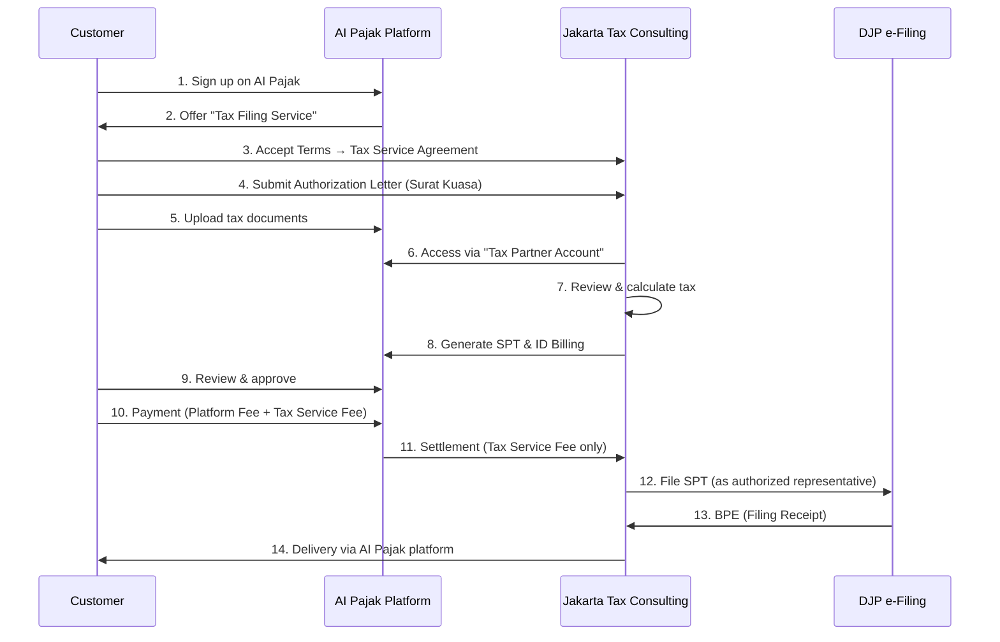

# Executive Summary & Legal Structure

**Navigation**: [Home](README.md) | [Market Analysis](02-market-analysis.md) | [Personas](personas/README.md) | [Features](features/README.md)

---

**Version**: 3.4 (Tax Calculation Engine + AI Tax Law Automation Complete)
**Last Updated**: 2025-12-23
**Implementation Status**: 🟢 Phase 2 - Tax Calculation Engine 80% Complete (Phases 0-3, 5 완료)
**Target Market**: 인도네시아 전체 납세자 (개인, 개인사업자, 법인, 세무컨설턴트)
**Legal Structure**: AI Pajak (Platform) × Jakarta Tax Consulting (Tax Services) × Mono Flip Global (Operator)

---

## 1. Executive Summary

### Vision
인도네시아의 모든 납세자가 **월별 신고(SPT Masa)**와 **연간 신고(SPT Tahunan)**를 쉽고 정확하게 완료할 수 있는 AI 기반 통합 세무 플랫폼

### Problem
인도네시아 세무 신고는 복잡하고 부담스럽습니다:

| 문제점 | 현황 |
|--------|------|
| **복잡한 신고 체계** | SPT Masa (월별) + SPT Tahunan (연간) 이중 부담 |
| **납세자 유형별 차이** | 개인/UMKM/법인마다 신고 양식과 기한이 다름 |
| **잦은 마감일** | 매월 15일/20일/말일, 연간 3월31일/4월30일 |
| **높은 오류율** | 수작업 입력 → 계산 실수 → 벌금 |
| **세무사 의존** | 비용 부담 (월 Rp 1.5M~3M, 연간 Rp 5M~15M) |

### Solution
AI PAJAK은 **SPT Masa + SPT Tahunan 통합 자동화**를 제공합니다:

```
[월별 자동화]
매출/급여 입력 → AI 계산 → e-Billing 생성 → DJP 제출 (5분)

[연간 자동화]
12개월 데이터 자동 취합 → 양식 선택 → 최종 정산 → e-Filing (15분)

[세무사 도구]
35개 고객사 통합 관리 → 일괄 신고 → 진행률 추적 (월 10시간)
```

### Market Opportunity

| 납세자 유형 | 규모 | TAM (연간) |
|------------|------|-----------|
| 개인 (근로소득) | 4천만 명 | Rp 2T (평균 Rp 50K/명) |
| UMKM | 6,400만 개 | Rp 15T (평균 Rp 2.4M/년) |
| 법인 (PT) | 150만 개 | Rp 18T (평균 Rp 12M/년) |
| 세무사 | 1만 명 | Rp 300B (평균 Rp 30M/년) |
| **Total TAM** | - | **Rp 35.3T (USD 2.35B)** |

---

## 2. Legal & Operational Structure (법적·운영 구조)

> **AI Pajak is a tax preparation and management platform.**
> **AI Pajak does not provide tax filing or tax representation services.**
> **All tax filing services are provided solely by Jakarta Tax Consulting.**
> **AI Pajak acts only as a collecting agent for tax service fees.**

### 2.1 Entities & Roles

| Entity | Legal Role | Tax Services | Platform Ownership | Revenue Attribution |
|--------|-----------|--------------|-------------------|---------------------|
| **Mono Flip Global** | Platform Operator | ❌ None | ⭕ Owner | Platform Subscription Only |
| **AI Pajak** | Software Platform | ❌ None | - | Platform Fee Revenue |
| **Jakarta Tax Consulting** | Tax Consultant | ⭕ Full Authority | ❌ None | Tax Service Fee Revenue |
| **Customer (Taxpayer)** | Service Recipient | - | - | Data Owner |

### 2.2 Contractual Relationships

#### A. Customer ↔ Jakarta Tax Consulting
```
Contract: Tax Consulting & Filing Service Agreement
- Service Provider: Jakarta Tax Consulting
- Filing Authority: Jakarta Tax Consulting
- Legal Liability: Jakarta Tax Consulting
- Revenue Owner: Jakarta Tax Consulting (100% of tax service fees)
```

#### B. Mono Flip Global ↔ Jakarta Tax Consulting
```
Contract: Platform Usage & Collection Agency Agreement
- Platform Provider: Mono Flip Global
- Collection Agent: Mono Flip Global (for tax service fees)
- Tax Service Provider: Jakarta Tax Consulting
- Revenue Split:
  * Platform Fee → Mono Flip Global
  * Tax Service Fee → Jakarta Tax Consulting (100%)
```

#### C. AI Pajak ↔ Customer
```
Contract: Platform Terms of Service
- Platform Provider: AI Pajak (operated by Mono Flip Global)
- Service Scope: Tools for tax preparation & management
- Tax Filing: ❌ NOT provided by AI Pajak
- Tax Filing: ⭕ Provided by 3rd party (Jakarta Tax Consulting)
- Payment Processing: Collection agent only
```

### 2.3 Role-Based Access Control (RBAC)

**System Roles:**

| Role | Data Access | Data Modification | Tax Calculation | ID Billing | DJP Filing | Customer Support |
|------|------------|------------------|----------------|-----------|-----------|-----------------|
| **Customer** | ⭕ Own Data | ⭕ Own Data | ⭕ | ⭕ | ⭕ (via consultant) | ⭕ |
| **Jakarta Tax Consultant** | ⭕ Assigned Clients | ⭕ Assigned Clients | ⭕ | ⭕ | ⭕ | ⭕ |
| **AI Pajak Admin** | ❌ No Access | ❌ No Access | ❌ | ❌ | ❌ | ⭕ Platform Only |

**Critical Rules:**
- ✅ AI Pajak admins **CANNOT access customer tax data**
- ✅ All tax consultants are **Jakarta Tax Consulting employees** (NOT AI Pajak employees)
- ✅ All DJP filings are logged as **Jakarta Tax Consulting** actions

### 2.4 Customer Journey (End-to-End)



### 2.5 Consultant (Agent) Definition

**Employment:**
- ❌ NOT AI Pajak employees
- ⭕ Jakarta Tax Consulting employees

**Job Titles (Allowed):**
- Tax Consultant
- Tax Officer
- Tax Account Manager
- Tax Service Representative

**Job Titles (Forbidden):**
- ❌ "AI Pajak Consultant"
- ❌ "AI Pajak Tax Agent"
- ❌ "AI Pajak Representative"

**System Account:**
- Account Type: "Tax Partner Account"
- Organization: Jakarta Tax Consulting
- Access Level: Assigned client data only
- Permissions: Full tax preparation & filing authority

### 2.6 Technical Implementation Requirements

#### Database Design (✅ IMPLEMENTED)

**현재 구현 상태**: ✅ 완료 (2025-12-23)

```sql
-- User Roles (ENHANCED - 5 roles instead of 3)
CREATE TYPE user_role AS ENUM (
  'CUSTOMER',              -- End customer
  'CONSULTANT_JTC',        -- Jakarta Tax Consulting consultant (계산만 가능)
  'TAX_ADVISOR_JTC',       -- Jakarta Tax Consulting tax advisor (계산 + 신고 가능)
  'PLATFORM_ADMIN',        -- AI Pajak admin (NO tax data access)
  'SYSTEM'                 -- System account for billing (NO tax data access)
);

-- 역할 분리 강화:
-- - CONSULTANT_JTC: 세금 계산만 가능, 신고 불가
-- - TAX_ADVISOR_JTC: 세금 계산 + 신고 가능 (POA 필요)
-- - SYSTEM: 빌링 생성만 가능, 세무 데이터 접근 불가

-- Users (✅ IMPLEMENTED)
CREATE TABLE users (
  id UUID PRIMARY KEY REFERENCES auth.users(id),
  email VARCHAR(255) UNIQUE NOT NULL,
  role user_role NOT NULL,
  full_name VARCHAR(255),
  created_at TIMESTAMPTZ DEFAULT NOW(),
  updated_at TIMESTAMPTZ DEFAULT NOW()
);

-- Customers (✅ IMPLEMENTED)
CREATE TABLE customers (
  id UUID PRIMARY KEY DEFAULT uuid_generate_v4(),
  user_id UUID UNIQUE REFERENCES users(id),
  npwp VARCHAR(16) UNIQUE NOT NULL,
  full_name VARCHAR(255) NOT NULL,
  company_name VARCHAR(255),
  address TEXT,
  phone VARCHAR(20),
  customer_type VARCHAR(20), -- 'INDIVIDUAL', 'UMKM', 'PT'
  created_at TIMESTAMPTZ DEFAULT NOW()
);

-- Consultants (✅ IMPLEMENTED)
CREATE TABLE consultants (
  id UUID PRIMARY KEY DEFAULT uuid_generate_v4(),
  user_id UUID UNIQUE REFERENCES users(id),
  tax_partner_id UUID REFERENCES tax_partners(id),
  full_name VARCHAR(255) NOT NULL,
  license_number VARCHAR(100), -- TAX_ADVISOR_JTC only
  assigned_customers UUID[], -- Array of customer IDs
  can_file_tax BOOLEAN DEFAULT FALSE, -- TRUE for TAX_ADVISOR_JTC
  created_at TIMESTAMPTZ DEFAULT NOW()
);

-- Tax Partners (✅ IMPLEMENTED)
CREATE TABLE tax_partners (
  id UUID PRIMARY KEY DEFAULT uuid_generate_v4(),
  name VARCHAR(255) NOT NULL, -- "Jakarta Tax Consulting"
  license_number VARCHAR(100) NOT NULL,
  address TEXT,
  phone VARCHAR(20),
  email VARCHAR(255),
  is_active BOOLEAN DEFAULT TRUE,
  created_at TIMESTAMPTZ DEFAULT NOW()
);

-- Power of Attorney (✅ IMPLEMENTED - NEW!)
-- Legal requirement: Customer authorization for tax filing
CREATE TABLE power_of_attorney (
  id UUID PRIMARY KEY DEFAULT uuid_generate_v4(),
  poa_number VARCHAR(50) UNIQUE NOT NULL,
  customer_id UUID REFERENCES customers(id),
  tax_partner_id UUID REFERENCES tax_partners(id),
  scope VARCHAR(50) NOT NULL, -- 'ALL_TAX_TYPES', 'PPH_21_ONLY', etc.
  valid_from DATE NOT NULL,
  valid_to DATE NOT NULL,
  status VARCHAR(20) DEFAULT 'DRAFT', -- DRAFT, PENDING_SIGNATURE, ACTIVE, EXPIRED
  customer_signed_at TIMESTAMPTZ,
  partner_signed_at TIMESTAMPTZ,
  signed_by_advisor_id UUID REFERENCES consultants(id),
  document_id UUID,
  created_at TIMESTAMPTZ DEFAULT NOW(),
  CHECK (valid_to > valid_from)
);

-- Tax Filing (✅ IMPLEMENTED)
-- Unified table for both SPT Masa and SPT Tahunan
CREATE TABLE tax_filing (
  id UUID PRIMARY KEY DEFAULT uuid_generate_v4(),
  filing_number VARCHAR(50) UNIQUE NOT NULL,
  customer_id UUID REFERENCES customers(id),
  tax_partner_id UUID REFERENCES tax_partners(id),
  poa_id UUID REFERENCES power_of_attorney(id), -- REQUIRED for filing
  tax_type VARCHAR(20) NOT NULL, -- 'PPH_21', 'PPH_23', 'PPH_FINAL', 'PPN', 'SPT_TAHUNAN'
  tax_period VARCHAR(10) NOT NULL, -- 'YYYY-MM' for Masa, 'YYYY' for Tahunan
  tax_year INTEGER NOT NULL,
  status VARCHAR(20) DEFAULT 'DRAFT', -- DRAFT, SUBMITTED, ACCEPTED, REJECTED
  filing_data JSONB NOT NULL, -- All tax data
  calculated_tax DECIMAL(15,2),
  net_tax_due DECIMAL(15,2),
  submitted_at TIMESTAMPTZ,
  submitted_by_user_id UUID REFERENCES users(id),
  submitted_by_consultant_id UUID REFERENCES consultants(id),
  bpe VARCHAR(50), -- DJP filing receipt
  djp_response JSONB,
  created_at TIMESTAMPTZ DEFAULT NOW()
);

-- Billing Transaction (✅ IMPLEMENTED - NEW!)
-- Separation of billing authority from tax filing authority
CREATE TABLE billing_transaction (
  id UUID PRIMARY KEY DEFAULT uuid_generate_v4(),
  idempotency_key VARCHAR(255) UNIQUE NOT NULL, -- Prevent duplicate billing
  invoice_number VARCHAR(50) UNIQUE NOT NULL,
  customer_id UUID REFERENCES customers(id),
  tax_filing_id UUID REFERENCES tax_filing(id),
  tax_partner_id UUID REFERENCES tax_partners(id),
  service_type VARCHAR(50) NOT NULL, -- 'TAX_FILING', 'CONSULTATION', etc.
  description TEXT,
  amount_base DECIMAL(15,2) NOT NULL,
  amount_tax DECIMAL(15,2) NOT NULL,
  amount_total DECIMAL(15,2) NOT NULL,
  currency VARCHAR(3) DEFAULT 'IDR',
  billing_period VARCHAR(20),
  due_date DATE,
  payment_status VARCHAR(20) DEFAULT 'PENDING', -- PENDING, PAID, OVERDUE, CANCELLED
  paid_at TIMESTAMPTZ,
  metadata JSONB,
  created_by VARCHAR(20) DEFAULT 'SYSTEM', -- Always 'SYSTEM'
  created_at TIMESTAMPTZ DEFAULT NOW(),
  CHECK (amount_total = amount_base + amount_tax)
);

-- Audit Log (✅ IMPLEMENTED - ENHANCED!)
-- Immutable log of all tax-related activities
CREATE TABLE audit_log (
  id UUID PRIMARY KEY DEFAULT uuid_generate_v4(),
  activity_type VARCHAR(50) NOT NULL, -- 'TAX_FILING_SUBMIT', 'POA_SIGN', 'BILLING_CREATE', etc.
  user_id UUID REFERENCES users(id),
  customer_id UUID REFERENCES customers(id),
  tax_filing_id UUID REFERENCES tax_filing(id),
  tax_partner_id UUID REFERENCES tax_partners(id),
  poa_id UUID REFERENCES power_of_attorney(id),
  activity_details JSONB,
  ip_address INET,
  user_agent TEXT,
  timestamp TIMESTAMPTZ DEFAULT NOW(),
  is_success BOOLEAN DEFAULT TRUE,
  error_message TEXT
);

-- Make audit_log immutable (no UPDATE or DELETE allowed)
-- Enforced via RLS policies
```

**구현 개선사항**:
1. ✅ 역할을 3개 → 5개로 세분화 (권한 분리 강화)
2. ✅ Power of Attorney 테이블 추가 (법적 요구사항)
3. ✅ Billing 분리 (SYSTEM 역할 전용)
4. ✅ Audit Log 강화 (모든 활동 추적)
5. ✅ Idempotency Key (중복 방지)

For detailed implementation code examples, see the [Technical Architecture](06-user-flows.md#technical-implementation) section.

**보안 테스트 커버리지**:
- ✅ 59개 E2E 테스트 (Playwright)
- ✅ 12개 CRITICAL 테스트 (Platform Admin 차단)
- ✅ 13개 POA 검증 테스트
- ✅ 11개 Audit Log 테스트

### 2.7 Marketing & UI Compliance

**Allowed Messaging:**
- ✅ "AI Pajak membantu Anda menyiapkan dokumen pajak dengan mudah"
- ✅ "Konsultan pajak profesional melayani Anda melalui platform AI Pajak"
- ✅ "AI Pajak adalah platform untuk mengelola kewajiban pajak"

**Forbidden Messaging:**
- ❌ "AI Pajak akan melaporkan pajak Anda"
- ❌ "Layanan pelaporan pajak AI Pajak"
- ❌ "AI Pajak adalah konsultan pajak Anda"

**UI Labels:**
```typescript
// Correct
<button>Hubungkan dengan Konsultan Pajak</button>
<p>Layanan pelaporan pajak disediakan oleh Jakarta Tax Consulting</p>

// Incorrect
<button>AI Pajak akan melaporkan</button> ❌
<p>AI Pajak melayani kebutuhan pajak Anda</p> ❌
```

### 2.8 Payment & Revenue Recognition

```typescript
interface InvoiceBreakdown {
  platformFee: {
    amount: number;
    recipient: 'Mono Flip Global';
    revenueType: 'Platform Subscription';
  };

  taxServiceFee: {
    amount: number;
    recipient: 'Jakarta Tax Consulting';
    revenueType: 'Tax Consulting Service';
    accountingTreatment: 'Pass-through / Deposit';
  };

  total: number;
}

// Revenue Recognition
async function recognizeRevenue(payment: Payment) {
  // Platform fee → Revenue
  await accounting.recordRevenue({
    account: 'Platform Subscription Revenue',
    amount: payment.platformFee,
    entity: 'Mono Flip Global',
  });

  // Tax service fee → Deposit (not revenue!)
  await accounting.recordLiability({
    account: 'Tax Service Fee Payable',
    amount: payment.taxServiceFee,
    entity: 'Mono Flip Global',
    payableTo: 'Jakarta Tax Consulting',
  });
}

// Settlement to Jakarta Tax Consulting
async function settleToJakartaTax(period: string) {
  const totalTaxFees = await db.payments
    .where('period', period)
    .sum('taxServiceFee');

  // Transfer
  await bankTransfer({
    from: 'Mono Flip Global',
    to: 'Jakarta Tax Consulting',
    amount: totalTaxFees,
    memo: `Tax service fee settlement - ${period}`,
  });

  // Clear liability
  await accounting.recordPayment({
    account: 'Tax Service Fee Payable',
    amount: totalTaxFees,
  });
}
```

### 2.9 Compliance Checklist

- [ ] **UI/UX**: All messaging avoids "AI Pajak provides tax filing"
- [ ] **Database**: Jakarta Tax Consulting attribution in all filing logs
- [ ] **Authentication**: Platform admins blocked from tax data
- [ ] **Contracts**: Tax service agreement clearly states Jakarta Tax Consulting as provider
- [ ] **Marketing**: All materials reviewed for compliance
- [ ] **Invoices**: Platform fee vs. tax service fee clearly separated
- [ ] **Revenue**: Tax service fees recorded as pass-through/deposit
- [ ] **DJP Submission**: All filings logged with Jakarta Tax Consulting credentials

---

## Related Documents

- [Market Analysis](02-market-analysis.md) - Competitive landscape and TAM analysis
- [Business Model](03-business-model.md) - Go-to-market strategy and pricing
- [Personas](personas/README.md) - Detailed user personas and pain points
- [Features](features/README.md) - Core features and technical specifications
- [Success Metrics](05-success-metrics.md) - KPIs and measurement framework
- [Roadmap](roadmap/phase-overview.md) - Implementation phases and timeline

---

**Last Updated**: 2025-12-23
**Source**: Extracted from PRD.md sections 1-1.1
