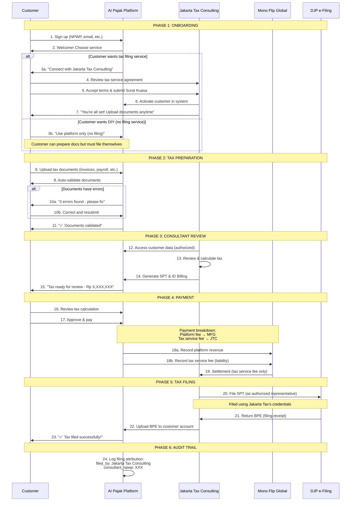

# AI Pajak × Jakarta Tax Consulting × Mono Flip Global
## Legal & Operational Structure

**Version**: 1.0
**Date**: 2025-12-23
**Purpose**: Definitive guide for legal positioning, technical implementation, and operational procedures

---

## Quick Reference Card

```
┌─────────────────────────────────────────────────────────────┐
│                    WHO DOES WHAT                            │
├─────────────────────────────────────────────────────────────┤
│ AI Pajak           → Platform (software tool)               │
│ Jakarta Tax        → Tax filing services (100%)             │
│ Mono Flip Global   → Platform operator + payment collector │
│ Customer           → Data owner + service recipient         │
└─────────────────────────────────────────────────────────────┘
```

### Core Principle

> **AI Pajak is a tax preparation and management platform.**
> **AI Pajak does not provide tax filing or tax representation services.**
> **All tax filing services are provided solely by Jakarta Tax Consulting.**
> **AI Pajak acts only as a collecting agent for tax service fees.**

---

## 1. Entity Definitions

### 1.1 Mono Flip Global

| Attribute | Value |
|-----------|-------|
| **Legal Role** | Platform Operator |
| **Business Type** | IT / SaaS Company |
| **Tax Services** | ❌ None |
| **Tax Filing Authority** | ❌ None |
| **Revenue Streams** | Platform subscription fees only |
| **Special Role** | Collecting agent for Jakarta Tax Consulting |

### 1.2 AI Pajak

| Attribute | Value |
|-----------|-------|
| **Legal Role** | Software Platform |
| **Nature** | B2B SaaS Tax Management Tool |
| **Services Provided** | Document preparation, calculation, workflow management |
| **Services NOT Provided** | Tax filing, tax representation, tax advice |
| **PJAP Status** | Not required (does not file to DJP) |
| **Owner** | Mono Flip Global |

### 1.3 Jakarta Tax Consulting

| Attribute | Value |
|-----------|-------|
| **Legal Role** | Tax Consultant / Tax Representative |
| **Business Type** | Licensed Tax Consulting Firm |
| **Tax Services** | ⭕ Full authority (filing, representation, advice) |
| **Platform Access** | Uses AI Pajak as operational tool |
| **Revenue Ownership** | 100% of tax service fees |
| **Liability** | Full liability for all tax filings |
| **Required Licenses** | PJAP (for DJP API) or individual consultant licenses |

### 1.4 Customer (Taxpayer)

| Attribute | Value |
|-----------|-------|
| **Legal Role** | Service recipient, Data owner |
| **Contracts With** | 1) Jakarta Tax Consulting (tax services)<br>2) AI Pajak (platform usage) |
| **Data Rights** | Owns all tax data |
| **Authorization** | Must provide Surat Kuasa to Jakarta Tax Consulting |

---

## 2. Contractual Framework

### 2.1 Contract A: Customer ↔ Jakarta Tax Consulting

**Contract Name**: Tax Consulting & Filing Service Agreement

**Key Terms**:
- **Service Provider**: Jakarta Tax Consulting (NOT AI Pajak)
- **Services Included**:
  - Tax document preparation
  - Tax calculation
  - Tax filing to DJP (as authorized representative)
  - Tax advice (if applicable)
- **Liability**: Jakarta Tax Consulting assumes full legal liability
- **Fee**: Tax service fee (separate from platform fee)
- **Payment Collection**: Via AI Pajak (as collecting agent)
- **Authorization**: Surat Kuasa (power of attorney) required

**Critical Clause Example**:
```
"The tax filing services are provided exclusively by Jakarta Tax Consulting,
a licensed tax consultant. AI Pajak serves solely as the technology platform
through which these services are delivered. AI Pajak does not provide tax
filing, tax representation, or tax advisory services."
```

### 2.2 Contract B: Mono Flip Global ↔ Jakarta Tax Consulting

**Contract Name**: Platform Usage & Collection Agency Agreement

**Key Terms**:
- **Platform Provider**: Mono Flip Global
- **Platform Product**: AI Pajak
- **Usage Rights**: Jakarta Tax Consulting granted license to use AI Pajak for client services
- **Collection Agent Role**:
  - Mono Flip Global collects tax service fees on behalf of Jakarta Tax Consulting
  - Fees are pass-through (not revenue for Mono Flip Global)
- **Revenue Split**:
  - Platform subscription fee → 100% to Mono Flip Global
  - Tax service fee → 100% to Jakarta Tax Consulting
- **Settlement**: Regular settlement schedule (weekly/monthly)
- **Platform Fee**: Jakarta Tax Consulting pays platform usage fee (or zero if equity partnership)

### 2.3 Contract C: AI Pajak ↔ Customer

**Contract Name**: Platform Terms of Service

**Key Terms**:
- **Platform Provider**: AI Pajak (operated by Mono Flip Global)
- **Service Scope**:
  - ✅ Tax document preparation tools
  - ✅ Tax calculation tools
  - ✅ Workflow management
  - ✅ Data storage
  - ❌ Tax filing (provided by 3rd party)
  - ❌ Tax advice (provided by 3rd party)
- **Third-Party Services**:
  - Tax filing services provided by Jakarta Tax Consulting
  - Customer must separately contract with Jakarta Tax Consulting
- **Payment Processing**:
  - AI Pajak acts as collecting agent
  - Invoices clearly separate platform fee vs. tax service fee
- **Data Ownership**: Customer retains all rights to tax data
- **Data Access**:
  - Customer can access own data
  - Jakarta Tax Consulting (with authorization) can access customer data
  - AI Pajak admins CANNOT access customer tax data

**Critical Disclaimer Example**:
```
"AI Pajak is a software platform that helps you prepare tax documents.
Tax filing services are provided by Jakarta Tax Consulting, an independent
licensed tax consultant. By using this platform, you agree to engage Jakarta
Tax Consulting for tax filing services. AI Pajak is not responsible for the
accuracy or legal compliance of tax filings."
```

---

## 3. Role-Based Access Control (RBAC)

### 3.1 System Roles

```sql
CREATE TYPE user_role AS ENUM (
  'CUSTOMER',           -- End customer (taxpayer)
  'TAX_CONSULTANT',     -- Jakarta Tax Consulting employee
  'PLATFORM_ADMIN'      -- AI Pajak / Mono Flip Global admin
);
```

### 3.2 Permission Matrix

| Permission | Customer | Tax Consultant | Platform Admin |
|------------|----------|----------------|----------------|
| **View own tax data** | ✅ | ⚪ N/A | ❌ |
| **Edit own tax data** | ✅ | ⚪ N/A | ❌ |
| **View assigned client data** | ⚪ N/A | ✅ | ❌ |
| **Edit assigned client data** | ⚪ N/A | ✅ | ❌ |
| **Calculate tax** | ✅ | ✅ | ❌ |
| **Generate ID Billing** | ✅ | ✅ | ❌ |
| **File to DJP** | ⚪ Via consultant | ✅ | ❌ |
| **View platform usage stats** | ⚪ Own only | ⚪ Own clients | ✅ |
| **Access customer support** | ✅ (platform) | ✅ (tax + platform) | ✅ (platform only) |
| **Manage users** | ❌ | ✅ (within org) | ✅ (platform users) |

### 3.3 Critical Rules

1. **Platform admins MUST NOT access customer tax data**
   - Database queries filtered by organization
   - Middleware blocks platform admin access to tax endpoints
   - Audit logs track all access attempts

2. **All tax consultants are Jakarta Tax Consulting employees**
   - Employment contract with Jakarta Tax Consulting
   - Email domain: `@jakartatax.co.id` (NOT `@aipajak.com`)
   - Business cards show Jakarta Tax Consulting branding

3. **All DJP filings must be attributed to Jakarta Tax Consulting**
   - `filed_by_organization_id` MUST reference Jakarta Tax Consulting
   - NPWP used for filing: Jakarta Tax Consulting's NPWP
   - Audit trail preserved for 10 years (UU KUP requirement)

---

## 4. Customer Journey (End-to-End)



---

## 5. Consultant (Agent) Definition

### 5.1 Employment Status

**Correct**:
- ✅ Jakarta Tax Consulting employee
- ✅ Employment contract with Jakarta Tax Consulting
- ✅ Salary/payroll from Jakarta Tax Consulting
- ✅ Business card: "Jakarta Tax Consulting"
- ✅ Email: `@jakartatax.co.id`

**Incorrect**:
- ❌ AI Pajak employee
- ❌ Mono Flip Global employee
- ❌ Contractor for AI Pajak
- ❌ Email: `@aipajak.com`

### 5.2 Job Titles

**Allowed Titles**:
- Tax Consultant (Konsultan Pajak)
- Tax Officer (Petugas Pajak)
- Tax Account Manager
- Tax Service Representative
- Senior Tax Specialist

**Forbidden Titles**:
- ❌ "AI Pajak Consultant"
- ❌ "AI Pajak Tax Agent"
- ❌ "AI Pajak Representative"
- ❌ Any title suggesting employment by AI Pajak

### 5.3 System Account Setup

**Account Type**: "Tax Partner Account"

**Configuration**:
```json
{
  "user_id": "uuid",
  "role": "TAX_CONSULTANT",
  "organization_id": "jakarta-tax-consulting-uuid",
  "organization_name": "Jakarta Tax Consulting",
  "permissions": {
    "view_client_data": true,
    "edit_client_data": true,
    "file_to_djp": true,
    "access_platform_admin": false
  },
  "assigned_clients": ["client-uuid-1", "client-uuid-2", "..."]
}
```

### 5.4 Customer-Facing Presentation

**When communicating with customers:**

**Good Example**:
> "Saya Budi dari Jakarta Tax Consulting. Saya akan membantu Anda melalui platform AI Pajak."
> (I'm Budi from Jakarta Tax Consulting. I'll help you through the AI Pajak platform.)

**Bad Example**:
> ❌ "Saya Budi dari AI Pajak. Saya konsultan pajak Anda."
> (I'm Budi from AI Pajak. I'm your tax consultant.)

---

## 6. Technical Implementation

### 6.1 Database Schema

```sql
-- Organizations
CREATE TABLE organizations (
  id UUID PRIMARY KEY DEFAULT uuid_generate_v4(),
  name VARCHAR(255) NOT NULL,
  type VARCHAR(50) NOT NULL, -- 'TAX_FIRM' | 'PLATFORM_OPERATOR'
  tax_license_number VARCHAR(100), -- Jakarta Tax only
  npwp VARCHAR(16),
  email_domain VARCHAR(100), -- e.g. 'jakartatax.co.id'
  created_at TIMESTAMP DEFAULT NOW()
);

-- Users (both customers and consultants)
CREATE TABLE users (
  id UUID PRIMARY KEY DEFAULT uuid_generate_v4(),
  email VARCHAR(255) UNIQUE NOT NULL,
  role user_role NOT NULL,
  organization_id UUID REFERENCES organizations(id),

  -- Permissions
  can_access_tax_data BOOLEAN DEFAULT FALSE,
  can_file_to_djp BOOLEAN DEFAULT FALSE,

  -- Profile
  full_name VARCHAR(255),
  npwp VARCHAR(16),
  phone VARCHAR(20),

  created_at TIMESTAMP DEFAULT NOW(),
  updated_at TIMESTAMP DEFAULT NOW()
);

-- Client-Consultant Assignments
CREATE TABLE consultant_clients (
  id UUID PRIMARY KEY DEFAULT uuid_generate_v4(),
  consultant_id UUID REFERENCES users(id),
  customer_id UUID REFERENCES users(id),
  status VARCHAR(20) DEFAULT 'ACTIVE', -- 'ACTIVE' | 'SUSPENDED' | 'TERMINATED'
  authorized_at TIMESTAMP, -- When Surat Kuasa signed
  authorization_document_url TEXT, -- S3 URL
  created_at TIMESTAMP DEFAULT NOW(),

  UNIQUE(consultant_id, customer_id)
);

-- Tax Filing Logs (CRITICAL for audit)
CREATE TABLE tax_filing_logs (
  id UUID PRIMARY KEY DEFAULT uuid_generate_v4(),

  -- Customer
  customer_id UUID REFERENCES users(id) NOT NULL,

  -- Filing organization (MUST be Jakarta Tax Consulting)
  filed_by_user_id UUID REFERENCES users(id) NOT NULL,
  filed_by_organization_id UUID REFERENCES organizations(id) NOT NULL,

  -- Filing details
  spt_type VARCHAR(50) NOT NULL, -- 'PPH_21' | 'PPH_FINAL' | 'PPN' | etc.
  period DATE NOT NULL, -- YYYY-MM-01
  tax_amount BIGINT,

  -- DJP response
  bpe VARCHAR(100), -- Filing receipt number
  ntpn VARCHAR(100), -- Payment proof number

  -- Metadata
  filed_at TIMESTAMP NOT NULL,
  filing_method VARCHAR(50), -- 'API' | 'MANUAL'

  created_at TIMESTAMP DEFAULT NOW(),

  -- Constraints
  CONSTRAINT filed_by_tax_firm CHECK (
    filed_by_organization_id IN (
      SELECT id FROM organizations WHERE type = 'TAX_FIRM'
    )
  )
);

-- Create indexes
CREATE INDEX idx_users_role ON users(role);
CREATE INDEX idx_users_organization ON users(organization_id);
CREATE INDEX idx_consultant_clients_consultant ON consultant_clients(consultant_id);
CREATE INDEX idx_consultant_clients_customer ON consultant_clients(customer_id);
CREATE INDEX idx_filing_logs_customer ON tax_filing_logs(customer_id);
CREATE INDEX idx_filing_logs_organization ON tax_filing_logs(filed_by_organization_id);
CREATE INDEX idx_filing_logs_period ON tax_filing_logs(period);
```

### 6.2 Authentication Middleware

```typescript
// middleware/auth.ts

import { Request, Response, NextFunction } from 'express';
import { db } from '@/lib/database';

/**
 * Protect tax data routes from platform admins
 */
export async function requireTaxDataAccess(
  req: Request,
  res: Response,
  next: NextFunction
) {
  const user = req.user; // Assume set by authentication middleware

  if (!user) {
    return res.status(401).json({ error: 'Unauthorized' });
  }

  // Load user's organization
  const organization = await db.organizations.findById(user.organizationId);

  // CRITICAL: Platform admins CANNOT access tax data
  if (organization.type === 'PLATFORM_OPERATOR') {
    console.warn(`Platform admin ${user.id} attempted to access tax data`);

    return res.status(403).json({
      error: 'Access denied',
      message: 'Platform administrators cannot access customer tax data',
    });
  }

  // Customers can only access their own data
  if (user.role === 'CUSTOMER') {
    const customerId = req.params.customerId || req.query.customerId;

    if (customerId !== user.id) {
      return res.status(403).json({
        error: 'Access denied',
        message: 'You can only access your own tax data',
      });
    }
  }

  // Tax consultants can only access assigned clients
  if (user.role === 'TAX_CONSULTANT') {
    const customerId = req.params.customerId || req.query.customerId;

    const assignment = await db.consultantClients.findOne({
      consultantId: user.id,
      customerId: customerId,
      status: 'ACTIVE',
    });

    if (!assignment) {
      return res.status(403).json({
        error: 'Access denied',
        message: 'You are not assigned to this client',
      });
    }
  }

  // Access granted
  next();
}

/**
 * Protect DJP filing endpoints
 * Only Jakarta Tax Consulting can file
 */
export async function requireTaxFilingAuthority(
  req: Request,
  res: Response,
  next: NextFunction
) {
  const user = req.user;

  if (!user) {
    return res.status(401).json({ error: 'Unauthorized' });
  }

  const organization = await db.organizations.findById(user.organizationId);

  // CRITICAL: Only tax firms can file to DJP
  if (organization.type !== 'TAX_FIRM') {
    console.error(`Non-tax-firm user ${user.id} attempted to file to DJP`);

    return res.status(403).json({
      error: 'Access denied',
      message: 'Only licensed tax consultants can file to DJP',
    });
  }

  // Additional check: user must have filing permission
  if (!user.canFileToDJP) {
    return res.status(403).json({
      error: 'Access denied',
      message: 'You do not have DJP filing permission',
    });
  }

  next();
}
```

### 6.3 DJP Filing Service

```typescript
// services/djp-filing.ts

import { db } from '@/lib/database';
import { djpApi } from '@/lib/djp-api';

interface FilingParams {
  customerId: string;
  consultantUserId: string;
  sptType: string;
  period: Date;
  sptData: any;
}

/**
 * File SPT to DJP
 * CRITICAL: Must be called by Jakarta Tax Consulting user
 */
export async function fileToDJP(params: FilingParams) {
  const { customerId, consultantUserId, sptType, period, sptData } = params;

  // 1. Load consultant user
  const consultant = await db.users.findById(consultantUserId);
  if (!consultant) {
    throw new Error('Consultant not found');
  }

  // 2. Load organization
  const organization = await db.organizations.findById(consultant.organizationId);

  // 3. CRITICAL CHECK: Must be tax firm
  if (organization.type !== 'TAX_FIRM') {
    throw new Error('Only Jakarta Tax Consulting can file to DJP');
  }

  // 4. Verify consultant is assigned to customer
  const assignment = await db.consultantClients.findOne({
    consultantId: consultantUserId,
    customerId: customerId,
    status: 'ACTIVE',
  });

  if (!assignment) {
    throw new Error('Consultant not authorized for this customer');
  }

  // 5. Verify authorization document exists
  if (!assignment.authorizationDocumentUrl) {
    throw new Error('Surat Kuasa not on file');
  }

  // 6. Call DJP API
  const result = await djpApi.submitSPT({
    ...sptData,

    // CRITICAL: Attribution
    filedBy: organization.name, // "Jakarta Tax Consulting"
    consultantNPWP: consultant.npwp,
    consultantName: consultant.fullName,
    authorizationReference: assignment.authorizationDocumentUrl,
  });

  // 7. Record in audit log
  await db.taxFilingLogs.create({
    customerId,
    filedByUserId: consultantUserId,
    filedByOrganizationId: organization.id,
    sptType,
    period,
    taxAmount: sptData.taxAmount,
    bpe: result.bpe,
    ntpn: result.ntpn,
    filedAt: new Date(),
    filingMethod: 'API',
  });

  // 8. Notify customer
  await notifyCustomer(customerId, {
    type: 'FILING_SUCCESS',
    sptType,
    period,
    bpe: result.bpe,
  });

  return result;
}
```

### 6.4 Revenue Recognition

```typescript
// services/payment.ts

interface PaymentParams {
  customerId: string;
  subscriptionTier: string; // 'STARTER' | 'PROFESSIONAL' | etc.
  includeTaxService: boolean;
}

/**
 * Process customer payment
 * Separate platform fee vs. tax service fee
 */
export async function processPayment(params: PaymentParams) {
  const { customerId, subscriptionTier, includeTaxService } = params;

  // 1. Calculate fees
  const pricing = getPricing(subscriptionTier);

  const platformFee = pricing.platformFee; // e.g. Rp 199,000
  const taxServiceFee = includeTaxService ? pricing.taxServiceFee : 0; // e.g. Rp 500,000

  const totalAmount = platformFee + taxServiceFee;

  // 2. Charge customer via Midtrans
  const payment = await midtrans.charge({
    amount: totalAmount,
    customerId,
    itemDetails: [
      {
        id: 'platform-subscription',
        name: `AI Pajak ${subscriptionTier}`,
        price: platformFee,
        quantity: 1,
      },
      includeTaxService && {
        id: 'tax-service',
        name: 'Jakarta Tax Consulting Service',
        price: taxServiceFee,
        quantity: 1,
      },
    ].filter(Boolean),
  });

  // 3. Record in database
  const invoice = await db.invoices.create({
    customerId,
    totalAmount,
    platformFee,
    taxServiceFee,
    paymentStatus: 'PENDING',
    midtransOrderId: payment.orderId,
  });

  // 4. On payment success (webhook):
  // await handlePaymentSuccess(invoice.id);

  return { invoice, payment };
}

/**
 * Handle payment success
 * Record revenue appropriately
 */
async function handlePaymentSuccess(invoiceId: string) {
  const invoice = await db.invoices.findById(invoiceId);

  // 1. Platform fee → Revenue for Mono Flip Global
  await db.accounting.recordRevenue({
    account: 'Platform Subscription Revenue',
    amount: invoice.platformFee,
    entity: 'Mono Flip Global',
    reference: invoiceId,
  });

  // 2. Tax service fee → Liability (payable to Jakarta Tax)
  if (invoice.taxServiceFee > 0) {
    await db.accounting.recordLiability({
      account: 'Tax Service Fee Payable',
      amount: invoice.taxServiceFee,
      entity: 'Mono Flip Global',
      payableTo: 'Jakarta Tax Consulting',
      reference: invoiceId,
    });
  }

  // 3. Update invoice status
  await db.invoices.update(invoiceId, {
    paymentStatus: 'PAID',
    paidAt: new Date(),
  });
}

/**
 * Settle to Jakarta Tax Consulting
 * Run weekly or monthly
 */
export async function settleToJakartaTax(periodStart: Date, periodEnd: Date) {
  // 1. Calculate total tax service fees collected
  const totalTaxFees = await db.invoices
    .where('paidAt', '>=', periodStart)
    .where('paidAt', '<', periodEnd)
    .where('paymentStatus', 'PAID')
    .sum('taxServiceFee');

  if (totalTaxFees === 0) {
    console.log('No tax service fees to settle');
    return;
  }

  // 2. Transfer funds
  const transfer = await bankTransfer({
    from: 'Mono Flip Global',
    to: 'Jakarta Tax Consulting',
    amount: totalTaxFees,
    memo: `Tax service fee settlement ${periodStart.toISOString()} - ${periodEnd.toISOString()}`,
  });

  // 3. Record settlement
  await db.accounting.recordPayment({
    account: 'Tax Service Fee Payable',
    amount: totalTaxFees,
    entity: 'Mono Flip Global',
    reference: transfer.transactionId,
    paidAt: new Date(),
  });

  // 4. Notify Jakarta Tax
  await notifyJakartaTax({
    type: 'SETTLEMENT',
    amount: totalTaxFees,
    period: { start: periodStart, end: periodEnd },
    transactionId: transfer.transactionId,
  });

  console.log(`Settled Rp ${totalTaxFees.toLocaleString()} to Jakarta Tax Consulting`);
}
```

---

## 7. Marketing & UI Compliance

### 7.1 Allowed Messaging

**Website / Landing Page**:
- ✅ "AI Pajak membantu Anda menyiapkan dokumen pajak dengan mudah"
  (AI Pajak helps you prepare tax documents easily)
- ✅ "Platform manajemen pajak yang efisien"
  (Efficient tax management platform)
- ✅ "Konsultan pajak profesional melayani Anda melalui AI Pajak"
  (Professional tax consultants serve you through AI Pajak)
- ✅ "Dapatkan bantuan dari Jakarta Tax Consulting"
  (Get help from Jakarta Tax Consulting)

**In-App**:
- ✅ Button: "Hubungkan dengan Konsultan Pajak"
  (Connect with Tax Consultant)
- ✅ Label: "Layanan pelaporan pajak disediakan oleh Jakarta Tax Consulting"
  (Tax filing services provided by Jakarta Tax Consulting)
- ✅ Notification: "Jakarta Tax Consulting telah mengajukan SPT Anda"
  (Jakarta Tax Consulting has filed your SPT)

### 7.2 Forbidden Messaging

**NEVER Say**:
- ❌ "AI Pajak akan melaporkan pajak Anda"
  (AI Pajak will file your taxes)
- ❌ "Layanan pelaporan pajak AI Pajak"
  (AI Pajak's tax filing service)
- ❌ "AI Pajak adalah konsultan pajak Anda"
  (AI Pajak is your tax consultant)
- ❌ "Kami akan mengurus semua kewajiban pajak Anda"
  (We will handle all your tax obligations)
- ❌ Any statement suggesting AI Pajak provides tax services

### 7.3 UI Examples

**Good Example - Tax Filing Button**:
```tsx
<button onClick={connectToConsultant}>
  Hubungkan dengan Konsultan Pajak
</button>
<p className="text-sm text-gray-600">
  Layanan pelaporan pajak disediakan oleh Jakarta Tax Consulting,
  konsultan pajak berlisensi.
</p>
```

**Bad Example**:
```tsx
<button onClick={fileNow}>
  ❌ AI Pajak akan melaporkan sekarang
</button>
```

**Good Example - Dashboard Status**:
```tsx
<div className="status-card">
  <h3>Status Pelaporan PPh 21 - Januari 2025</h3>
  <p>✅ Dilaporkan oleh Jakarta Tax Consulting</p>
  <p>BPE: 202501XXXXX</p>
  <p>Tanggal: 2025-01-20</p>
</div>
```

**Bad Example**:
```tsx
<div className="status-card">
  ❌ <p>✅ Dilaporkan oleh AI Pajak</p>
</div>
```

---

## 8. Compliance Checklist

Use this checklist before launching any feature:

### Legal & Contracts
- [ ] Tax service agreement clearly states Jakarta Tax Consulting as provider
- [ ] Platform ToS disclaims AI Pajak from tax services
- [ ] Collection agency agreement in place
- [ ] Surat Kuasa template prepared for customers

### Technical Implementation
- [ ] Database schema enforces Jakarta Tax attribution
- [ ] Middleware blocks platform admins from tax data
- [ ] DJP filing function checks organization type = 'TAX_FIRM'
- [ ] Audit logs capture all filing activities
- [ ] Revenue recognition separates platform vs. tax service fees

### User Interface
- [ ] All UI text reviewed for compliance
- [ ] No buttons say "AI Pajak will file..."
- [ ] Jakarta Tax Consulting credit visible on filing confirmations
- [ ] Consultant profiles show Jakarta Tax Consulting affiliation

### Operations
- [ ] Consultants hired by Jakarta Tax Consulting (not AI Pajak)
- [ ] Consultant email addresses use `@jakartatax.co.id`
- [ ] Business cards branded as Jakarta Tax Consulting
- [ ] Customer support scripts avoid claiming tax services

### Marketing
- [ ] Website copy reviewed by legal
- [ ] Ad campaigns don't claim tax filing by AI Pajak
- [ ] Social media posts clarify Jakarta Tax Consulting role
- [ ] Partnership announcements emphasize Jakarta Tax as service provider

### Financial
- [ ] Invoices separate platform fee vs. tax service fee
- [ ] Accounting system records tax service fees as liabilities
- [ ] Settlement process to Jakarta Tax established
- [ ] Payment gateway fees allocated correctly

---

## 9. FAQs

### Q1: Can AI Pajak file taxes directly to DJP?
**A**: No. AI Pajak is a software platform. All DJP filings must be performed by Jakarta Tax Consulting, a licensed tax consultant.

### Q2: Who owns the customer tax data?
**A**: The customer owns all tax data. Jakarta Tax Consulting (with authorization) can access the data to provide services. AI Pajak platform admins cannot access customer tax data.

### Q3: Can we hire consultants as AI Pajak employees?
**A**: No. All consultants must be employed by Jakarta Tax Consulting to maintain legal separation. They can access AI Pajak via "Tax Partner Accounts."

### Q4: What if a customer wants to DIY without Jakarta Tax?
**A**: Allowed. Customer can use AI Pajak to prepare documents and file to DJP themselves. Platform provides document preparation tools only.

### Q5: Can we white-label AI Pajak for other tax consultants?
**A**: Yes, in the future. But each tax consultant would need their own organization account, and the same legal separation principles apply.

### Q6: What happens to tax service fees collected via AI Pajak?
**A**: They are pass-through revenues. Mono Flip Global holds them as liabilities and settles to Jakarta Tax Consulting on a regular schedule (weekly/monthly).

### Q7: Can AI Pajak provide tax advice to customers?
**A**: No. Only licensed tax consultants (Jakarta Tax Consulting employees) can provide tax advice. AI Pajak can show calculations and explanations of tax rules, but not personalized advice.

### Q8: What if Jakarta Tax Consulting wants to stop the partnership?
**A**: The partnership can be terminated per the contract terms. Customer contracts are with Jakarta Tax Consulting, so customers would need to be transitioned to a new tax consultant or DIY. AI Pajak platform continues operating as software.

### Q9: Do we need PJAP certification?
**A**: Jakarta Tax Consulting needs PJAP if filing via DJP API. AI Pajak platform does not need PJAP because it doesn't file to DJP.

### Q10: How do we handle customer complaints about tax filings?
**A**: Tax filing complaints are handled by Jakarta Tax Consulting (service provider). Platform/technical issues are handled by AI Pajak. Clear escalation path needed.

---

## 10. Next Steps

**Before Development Starts**:
1. [ ] Legal review of this structure by Indonesian tax lawyer
2. [ ] Draft contracts (A, B, C) and get signatures
3. [ ] Register Jakarta Tax Consulting entity (if not already done)
4. [ ] Apply for PJAP certification (Jakarta Tax Consulting)
5. [ ] Set up bank accounts and payment settlement process

**During Development**:
1. [ ] Implement RBAC as specified
2. [ ] Build audit logging for all tax activities
3. [ ] Create UI components following compliance guidelines
4. [ ] Set up revenue recognition automation

**Before Launch**:
1. [ ] Final legal review of all customer-facing text
2. [ ] Train consultants on messaging ("from Jakarta Tax Consulting")
3. [ ] Test settlement process with Jakarta Tax
4. [ ] Prepare customer onboarding materials (including Surat Kuasa)
5. [ ] Set up compliance monitoring and alerts

---

## Document Control

| Attribute | Value |
|-----------|-------|
| **Version** | 1.0 |
| **Date** | 2025-12-23 |
| **Author** | AI Pajak Product Team |
| **Reviewers** | Legal, Engineering, Operations, Jakarta Tax Consulting |
| **Approval** | [Pending] |
| **Next Review** | Before MVP launch |

---

**End of Document**
