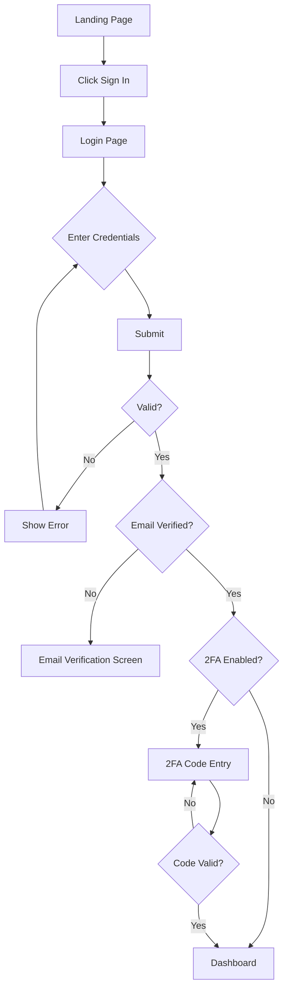
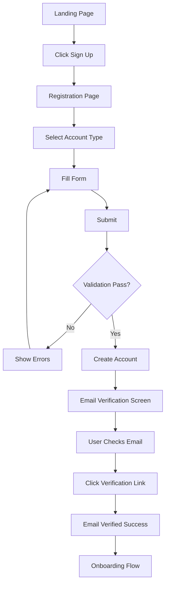
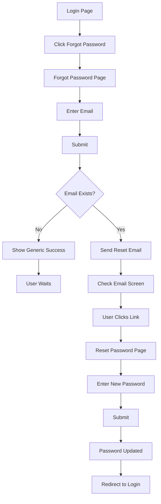

# Login & Registration Screens - Detailed Specification

## Overview
The Login and Registration screens serve as the primary entry points to the AI-Pajak platform. They provide secure authentication, user onboarding, and account creation for all user personas.

---

## Screen 1: Login Page

### Layout Composition

```
┌─────────────────────────────────────────────────────────────┐
│                          FULL VIEWPORT                       │
├──────────────────────┬──────────────────────────────────────┤
│                      │                                      │
│   LEFT PANEL         │        RIGHT PANEL                   │
│   (40% width)        │        (60% width)                   │
│   Brand/Marketing    │        Login Form                    │
│                      │                                      │
│   [Visual]           │        [Functional]                  │
│                      │                                      │
└──────────────────────┴──────────────────────────────────────┘
```

### Component Hierarchy

#### Left Panel (Brand Panel)
```
┌────────────────────────────────┐
│                                │
│    [AI-PAJAK LOGO]             │
│    Large, centered             │
│                                │
│    Simplify Your Tax           │
│    Management with AI          │
│                                │
│    [Illustration/Image]        │
│    - Tax documents             │
│    - Digital workflow          │
│    - Happy users               │
│                                │
│    "Trusted by 1,000+          │
│     Indonesian businesses"     │
│                                │
│    ⭐⭐⭐⭐⭐                    │
│                                │
└────────────────────────────────┘
```

**Visual Specifications:**
- Background: Gradient (Primary 600 → Primary 800)
- Logo: White version, 200px width
- Headline: White, 32px, Bold
- Body text: White/90%, 18px, Regular
- Illustration: Full color or white outline
- Reviews: White, 14px, stars in gold

**Content:**
- Rotating taglines (carousel every 5 seconds)
- Customer testimonial quotes
- Key platform benefits
- Security badges (ISO, SSL, etc.)

---

#### Right Panel (Login Form)
```
┌────────────────────────────────────────┐
│                                        │
│  ┌──────────────────────────────────┐ │
│  │                                  │ │
│  │    Welcome Back! 👋              │ │
│  │    Sign in to your account       │ │
│  │                                  │ │
│  │    Email Address *               │ │
│  │    ┌──────────────────────────┐ │ │
│  │    │ 📧 you@company.com       │ │ │
│  │    └──────────────────────────┘ │ │
│  │                                  │ │
│  │    Password *                    │ │
│  │    ┌──────────────────────────┐ │ │
│  │    │ 🔒 ••••••••••      👁   │ │ │
│  │    └──────────────────────────┘ │ │
│  │                                  │ │
│  │    ☐ Remember me                │ │
│  │            Forgot password?  →  │ │
│  │                                  │ │
│  │    ┌──────────────────────────┐ │ │
│  │    │      SIGN IN             │ │ │
│  │    └──────────────────────────┘ │ │
│  │                                  │ │
│  │    ─────────  OR  ─────────     │ │
│  │                                  │ │
│  │    ┌──────────────────────────┐ │ │
│  │    │  🔵 Sign in with Google  │ │ │
│  │    └──────────────────────────┘ │ │
│  │                                  │ │
│  │    ┌──────────────────────────┐ │ │
│  │    │  🟦 Sign in with Microsoft│ │ │
│  │    └──────────────────────────┘ │ │
│  │                                  │ │
│  │    Don't have an account?       │ │
│  │    Sign up →                    │ │
│  │                                  │ │
│  └──────────────────────────────────┘ │
│                                        │
│  🔒 Secure SSL Encryption              │
│  🛡️ ISO 27001 Certified                │
│                                        │
└────────────────────────────────────────┘
```

### Detailed Component Specifications

#### 1. Form Container
**Dimensions:**
- Max width: 480px
- Padding: 60px 40px
- Margin: Auto (centered)
- Background: White
- Border radius: 8px (optional, for card style)
- Shadow: None (or subtle: 0 2px 8px rgba(0,0,0,0.04))

#### 2. Header Section
**Welcome Headline:**
- Text: "Welcome Back! 👋" (emoji optional)
- Font: 32px, Bold (font-weight: 700)
- Color: Neutral 900 (#1A1A1A)
- Margin bottom: 8px

**Subtitle:**
- Text: "Sign in to your account"
- Font: 16px, Regular (font-weight: 400)
- Color: Neutral 600 (#666666)
- Margin bottom: 32px

#### 3. Email Input Field
**Label:**
- Text: "Email Address *"
- Font: 14px, Medium (font-weight: 500)
- Color: Neutral 700
- Margin bottom: 8px

**Input:**
- Height: 48px
- Padding: 12px 16px 12px 44px (left padding for icon)
- Border: 1px solid Neutral 300
- Border radius: 6px
- Font: 16px, Regular
- Placeholder: "you@company.com"
- Icon: 📧 (mail icon, left positioned, 16x16, Neutral 500)

**States:**
- Default: Border Neutral 300
- Focus: Border Primary 500, Box-shadow 0 0 0 3px Primary 100
- Error: Border Error 500, Box-shadow 0 0 0 3px Error 100
- Disabled: Background Neutral 100, Border Neutral 200

**Validation:**
- Required field
- Email format validation (regex)
- Real-time validation on blur
- Error message below field in Error 600, 14px

#### 4. Password Input Field
**Label:**
- Text: "Password *"
- Font: 14px, Medium
- Color: Neutral 700
- Margin bottom: 8px

**Input:**
- Height: 48px
- Padding: 12px 44px 12px 44px (icons on both sides)
- Border: 1px solid Neutral 300
- Border radius: 6px
- Font: 16px, Regular
- Placeholder: "Enter your password"
- Type: password (toggleable)
- Left icon: 🔒 (lock icon, 16x16)
- Right icon: 👁 (eye icon, 16x16, toggles to eye-slash)

**Toggle Visibility:**
- Click eye icon → Show/hide password
- Icon changes: 👁 ↔ 🙈
- Cursor: pointer on hover
- Tooltip: "Show password" / "Hide password"

**States:** Same as email field

**Validation:**
- Required field
- Minimum 8 characters
- At least one uppercase, one lowercase, one number (for registration)
- Error message below field

#### 5. Remember Me & Forgot Password
**Layout:**
- Flexbox, space-between
- Margin top: 16px
- Margin bottom: 24px

**Remember Me Checkbox:**
- Custom styled checkbox (not native)
- Size: 18x18
- Border: 2px solid Neutral 400
- Checked: Background Primary 500, white checkmark
- Label: "Remember me", 14px, Regular, Neutral 700
- Gap between checkbox and label: 8px

**Forgot Password Link:**
- Text: "Forgot password?"
- Font: 14px, Medium
- Color: Primary 600
- Hover: Primary 700, underline
- Click: Navigate to password reset page

#### 6. Sign In Button
**Specifications:**
- Width: 100%
- Height: 48px
- Background: Primary 600 (gradient optional)
- Text: "SIGN IN" or "Sign In"
- Font: 16px, Semi-bold (font-weight: 600)
- Color: White
- Border radius: 6px
- Border: None
- Cursor: pointer

**States:**
- Default: Background Primary 600
- Hover: Background Primary 700, subtle lift (transform: translateY(-1px))
- Active: Background Primary 800
- Loading: Disabled state + spinner icon
- Disabled: Background Neutral 300, Cursor not-allowed

**Loading State:**
- Show spinner (white, 20x20) to left of text
- Text: "Signing in..."
- Prevent double-click

#### 7. Divider
**Specifications:**
- Margin: 24px 0
- Text: "OR"
- Font: 12px, Medium, Neutral 500
- Lines: 1px solid Neutral 300
- Implementation: HR with centered text or flexbox

#### 8. Social Login Buttons
**Google Sign In:**
- Width: 100%
- Height: 48px
- Background: White
- Border: 1px solid Neutral 300
- Text: "Sign in with Google"
- Font: 15px, Medium
- Color: Neutral 700
- Icon: Google logo (20x20), left-aligned with 12px margin
- Border radius: 6px
- Margin bottom: 12px

**Microsoft Sign In:**
- Same as Google but with Microsoft logo
- Text: "Sign in with Microsoft"

**States:**
- Hover: Border Primary 300, Background Neutral 50
- Active: Background Neutral 100
- Loading: Spinner replaces icon

**OAuth Flow:**
- Click → Redirect to OAuth provider
- Return with token → Auto-login
- Error → Show error toast

#### 9. Sign Up Link
**Layout:**
- Margin top: 24px
- Text align: center

**Text:**
- Regular: "Don't have an account?" (14px, Regular, Neutral 600)
- Link: "Sign up" (14px, Semi-bold, Primary 600)
- Hover: Primary 700, underline

#### 10. Security Badges
**Position:** Bottom of form or footer
**Content:**
- 🔒 Secure SSL Encryption
- 🛡️ ISO 27001 Certified
- Font: 12px, Regular, Neutral 500
- Icons: 16x16, Neutral 400
- Gap: 16px between badges

---

## Screen 2: Registration Page

### Layout
Similar to Login Page: Left panel (brand) + Right panel (form)

### Registration Form Structure

```
┌────────────────────────────────────────┐
│                                        │
│  Create Your Account                   │
│  Start your 30-day free trial         │
│                                        │
│  Account Type *                        │
│  ○ Tax Consultant Firm                │
│  ○ Business (Self-Service)            │
│                                        │
│  Company Name *                        │
│  ┌──────────────────────────────────┐ │
│  │ 🏢 Your Company Name             │ │
│  └──────────────────────────────────┘ │
│                                        │
│  Your Full Name *                      │
│  ┌──────────────────────────────────┐ │
│  │ 👤 John Doe                      │ │
│  └──────────────────────────────────┘ │
│                                        │
│  Email Address *                       │
│  ┌──────────────────────────────────┐ │
│  │ 📧 you@company.com               │ │
│  └──────────────────────────────────┘ │
│  ℹ️ We'll send verification here      │
│                                        │
│  Phone Number *                        │
│  ┌───┬─────────────────────────────┐ │
│  │+62│ 812-3456-7890               │ │
│  └───┴─────────────────────────────┘ │
│                                        │
│  Password *                            │
│  ┌──────────────────────────────────┐ │
│  │ 🔒 ••••••••••••••         👁    │ │
│  └──────────────────────────────────┘ │
│  Password strength: ▓▓▓▓░ Strong      │
│                                        │
│  Confirm Password *                    │
│  ┌──────────────────────────────────┐ │
│  │ 🔒 ••••••••••••••         👁    │ │
│  └──────────────────────────────────┘ │
│                                        │
│  ☑ I agree to the Terms of Service   │
│     and Privacy Policy                │
│                                        │
│  ☐ Subscribe to newsletter            │
│                                        │
│  ┌──────────────────────────────────┐ │
│  │    CREATE ACCOUNT                │ │
│  └──────────────────────────────────┘ │
│                                        │
│  ─────────  OR  ─────────             │
│                                        │
│  ┌──────────────────────────────────┐ │
│  │  🔵 Sign up with Google          │ │
│  └──────────────────────────────────┘ │
│                                        │
│  Already have an account? Sign in →   │
│                                        │
└────────────────────────────────────────┘
```

### Component Specifications

#### 1. Form Header
**Headline:**
- Text: "Create Your Account"
- Font: 32px, Bold
- Color: Neutral 900
- Margin bottom: 8px

**Subheadline:**
- Text: "Start your 30-day free trial"
- Font: 16px, Regular
- Color: Primary 600 (highlight the offer)
- Margin bottom: 32px

#### 2. Account Type (Radio Buttons)
**Label:** "Account Type *"

**Options:**
```
○ Tax Consultant Firm
  Perfect for accounting firms managing multiple clients

○ Business (Self-Service)
  For businesses managing their own tax compliance
```

**Radio Button Specs:**
- Size: 20x20
- Border: 2px solid Neutral 400
- Selected: Blue inner circle (Primary 600)
- Label: 16px, Medium
- Description: 14px, Regular, Neutral 600
- Margin between options: 16px

**Behavior:**
- Only one selectable
- Default: Tax Consultant selected
- Changes form fields based on selection

#### 3. Company Name Input
**Specifications:**
- Same as email input from login
- Icon: 🏢 (building icon)
- Placeholder: "Your Company Name"
- Validation: Required, 2-100 characters
- Auto-capitalize: Words

#### 4. Full Name Input
**Specifications:**
- Icon: 👤 (user icon)
- Placeholder: "John Doe"
- Validation: Required, 2-50 characters
- Auto-capitalize: Words
- Pattern: Letters and spaces only

#### 5. Email Input
**Additional Features:**
- Async validation (check if email already exists)
- Info message: "We'll send verification here" (Neutral 600, 13px, italic)
- Loading indicator during async check
- Unique email requirement

#### 6. Phone Number Input
**Specifications:**
- Split input: Country code dropdown + number input
- Country code:
  - Default: +62 (Indonesia)
  - Dropdown with flags
  - Searchable
  - Width: 80px
- Number input:
  - Format: Auto-format with dashes (812-3456-7890)
  - Validation: Indonesian phone number pattern
  - Length: 9-13 digits
- Combined height: 48px
- Border: 1px solid Neutral 300 (wraps both parts)

#### 7. Password Input
**Additional Features:**
- Password strength meter below input
- Strength levels:
  - Weak: Red, 1 bar
  - Fair: Orange, 2 bars
  - Good: Yellow, 3 bars
  - Strong: Green, 4 bars
  - Very Strong: Green, 5 bars
- Visual: ▓▓▓▓░ with color and text
- Requirements tooltip on focus:
  ```
  Password must contain:
  ✓ At least 8 characters
  ✓ One uppercase letter
  ✓ One lowercase letter
  ✓ One number
  ○ One special character (recommended)
  ```
- Real-time validation as user types

#### 8. Confirm Password Input
**Specifications:**
- Same as password input
- Real-time matching validation
- Error if doesn't match: "Passwords do not match"
- Success checkmark if matches

#### 9. Terms & Conditions Checkbox
**Required Checkbox:**
```
☑ I agree to the Terms of Service and Privacy Policy
```
- Checkbox: 18x18
- Text: 14px, Regular
- Links: "Terms of Service" and "Privacy Policy" in Primary 600
- Links open in new tab
- Required to submit (validation error if unchecked)

**Optional Checkbox:**
```
☐ Subscribe to newsletter and product updates
```
- Same style
- Optional
- Default: Unchecked

#### 10. Create Account Button
**Specifications:**
- Width: 100%
- Height: 52px (slightly taller than login)
- Background: Gradient (Primary 600 → Primary 700) or solid Primary 600
- Text: "CREATE ACCOUNT" or "Create Account"
- Font: 16px, Semi-bold
- Color: White
- Border radius: 6px
- Box shadow: 0 4px 12px rgba(Primary, 0.2)

**States:**
- Hover: Lift effect, darker gradient
- Loading: "Creating your account..." + spinner
- Disabled: Neutral 300 (if form invalid)

---

## Screen 3: Forgot Password

```
┌────────────────────────────────────────┐
│                                        │
│  ← Back to Sign In                     │
│                                        │
│  Forgot Password? 🔑                   │
│  No worries, we'll send you reset     │
│  instructions.                         │
│                                        │
│  Email Address *                       │
│  ┌──────────────────────────────────┐ │
│  │ 📧 you@company.com               │ │
│  └──────────────────────────────────┘ │
│                                        │
│  ┌──────────────────────────────────┐ │
│  │    SEND RESET LINK               │ │
│  └──────────────────────────────────┘ │
│                                        │
│  ← Back to Sign In                     │
│                                        │
└────────────────────────────────────────┘
```

### Component Specifications

#### Back Link
- Text: "← Back to Sign In"
- Font: 14px, Medium
- Color: Primary 600
- Hover: Primary 700, underline
- Position: Top of form

#### Header
- Title: "Forgot Password? 🔑"
- Font: 28px, Bold
- Description: "No worries, we'll send you reset instructions."
- Font: 16px, Regular, Neutral 600

#### Email Input
- Same specs as login email
- Validation: Email format + account existence check

#### Submit Button
- Text: "SEND RESET LINK"
- Same specs as sign in button
- Loading state: "Sending..."

---

## Screen 4: Email Verification Required

```
┌────────────────────────────────────────┐
│                                        │
│         ✉️                             │
│                                        │
│  Verify Your Email                     │
│                                        │
│  We've sent a verification link to:   │
│  you@company.com                       │
│                                        │
│  Please check your inbox and click    │
│  the link to verify your account.     │
│                                        │
│  Didn't receive the email?             │
│  ┌──────────────────────────────────┐ │
│  │    RESEND VERIFICATION EMAIL     │ │
│  └──────────────────────────────────┘ │
│                                        │
│  ✓ Email sent! Check your inbox.      │
│                                        │
│  ← Back to Sign In                     │
│                                        │
└────────────────────────────────────────┘
```

### Component Specifications

#### Email Icon
- Large envelope icon or illustration
- Size: 80x80
- Color: Primary 500
- Margin bottom: 24px

#### Title
- Text: "Verify Your Email"
- Font: 28px, Bold
- Color: Neutral 900
- Margin bottom: 16px

#### Email Display
- Text: "We've sent a verification link to:"
- User email in bold: you@company.com
- Font: 16px, Regular
- Email font: 16px, Semi-bold, Primary 600

#### Instructions
- Multi-line text
- Font: 16px, Regular
- Color: Neutral 700
- Line height: 1.6

#### Resend Button
- Initially shows after 60 seconds
- Countdown timer: "Resend in 45s"
- After countdown: Full button available
- Secondary button style (outlined)
- Click: Resend email, show success message, restart timer

#### Success Message
- Text: "✓ Email sent! Check your inbox."
- Color: Success 600
- Font: 14px, Medium
- Appears temporarily after resend

---

## User Flows

### Login Flow


### Registration Flow


### Password Reset Flow


---

## Validation Rules

### Email
- Required: Yes
- Format: Valid email regex
- Max length: 254 characters
- Async check: Email availability (registration)
- Trim whitespace

### Password
- Required: Yes
- Min length: 8 characters
- Max length: 128 characters
- Must contain:
  - At least one uppercase letter (A-Z)
  - At least one lowercase letter (a-z)
  - At least one digit (0-9)
  - Special character recommended but not required

### Company Name
- Required: Yes
- Min length: 2 characters
- Max length: 100 characters
- Pattern: Letters, numbers, spaces, common punctuation

### Full Name
- Required: Yes
- Min length: 2 characters
- Max length: 50 characters
- Pattern: Letters, spaces, hyphens, apostrophes

### Phone Number
- Required: Yes
- Format: Indonesian phone number
- Min digits: 9
- Max digits: 13
- Must start with valid prefix

### Terms Acceptance
- Required: Yes
- Must be explicitly checked

---

## Error Messages

### Field-Level Errors
| Field | Error | Message |
|-------|-------|---------|
| Email | Empty | "Email address is required" |
| Email | Invalid format | "Please enter a valid email address" |
| Email | Already exists | "This email is already registered" |
| Password | Empty | "Password is required" |
| Password | Too short | "Password must be at least 8 characters" |
| Password | Weak | "Password must contain uppercase, lowercase, and numbers" |
| Confirm Password | Mismatch | "Passwords do not match" |
| Terms | Not checked | "You must agree to the Terms of Service" |

### System Errors
- "Unable to connect. Please check your internet connection."
- "Something went wrong. Please try again later."
- "Too many login attempts. Please try again in 15 minutes."
- "Invalid email or password. Please try again."

---

## Success Messages

### Registration Success
```
✓ Account created successfully!
  We've sent a verification email to you@company.com
```

### Login Success
```
✓ Welcome back!
  Redirecting to dashboard...
```

### Password Reset Sent
```
✓ Reset link sent!
  Check your email for password reset instructions.
```

---

## Accessibility

### Keyboard Navigation
- Tab order: Logo → Form fields → Buttons → Links
- Enter to submit form
- Escape to clear form or close modals
- Arrow keys in dropdowns

### Screen Readers
- All form labels associated with inputs
- Error messages announced
- Loading states announced
- Success confirmations announced

### ARIA Attributes
```html
<input
  type="email"
  id="email"
  aria-label="Email address"
  aria-required="true"
  aria-invalid="false"
  aria-describedby="email-error"
/>
<span id="email-error" role="alert"></span>
```

---

## Security Features

### Password Security
- Hashed using bcrypt (backend)
- Never sent unencrypted
- Password strength meter
- Breach detection (Have I Been Pwned API)

### Rate Limiting
- Max 5 login attempts per 15 minutes
- Max 3 password reset requests per hour
- CAPTCHA after 3 failed attempts

### CSRF Protection
- CSRF tokens on all forms
- Token rotation per session
- Validation on backend

### Session Management
- Secure, httpOnly cookies
- Session timeout: 30 minutes inactive
- Remember me: 30 days
- Multi-device logout support

---

## Performance

### Initial Load
- Critical CSS inline
- Lazy load social login scripts
- Preconnect to OAuth providers
- < 2 second FCP

### Form Submission
- Optimistic UI updates
- Debounced async validation (300ms)
- Loading states prevent double submission
- < 500ms perceived response time

---

## Related Documentation
- [User Flows](/Users/tommy/git/ai-pajak/docs/02-design/ui-ux/user-flows.md)
- [Design System](/Users/tommy/git/ai-pajak/docs/02-design/ui-ux/design-system.md)
- [Authentication API](/Users/tommy/git/ai-pajak/docs/02-design/api/authentication.md)
- [Security Specifications](/Users/tommy/git/ai-pajak/docs/03-technical/security.md)

---

**Document Version:** 1.0
**Last Updated:** 2025-12-23
**Owner:** Product Design Team
**Status:** Ready for Development
