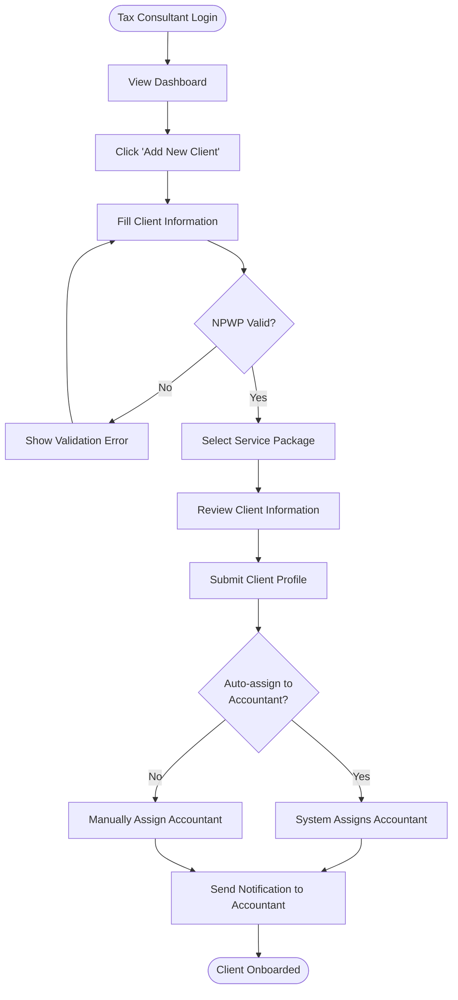
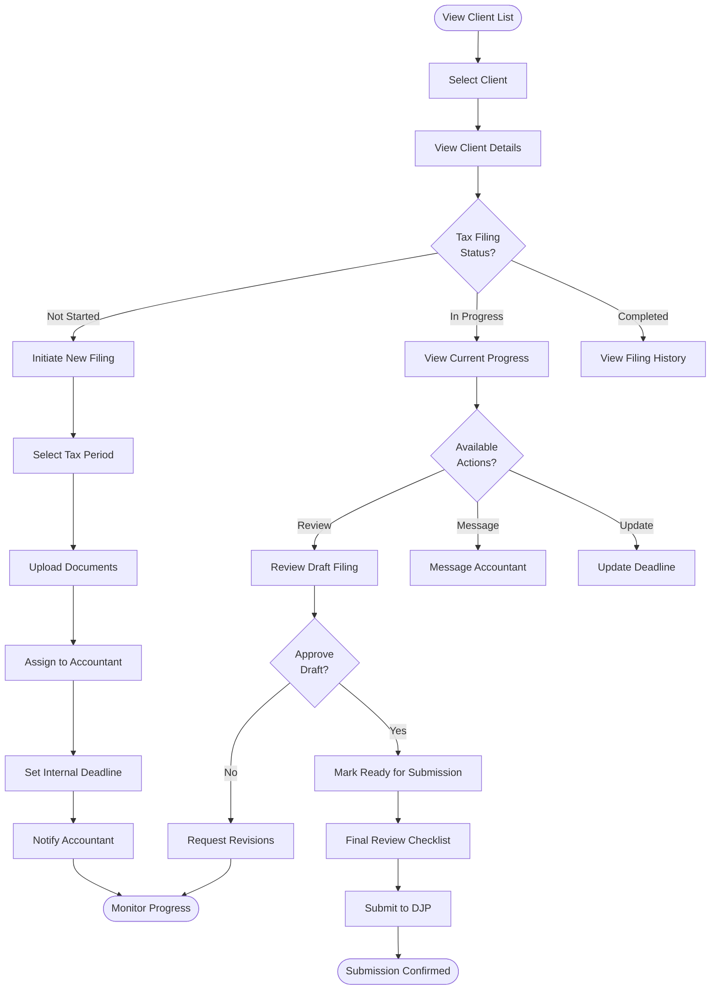
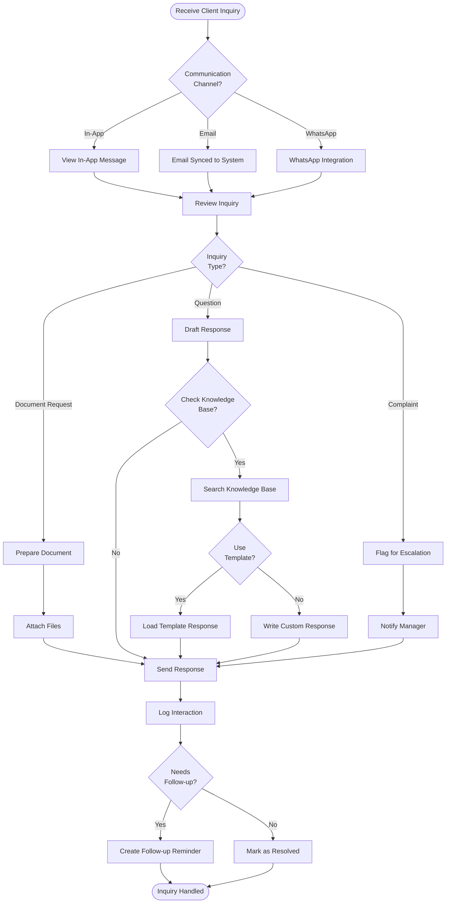
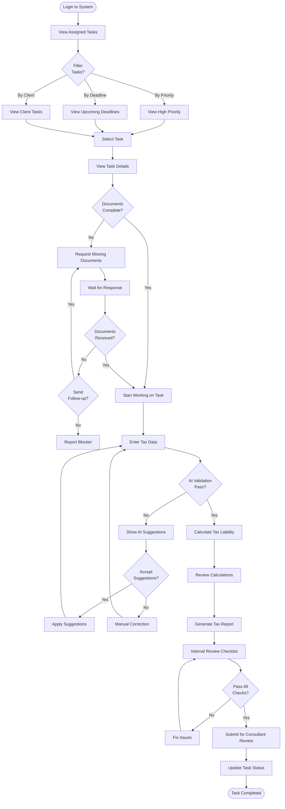
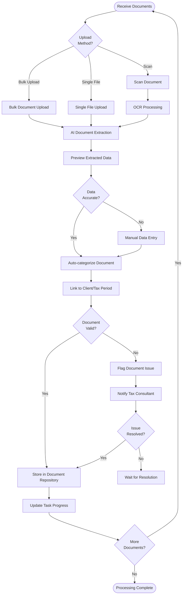
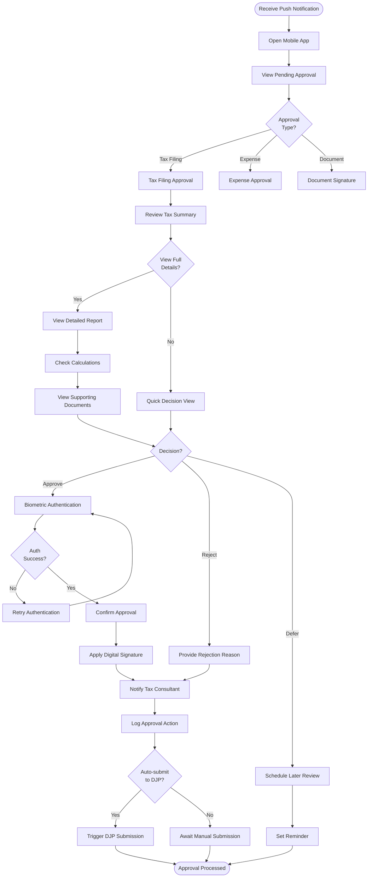
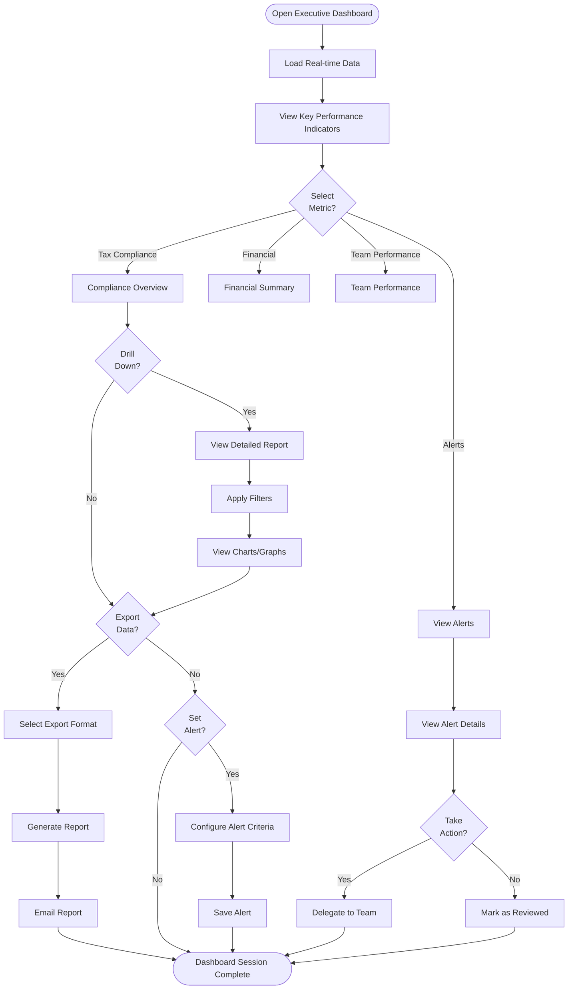
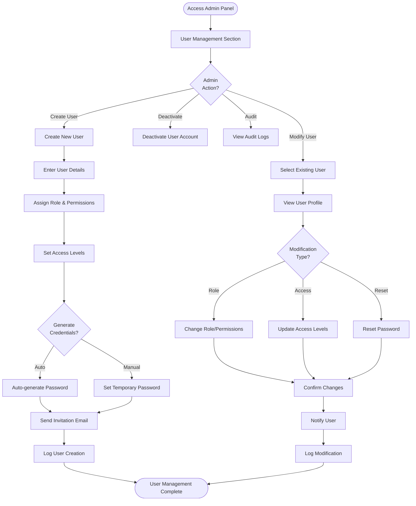
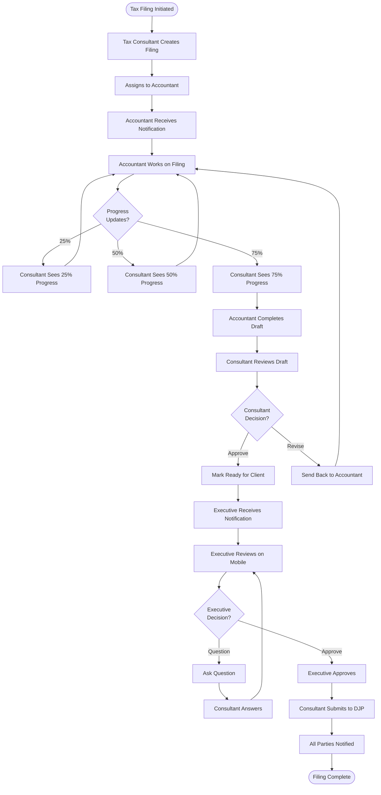
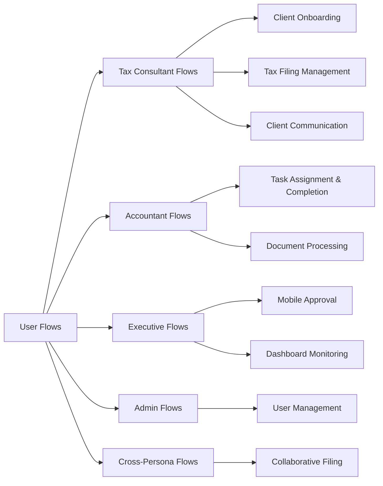

# User Flows

## Overview
This document maps out the complete user journeys for all personas in the AI-Pajak system. Each flow represents a typical task or goal that users need to accomplish.

---

## 1. Tax Consultant Flow

### 1.1 Client Onboarding Flow

**Entry Points:**
- Dashboard > "Add Client" button
- Quick action menu
- Clients list > "New Client"

**Exit Points:**
- Client profile page
- Clients list with new client
- Dashboard with updated metrics

**Key Decision Points:**
- NPWP validation
- Service package selection
- Accountant assignment method

**Error Scenarios:**
- Invalid NPWP format
- Duplicate client detection
- Missing required fields
- No available accountants

---

### 1.2 Tax Filing Management Flow

**Entry Points:**
- Client dashboard
- Clients list
- Task notifications
- Calendar view

**Exit Points:**
- Filing submitted successfully
- Draft saved for later
- Revision requested
- Task reassigned

**Key Decision Points:**
- Tax filing status check
- Document completeness validation
- Draft approval/rejection
- Submission timing

**Error Scenarios:**
- Missing documents
- DJP API connection failure
- Invalid tax calculations
- Deadline conflicts

---

### 1.3 Client Communication Flow

**Entry Points:**
- Message center
- Client profile
- Push notifications
- Email notifications

**Exit Points:**
- Message sent
- Follow-up scheduled
- Issue escalated
- Case closed

**Key Decision Points:**
- Communication channel routing
- Inquiry type classification
- Template vs custom response
- Escalation criteria

**Error Scenarios:**
- File attachment too large
- Template not available
- Client not found
- Message delivery failure

---

## 2. Accountant Flow

### 2.1 Task Assignment & Completion Flow

**Entry Points:**
- Task dashboard
- Email notifications
- Calendar reminders
- Mobile app notifications

**Exit Points:**
- Task submitted for review
- Task saved as draft
- Blocker reported
- Task reassigned

**Key Decision Points:**
- Document completeness check
- AI validation acceptance
- Internal quality checks
- Submission readiness

**Error Scenarios:**
- Missing critical documents
- AI validation failures
- Calculation discrepancies
- System timeout during save

---

### 2.2 Document Processing Flow

**Entry Points:**
- Task detail page
- Document upload center
- Email attachments
- Mobile camera

**Exit Points:**
- Documents stored successfully
- Issues flagged for review
- Processing queue
- Client notification sent

**Key Decision Points:**
- Upload method selection
- Data accuracy verification
- Document validation
- Issue resolution path

**Error Scenarios:**
- OCR failure
- Unsupported file format
- Missing metadata
- Storage quota exceeded

---

## 3. Executive/Business Owner Flow

### 3.1 Mobile Approval Flow

**Entry Points:**
- Push notification
- Email link
- App home screen
- WhatsApp message link

**Exit Points:**
- Approval granted
- Approval rejected
- Review deferred
- Session timeout

**Key Decision Points:**
- Detail level required
- Approval decision
- Authentication method
- Auto-submission preference

**Error Scenarios:**
- Biometric auth failure
- Network connection lost
- Session expired
- Invalid digital signature

---

### 3.2 Dashboard Monitoring Flow

**Entry Points:**
- Direct app/web access
- Email dashboard link
- Scheduled report notification
- Mobile quick access

**Exit Points:**
- Report exported
- Alert configured
- Task delegated
- Session ended

**Key Decision Points:**
- Metric selection
- Drill-down depth
- Export vs alert
- Action required

**Error Scenarios:**
- Data loading failure
- Export timeout
- Email delivery failure
- Alert configuration error

---

## 4. Admin Flow

### 4.1 User Management Flow

**Entry Points:**
- Admin panel
- User list
- Access request queue
- Audit notifications

**Exit Points:**
- User created/modified
- Credentials sent
- Access revoked
- Audit reviewed

**Key Decision Points:**
- User role assignment
- Credential generation method
- Access level granularity
- Notification preferences

**Error Scenarios:**
- Duplicate email/username
- Invalid role assignment
- Email sending failure
- Insufficient admin permissions

---

## 5. Cross-Persona Flows

### 5.1 Collaborative Filing Flow

**Entry Points:**
- Any persona's dashboard
- Email/push notifications
- Task management system

**Exit Points:**
- Filing submitted
- Waiting for response
- Issue escalated
- Process cancelled

**Key Decision Points:**
- Assignment routing
- Review approval
- Executive approval
- Submission timing

**Error Scenarios:**
- Notification failure
- Assignment conflict
- Approval timeout
- DJP submission error

---

## Navigation Map

---

## Flow Metrics & Success Criteria

### Tax Consultant Flows
- **Client Onboarding**: < 5 minutes average completion time
- **Filing Management**: < 2 clicks to reach any filing status
- **Communication**: < 30 seconds to send response

### Accountant Flows
- **Task Completion**: < 30 minutes for standard filing
- **Document Processing**: < 3 minutes per document
- **AI Validation**: > 95% accuracy rate

### Executive Flows
- **Mobile Approval**: < 2 minutes total time
- **Dashboard Load**: < 3 seconds initial load
- **Export Generation**: < 10 seconds for standard report

### Cross-Persona Flows
- **Collaborative Filing**: < 48 hours total cycle time
- **Notification Delivery**: < 5 seconds
- **Review Cycles**: Average 1.5 cycles to approval

---

## Related Documentation
- [Wireframes](/Users/tommy/git/ai-pajak/docs/02-design/ui-ux/wireframes/)
- [Screen Specifications](/Users/tommy/git/ai-pajak/docs/02-design/ui-ux/screens/)
- [Design System](/Users/tommy/git/ai-pajak/docs/02-design/ui-ux/design-system.md)
- [API Endpoints](/Users/tommy/git/ai-pajak/docs/02-design/api/endpoints/)
- [User Personas](/Users/tommy/git/ai-pajak/docs/01-requirements/personas.md)

---

**Document Version:** 1.0
**Last Updated:** 2025-12-23
**Owner:** Product Design Team
**Review Cycle:** Monthly
