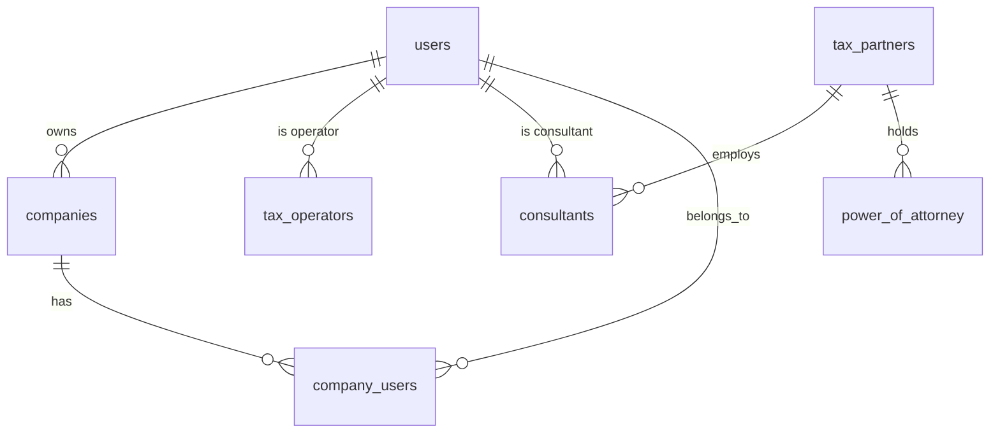
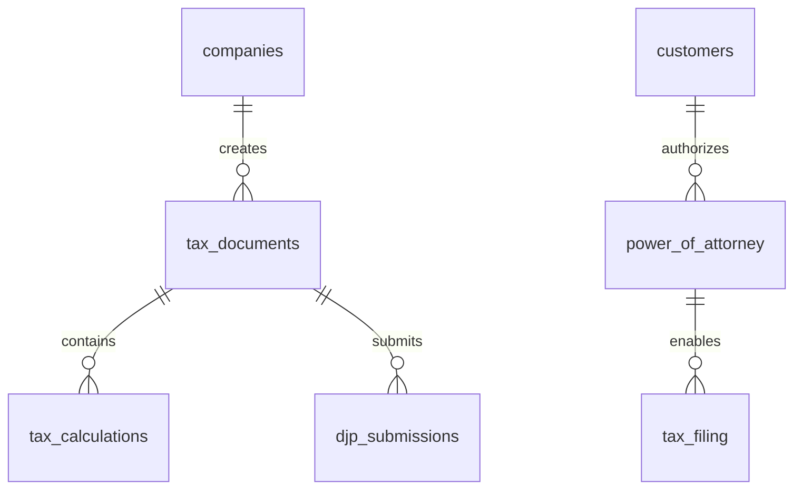
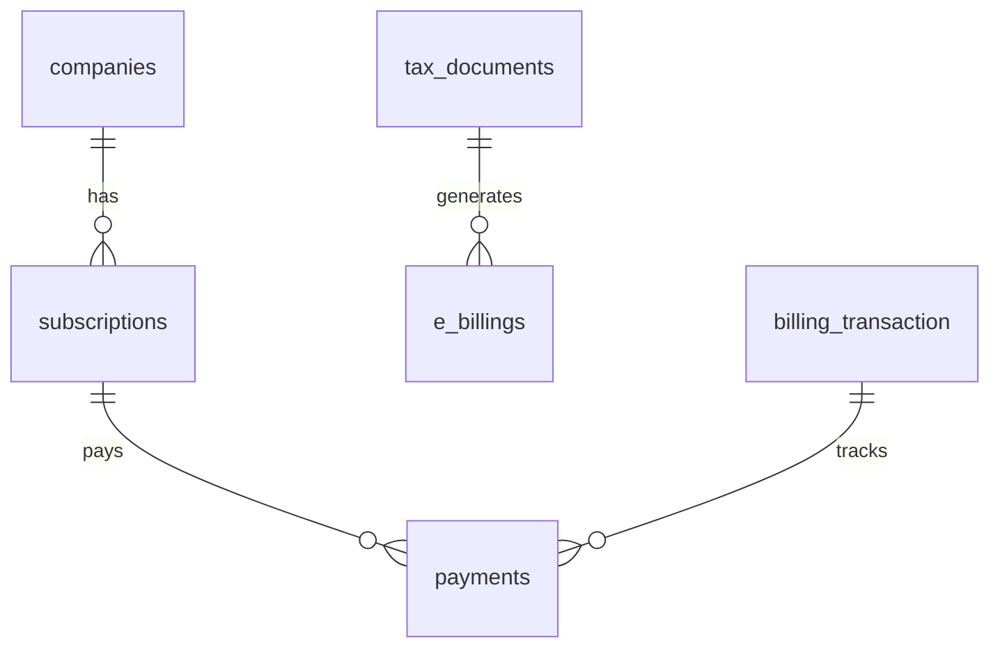

# Data Model: AI Pajak MVP

**Branch**: `001-initial-setup` | **Date**: 2025-12-28
**Source**: docs/ERD/ (67 tables documented)

---

## 1. Entity Overview

### 1.1 Core Entities (12 tables)



### 1.2 Tax Filing Entities (18 tables)



### 1.3 Billing Entities (8 tables)



---

## 2. Core Tables

### 2.1 users

Supabase Auth와 연동되는 사용자 테이블.

| Column | Type | Constraints | Description |
|--------|------|-------------|-------------|
| id | UUID | PK, FK(auth.users) | Supabase Auth ID |
| email | VARCHAR(255) | UNIQUE, NOT NULL | 이메일 |
| role | user_role | NOT NULL | RBAC 역할 |
| full_name | VARCHAR(255) | | 이름 |
| created_at | TIMESTAMPTZ | DEFAULT NOW() | 생성일 |
| updated_at | TIMESTAMPTZ | DEFAULT NOW() | 수정일 |

**user_role ENUM**:
```sql
CREATE TYPE user_role AS ENUM (
  'CUSTOMER',           -- 고객
  'CONSULTANT',     -- JTC 컨설턴트 (계산만)
  'TAX_ADVISOR',    -- JTC 세무사 (계산+신고)
  'PLATFORM_ADMIN',     -- 플랫폼 관리자
  'SYSTEM'              -- 시스템 (빌링만)
);
```

### 2.2 companies

법인/사업자 정보.

| Column | Type | Constraints | Description |
|--------|------|-------------|-------------|
| id | UUID | PK | 회사 ID |
| name | VARCHAR(255) | NOT NULL | 회사명 |
| npwp | VARCHAR(16) | UNIQUE, NOT NULL | 납세자번호 |
| company_type | VARCHAR(20) | | INDIVIDUAL, UMKM, PT |
| address | TEXT | | 주소 |
| phone | VARCHAR(20) | | 전화번호 |
| created_at | TIMESTAMPTZ | DEFAULT NOW() | |
| deleted_at | TIMESTAMPTZ | | Soft delete |

**NPWP 형식**: `XX.XXX.XXX.X-XXX.XXX`

### 2.3 customers

고객 상세 정보 (users 확장).

| Column | Type | Constraints | Description |
|--------|------|-------------|-------------|
| id | UUID | PK | 고객 ID |
| user_id | UUID | FK(users), UNIQUE | 사용자 ID |
| npwp | VARCHAR(16) | UNIQUE, NOT NULL | 납세자번호 |
| full_name | VARCHAR(255) | NOT NULL | 이름 |
| company_id | UUID | FK(companies) | 소속 회사 |
| customer_type | VARCHAR(20) | | INDIVIDUAL, UMKM, PT |
| created_at | TIMESTAMPTZ | DEFAULT NOW() | |

### 2.4 tax_partners

세무 컨설팅 파트너 (Jakarta Tax Consulting).

| Column | Type | Constraints | Description |
|--------|------|-------------|-------------|
| id | UUID | PK | 파트너 ID |
| name | VARCHAR(255) | NOT NULL | 회사명 |
| license_number | VARCHAR(100) | NOT NULL | PJAP 라이선스 |
| npwp | VARCHAR(16) | | 사업자번호 |
| email | VARCHAR(255) | | 이메일 |
| is_active | BOOLEAN | DEFAULT TRUE | 활성 상태 |
| created_at | TIMESTAMPTZ | DEFAULT NOW() | |

### 2.5 consultants

세무 컨설턴트 (JTC 직원).

| Column | Type | Constraints | Description |
|--------|------|-------------|-------------|
| id | UUID | PK | 컨설턴트 ID |
| user_id | UUID | FK(users), UNIQUE | 사용자 ID |
| tax_partner_id | UUID | FK(tax_partners) | 소속 파트너 |
| full_name | VARCHAR(255) | NOT NULL | 이름 |
| license_number | VARCHAR(100) | | 세무사 자격번호 |
| can_file_tax | BOOLEAN | DEFAULT FALSE | 신고 권한 |
| assigned_customers | UUID[] | | 배정된 고객 ID 배열 |
| created_at | TIMESTAMPTZ | DEFAULT NOW() | |

### 2.6 power_of_attorney

위임장 (Surat Kuasa) - 세금 신고 권한.

| Column | Type | Constraints | Description |
|--------|------|-------------|-------------|
| id | UUID | PK | POA ID |
| poa_number | VARCHAR(50) | UNIQUE, NOT NULL | 위임장 번호 |
| customer_id | UUID | FK(customers) | 고객 ID |
| tax_partner_id | UUID | FK(tax_partners) | 파트너 ID |
| scope | VARCHAR(50) | NOT NULL | 범위 (ALL, PPH_21_ONLY 등) |
| valid_from | DATE | NOT NULL | 유효 시작일 |
| valid_to | DATE | NOT NULL | 유효 종료일 |
| status | poa_status | DEFAULT 'DRAFT' | 상태 |
| customer_signed_at | TIMESTAMPTZ | | 고객 서명일 |
| partner_signed_at | TIMESTAMPTZ | | 파트너 서명일 |
| document_id | UUID | | 문서 Storage ID |
| created_at | TIMESTAMPTZ | DEFAULT NOW() | |

**poa_status ENUM**:
```sql
CREATE TYPE poa_status AS ENUM (
  'DRAFT',              -- 초안
  'PENDING_SIGNATURE',  -- 서명 대기
  'ACTIVE',             -- 유효
  'EXPIRED',            -- 만료
  'REVOKED'             -- 취소
);
```

**CHECK Constraint**:
```sql
CHECK (valid_to > valid_from)
```

---

## 3. Tax Filing Tables

### 3.1 tax_documents

모든 세금 문서 (JSONB 활용).

| Column | Type | Constraints | Description |
|--------|------|-------------|-------------|
| id | UUID | PK | 문서 ID |
| document_number | VARCHAR(50) | UNIQUE, NOT NULL | 문서 번호 |
| company_id | UUID | FK(companies) | 회사 ID |
| tax_type | tax_type | NOT NULL | 세금 유형 |
| period_year | INTEGER | NOT NULL | 연도 |
| period_month | INTEGER | | 월 (SPT Masa) |
| data | JSONB | NOT NULL | 세금 데이터 |
| status | document_status | DEFAULT 'DRAFT' | 상태 |
| created_by | UUID | FK(users) | 생성자 |
| created_at | TIMESTAMPTZ | DEFAULT NOW() | |
| updated_at | TIMESTAMPTZ | DEFAULT NOW() | |
| deleted_at | TIMESTAMPTZ | | Soft delete |

**tax_type ENUM**:
```sql
CREATE TYPE tax_type AS ENUM (
  'PPH_21',        -- 급여 원천세
  'PPH_23',        -- 서비스 원천세
  'PPH_FINAL',     -- 최종분리과세 (UMKM)
  'PPN',           -- 부가가치세
  'SPT_TAHUNAN'    -- 연간 소득세
);
```

**document_status ENUM**:
```sql
CREATE TYPE document_status AS ENUM (
  'DRAFT',         -- 작성 중
  'PENDING_REVIEW', -- 검토 대기
  'APPROVED',      -- 승인됨
  'SUBMITTED',     -- DJP 제출됨
  'ACCEPTED',      -- DJP 수리됨
  'REJECTED'       -- DJP 거부됨
);
```

### 3.2 tax_calculations

세금 계산 결과.

| Column | Type | Constraints | Description |
|--------|------|-------------|-------------|
| id | UUID | PK | 계산 ID |
| tax_document_id | UUID | FK(tax_documents) | 문서 ID |
| gross_income | DECIMAL(15,2) | | 총소득 |
| taxable_income | DECIMAL(15,2) | | 과세소득 |
| tax_rate | DECIMAL(5,2) | | 세율 |
| calculated_tax | DECIMAL(15,2) | | 계산된 세금 |
| credits | DECIMAL(15,2) | | 세액공제 |
| net_tax_due | DECIMAL(15,2) | | 납부할 세금 |
| calculation_details | JSONB | | 계산 상세 |
| calculated_by | UUID | FK(users) | 계산자 |
| calculated_at | TIMESTAMPTZ | DEFAULT NOW() | |

### 3.3 tax_filing

세금 신고 기록 (DJP 제출용).

| Column | Type | Constraints | Description |
|--------|------|-------------|-------------|
| id | UUID | PK | 신고 ID |
| filing_number | VARCHAR(50) | UNIQUE, NOT NULL | 신고 번호 |
| customer_id | UUID | FK(customers) | 고객 ID |
| tax_partner_id | UUID | FK(tax_partners) | 파트너 ID |
| poa_id | UUID | FK(power_of_attorney), NOT NULL | POA ID |
| tax_type | tax_type | NOT NULL | 세금 유형 |
| tax_period | VARCHAR(10) | NOT NULL | 기간 (YYYY-MM) |
| tax_year | INTEGER | NOT NULL | 연도 |
| status | filing_status | DEFAULT 'DRAFT' | 상태 |
| filing_data | JSONB | NOT NULL | 신고 데이터 |
| calculated_tax | DECIMAL(15,2) | | 계산된 세금 |
| net_tax_due | DECIMAL(15,2) | | 납부할 세금 |
| submitted_at | TIMESTAMPTZ | | 제출일 |
| submitted_by_user_id | UUID | FK(users) | 제출자 |
| submitted_by_consultant_id | UUID | FK(consultants) | 제출 컨설턴트 |
| bpe | VARCHAR(50) | | DJP 접수증 |
| djp_response | JSONB | | DJP 응답 |
| created_at | TIMESTAMPTZ | DEFAULT NOW() | |

**filing_status ENUM**:
```sql
CREATE TYPE filing_status AS ENUM (
  'DRAFT',
  'PENDING_PAYMENT',
  'READY_TO_SUBMIT',
  'SUBMITTED',
  'ACCEPTED',
  'REJECTED'
);
```

### 3.4 djp_submissions

DJP 제출 로그.

| Column | Type | Constraints | Description |
|--------|------|-------------|-------------|
| id | UUID | PK | 제출 ID |
| tax_filing_id | UUID | FK(tax_filing) | 신고 ID |
| request_payload | JSONB | | 요청 데이터 |
| response_payload | JSONB | | 응답 데이터 |
| status_code | INTEGER | | HTTP 상태 |
| bpe | VARCHAR(50) | | 접수증 번호 |
| submitted_at | TIMESTAMPTZ | DEFAULT NOW() | |
| submitted_by | UUID | FK(users) | 제출자 |

---

## 4. Billing Tables

### 4.1 subscriptions

구독 관리.

| Column | Type | Constraints | Description |
|--------|------|-------------|-------------|
| id | UUID | PK | 구독 ID |
| company_id | UUID | FK(companies) | 회사 ID |
| plan | subscription_plan | NOT NULL | 플랜 |
| status | subscription_status | DEFAULT 'ACTIVE' | 상태 |
| current_period_start | DATE | | 현재 기간 시작 |
| current_period_end | DATE | | 현재 기간 종료 |
| cancel_at_period_end | BOOLEAN | DEFAULT FALSE | 기간 종료 시 취소 |
| created_at | TIMESTAMPTZ | DEFAULT NOW() | |

**subscription_plan ENUM**:
```sql
CREATE TYPE subscription_plan AS ENUM (
  'FREE',           -- 무료
  'BASIC',          -- 기본 (월 Rp 199K)
  'PROFESSIONAL',   -- 전문가 (월 Rp 499K)
  'ENTERPRISE'      -- 기업 (협의)
);
```

### 4.2 billing_transaction

청구 거래.

| Column | Type | Constraints | Description |
|--------|------|-------------|-------------|
| id | UUID | PK | 거래 ID |
| idempotency_key | VARCHAR(255) | UNIQUE, NOT NULL | 멱등성 키 |
| invoice_number | VARCHAR(50) | UNIQUE, NOT NULL | 청구서 번호 |
| customer_id | UUID | FK(customers) | 고객 ID |
| tax_filing_id | UUID | FK(tax_filing) | 신고 ID |
| tax_partner_id | UUID | FK(tax_partners) | 파트너 ID |
| service_type | VARCHAR(50) | NOT NULL | 서비스 유형 |
| amount_base | DECIMAL(15,2) | NOT NULL | 기본 금액 |
| amount_tax | DECIMAL(15,2) | NOT NULL | 세금 |
| amount_total | DECIMAL(15,2) | NOT NULL | 총액 |
| currency | VARCHAR(3) | DEFAULT 'IDR' | 통화 |
| payment_status | payment_status | DEFAULT 'PENDING' | 결제 상태 |
| paid_at | TIMESTAMPTZ | | 결제일 |
| created_by | VARCHAR(20) | DEFAULT 'SYSTEM' | 생성자 (SYSTEM) |
| created_at | TIMESTAMPTZ | DEFAULT NOW() | |

**CHECK Constraint**:
```sql
CHECK (amount_total = amount_base + amount_tax)
```

### 4.3 e_billings

DJP e-Billing 코드.

| Column | Type | Constraints | Description |
|--------|------|-------------|-------------|
| id | UUID | PK | e-Billing ID |
| tax_filing_id | UUID | FK(tax_filing) | 신고 ID |
| billing_code | VARCHAR(30) | UNIQUE | e-Billing 코드 |
| amount | DECIMAL(15,2) | NOT NULL | 납부 금액 |
| valid_until | DATE | NOT NULL | 유효기간 (7일) |
| status | ebilling_status | DEFAULT 'ACTIVE' | 상태 |
| created_at | TIMESTAMPTZ | DEFAULT NOW() | |

---

## 5. Audit & Communication Tables

### 5.1 audit_log

감사 로그 (불변).

| Column | Type | Constraints | Description |
|--------|------|-------------|-------------|
| id | UUID | PK | 로그 ID |
| activity_type | VARCHAR(50) | NOT NULL | 활동 유형 |
| user_id | UUID | FK(users) | 사용자 ID |
| customer_id | UUID | FK(customers) | 고객 ID |
| tax_filing_id | UUID | FK(tax_filing) | 신고 ID |
| tax_partner_id | UUID | FK(tax_partners) | 파트너 ID |
| poa_id | UUID | FK(power_of_attorney) | POA ID |
| activity_details | JSONB | | 상세 내용 |
| ip_address | INET | | IP 주소 |
| user_agent | TEXT | | User Agent |
| timestamp | TIMESTAMPTZ | DEFAULT NOW() | 시간 |
| is_success | BOOLEAN | DEFAULT TRUE | 성공 여부 |
| error_message | TEXT | | 오류 메시지 |

**RLS Policy (No DELETE)**:
```sql
CREATE POLICY "audit_log_no_delete" ON audit_log
  FOR DELETE USING (false);
```

### 5.2 notifications

알림.

| Column | Type | Constraints | Description |
|--------|------|-------------|-------------|
| id | UUID | PK | 알림 ID |
| user_id | UUID | FK(users) | 수신자 ID |
| type | notification_type | NOT NULL | 유형 |
| title | VARCHAR(255) | NOT NULL | 제목 |
| body | TEXT | | 내용 |
| is_read | BOOLEAN | DEFAULT FALSE | 읽음 여부 |
| data | JSONB | | 추가 데이터 |
| created_at | TIMESTAMPTZ | DEFAULT NOW() | |

---

## 6. Reference Data Tables

### 6.1 ter_rates

TER 테이블 (PPh 21 세율).

| Column | Type | Constraints | Description |
|--------|------|-------------|-------------|
| id | UUID | PK | ID |
| ter_category | VARCHAR(10) | NOT NULL | TER 카테고리 (A, B, C) |
| income_min | DECIMAL(15,2) | NOT NULL | 최소 소득 |
| income_max | DECIMAL(15,2) | | 최대 소득 |
| rate | DECIMAL(5,4) | NOT NULL | 세율 |
| effective_from | DATE | NOT NULL | 시행일 |
| effective_to | DATE | | 종료일 |

### 6.2 kbli_pph23_rates

KBLI-PPh23 세율 매핑 (1,560개).

| Column | Type | Constraints | Description |
|--------|------|-------------|-------------|
| id | UUID | PK | ID |
| kbli_code | VARCHAR(10) | NOT NULL | KBLI 코드 |
| kbli_description | TEXT | | 설명 |
| pph23_rate | DECIMAL(5,2) | NOT NULL | PPh23 세율 |
| service_type | VARCHAR(100) | | 서비스 유형 |

### 6.3 tax_treaties

조세조약 (71개국).

| Column | Type | Constraints | Description |
|--------|------|-------------|-------------|
| id | UUID | PK | ID |
| country_code | VARCHAR(3) | NOT NULL | 국가 코드 |
| country_name | VARCHAR(100) | NOT NULL | 국가명 |
| dividend_rate | DECIMAL(5,2) | | 배당 세율 |
| interest_rate | DECIMAL(5,2) | | 이자 세율 |
| royalty_rate | DECIMAL(5,2) | | 로열티 세율 |
| effective_date | DATE | | 시행일 |

---

## 7. Validation Rules

### 7.1 NPWP Format

```typescript
const NPWP_REGEX = /^\d{2}\.\d{3}\.\d{3}\.\d-\d{3}\.\d{3}$/;
// Example: 01.234.567.8-901.000
```

### 7.2 POA Validation

```typescript
function isValidPOA(poa: POA, customer_id: string, tax_type: string): boolean {
  const now = new Date();
  return (
    poa.status === 'ACTIVE' &&
    poa.customer_id === customer_id &&
    poa.valid_from <= now &&
    poa.valid_to >= now &&
    (poa.scope === 'ALL_TAX_TYPES' || poa.scope.includes(tax_type))
  );
}
```

### 7.3 Role-Based Filing Permission

```typescript
function canFileTax(user: User, poa: POA): boolean {
  return (
    user.role === 'TAX_ADVISOR' &&
    user.can_file_tax === true &&
    isValidPOA(poa, ...)
  );
}
```

---

## 8. State Transitions

### 8.1 Document Status

```
DRAFT → PENDING_REVIEW → APPROVED → SUBMITTED → ACCEPTED
                                              ↘ REJECTED
```

### 8.2 POA Status

```
DRAFT → PENDING_SIGNATURE → ACTIVE → EXPIRED
                                   ↘ REVOKED
```

### 8.3 Subscription Status

```
TRIAL → ACTIVE → PAST_DUE → CANCELLED
              ↘ CANCELLED
```

---

## 9. Indexes

```sql
-- Most frequent queries
CREATE INDEX idx_tax_documents_company_period
  ON tax_documents(company_id, period_year, period_month);

CREATE INDEX idx_tax_filing_customer_period
  ON tax_filing(customer_id, tax_year, tax_period);

CREATE INDEX idx_audit_log_timestamp
  ON audit_log(timestamp DESC);

CREATE INDEX idx_power_of_attorney_customer_status
  ON power_of_attorney(customer_id, status)
  WHERE status = 'ACTIVE';

CREATE INDEX idx_consultants_assigned
  ON consultants USING GIN (assigned_customers);
```

---

## 10. RLS Policies Summary

| Table | Policy | Description |
|-------|--------|-------------|
| users | own_data | 본인 데이터만 |
| companies | company_members | 회사 멤버만 |
| tax_documents | company_or_consultant | 회사 멤버 또는 배정된 컨설턴트 |
| tax_filing | customer_or_advisor | 고객 또는 배정된 세무사 |
| audit_log | no_delete | DELETE 불가 |
| billing_transaction | system_only | SYSTEM 역할만 생성 |

---

**Generated by**: /speckit.plan Phase 1
**Date**: 2025-12-28
